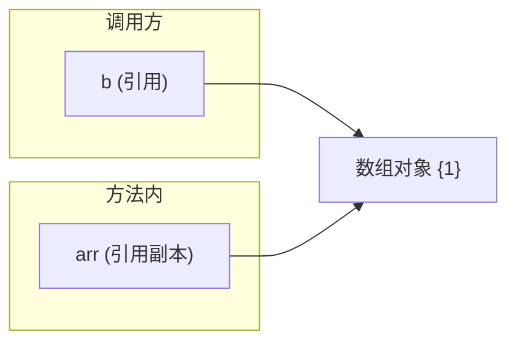

# 03 · 值传递（Value Passing）

> Java 中方法参数**只有值传递**：基本类型传值的副本，引用类型传引用（地址）的副本。没有"引用传递"。面试重要度：⭐⭐⭐ 高频。

## 📖 核心知识

**Java 只有值传递（pass by value），没有引用传递（pass by reference）。** 关键在于理解"传的是什么值"：

- **基本类型**：传递变量值的**副本**，方法内改动不影响外部。
- **引用类型**：传递的是**引用（对象地址）的副本**。副本和原引用指向同一个对象，所以方法内**通过引用修改对象内容**会影响外部；但**让副本重新指向新对象**不会影响外部原引用。

```java
void change(int x)      { x = 100; }          // 改副本，无效
void modify(int[] arr)  { arr[0] = 100; }     // 通过地址改对象，有效
void reassign(int[] arr){ arr = new int[]{9}; } // 副本改指向，对外无效

int a = 1;      change(a);      // a 仍为 1
int[] b = {1};  modify(b);      // b[0] 变 100
int[] c = {1};  reassign(c);    // c[0] 仍为 1
```

用图理解引用传递副本：



`b` 和 `arr` 是两个独立的引用变量，但指向同一个堆对象。`modify` 改的是对象本身（`arr[0]`），所以 `b` 也看到变化；`reassign` 让 `arr` 指向新对象，`b` 不受影响。

**String 的特殊性**：`String` 不可变，方法内 `s = s + "x"` 实际是让副本指向新字符串对象，原引用不变，容易被误当作"值传递证据"，其实和上面 `reassign` 同理。

## 🔑 面试要点

- Java **只有值传递**，这是标准答案，务必肯定回答。
- 基本类型传值副本，改副本不影响原变量。
- 引用类型传的是**地址的副本**：改对象内容影响外部，改指向不影响外部。
- 判断依据：方法能否让外部变量指向另一个对象？不能 → 就是值传递。
- `String`、包装类等不可变对象，看起来"传值"，本质是引用副本 + 不可变。
- 想在方法内交换两个对象引用是做不到的（经典 `swap` 失败）。

## ❓ 高频面试题

**Q：Java 是值传递还是引用传递？**
A：只有值传递。基本类型传值的副本，引用类型传引用（地址）的副本。因为方法内无法改变外部变量指向的对象，符合值传递定义。

**Q：既然是值传递，为什么方法里改数组元素外面能看到？**
A：因为传进去的引用副本和外部引用指向同一个堆对象，通过副本操作对象内容（`arr[0]=x`）改的是同一个对象，所以外部可见。这不违反值传递——值传递传的是"引用值"。

**Q：写个 `swap(a, b)` 交换两个对象，能成功吗？**
A：不能。方法内交换的只是两个引用副本的指向，方法返回后外部的原引用毫无变化。想交换只能借助包装对象、数组或返回值等间接手段。

**Q：`String` 作参数，方法内拼接后外部变了吗？**
A：没变。`String` 不可变，拼接生成新对象并让副本指向它，原引用仍指向原字符串。

## ⚠️ 易错点 / 加分项

- 最大误区：把"能改对象内容"当成引用传递。区分"改对象" vs "改指向"是关键。
- 别背"基本类型值传递、引用类型引用传递"——错误说法，全是值传递。
- 加分：一句话总结判定法——"方法结束后，实参变量指向的对象/值有没有可能被换成另一个？不能，就是值传递。"
- 加分：C++ 有真正的引用传递（`&` 或指针的引用），可对比说明 Java 没有这种语义。
- 易错：`StringBuilder` 作参数在方法内 `append` 会影响外部（改对象内容），而 `String` 拼接不会（改指向），面试常拿来对比。
