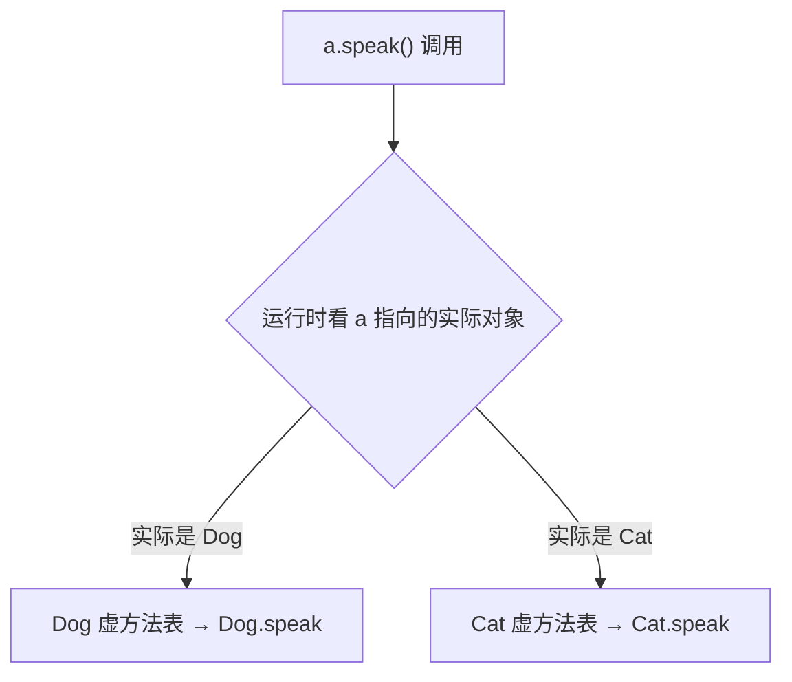

# 06 · 多态原理（Polymorphism）

> 多态=父类引用指向子类对象，方法调用运行时动态绑定到实际类型的实现；关键结论：方法有多态、成员变量和静态方法没有。面试重要度：⭐⭐⭐ 高频。

## 📖 核心知识

### 什么是多态

同一个父类引用，指向不同子类对象，调用同名方法时表现出不同行为。三要素：**继承/实现 + 重写 + 向上转型**。

```java
Animal a = new Dog();   // 向上转型（upcasting）
a.speak();              // 运行时调用 Dog.speak，动态绑定
a = new Cat();
a.speak();              // 换成 Cat.speak
```

### 向上转型与向下转型

- **向上转型**：子类对象赋给父类引用，自动、安全。转型后只能访问父类声明的方法（但实际执行子类重写版本）。
- **向下转型**：父类引用转回子类，需强制转换，且必须实际是该子类，否则抛 `ClassCastException`。转前用 `instanceof` 判断：

```java
if (a instanceof Dog) {
    Dog d = (Dog) a;   // 安全向下转型
}
```

### 动态绑定原理

方法调用分两类：
- **静态绑定（早绑定）**：编译期确定。适用于 `static`、`private`、`final` 方法和构造器——它们不能被重写，无多态。
- **动态绑定（晚绑定）**：运行期确定。普通实例方法调用时，JVM 通过对象头找到实际类型的**虚方法表（vtable）**，查到真正要执行的方法。这是多态的底层机制。



（虚方法表、方法分派细节属 JVM 层面，深入见 `../../jvm-learning/`。）

### 成员变量不具多态性

**只有方法（实例方法）有多态，成员变量按引用的声明类型静态解析**：

```java
class Parent { int x = 1; int get() { return x; } }
class Child extends Parent { int x = 2; int get() { return x; } }

Parent p = new Child();
System.out.println(p.x);       // 1  ← 字段看声明类型 Parent
System.out.println(p.get());   // 2  ← 方法看实际类型 Child（动态绑定）
```

字段访问在编译期按引用类型绑定（静态绑定），方法调用在运行期按实际对象绑定。这是极高频的坑题。

## 🔑 面试要点

- 多态三要素：继承/实现、重写、父类引用指向子类对象。
- 向上转型自动安全，向下转型需强转 + `instanceof` 校验，否则 `ClassCastException`。
- 实例方法动态绑定（运行期按实际类型），有多态。
- `static`、`private`、`final` 方法和字段是静态绑定，无多态。
- **成员变量不具多态性**：`p.x` 看引用声明类型，`p.get()` 看实际对象类型。
- 底层靠虚方法表（vtable）实现动态分派。
- 多态让代码面向抽象，符合开闭原则。

## ❓ 高频面试题

**Q：`Parent p = new Child();` 访问同名字段和调用重写方法，结果分别看谁？**
A：字段看**引用的声明类型**（Parent），因为字段是静态绑定；重写方法看**实际对象类型**（Child），因为实例方法是动态绑定。所以 `p.x` 取 Parent 的 x，`p.get()` 执行 Child 的 get。这就是"成员变量无多态、方法有多态"。

**Q：多态是怎么实现的（动态绑定原理）？**
A：编译期只确定方法签名，实际调用哪个实现推迟到运行期。JVM 为每个类维护虚方法表（vtable），存该类所有可被继承/重写方法的实际入口。调用实例方法时，通过对象头找到其实际类型的 vtable，查表定位真正执行的方法，从而实现动态分派。

**Q：哪些方法不具备多态（是静态绑定）？**
A：`static`（属于类）、`private`（子类不可见）、`final`（不可重写）方法，以及构造器。它们在编译期就能确定唯一目标，不进 vtable，没有运行期分派。

**Q：向下转型有什么风险，怎么规避？**
A：若父类引用实际指向的不是目标子类，强转会抛 `ClassCastException`。规避方法是转型前用 `instanceof` 判断实际类型，或用 JDK16+ 的模式匹配 `if (a instanceof Dog d)` 一步完成判断和转换。

## ⚠️ 易错点 / 加分项

- 头号坑：以为 `p.x` 也会多态取到子类字段——字段是静态绑定，永远看声明类型。
- 构造器中调用被子类重写的方法，会执行子类版本，但此时子类字段还没初始化，易出 bug。
- `static` 方法"重写"其实是隐藏，用父类引用调用走的是父类版本，无多态。
- 加分：能画出 vtable 分派过程，或点出 `invokevirtual`（虚方法）vs `invokestatic`/`invokespecial`（静态绑定）字节码指令差异。
- 加分：重载是编译期"多态"（静态分派，看声明类型选方法），重写是运行期多态（动态分派），二者常一起考。
