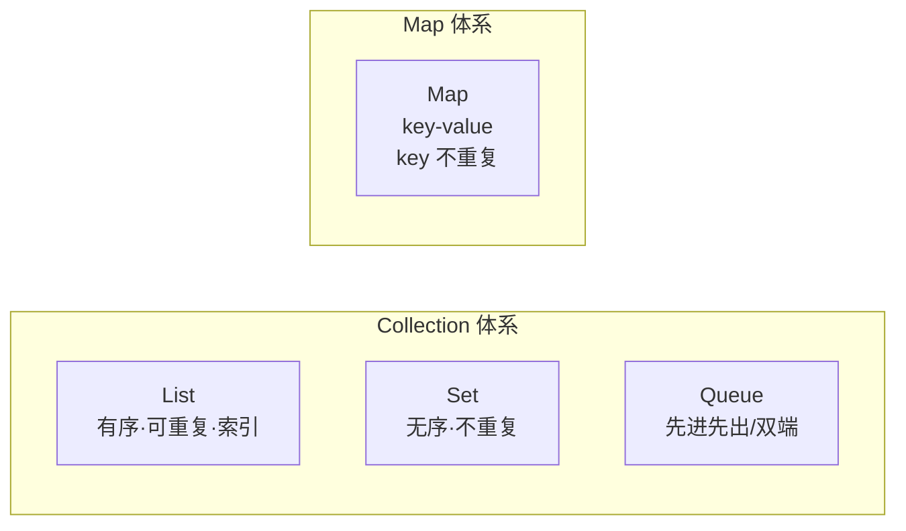

# 01 · 集合体系总览（Collection Overview）

> Java 集合分 `Collection`（单列）和 `Map`（双列）两大体系；List 有序可重复、Set 无序不重复、Queue 队列、Map 键值对。面试重要度：⭐⭐⭐（作为集合章开篇必须能画出体系图并说清各自特点）。

## 📖 核心知识

Java 集合框架（JCF）位于 `java.util` 包，顶层是两个互相独立的接口：

- **`Collection`**：单列集合的根接口，继承自 `Iterable`（所以能用增强 for 和迭代器）。下分 `List`、`Set`、`Queue` 三大子接口。
- **`Map`**：双列集合（键值对）的根接口，**不继承 `Collection`**，是独立体系。

各接口特点：

| 接口 | 是否有序 | 是否可重复 | 典型实现 | 底层结构 |
| --- | --- | --- | --- | --- |
| `List` | 有序（插入顺序，带索引） | 可重复 | `ArrayList`/`LinkedList` | 数组 / 双向链表 |
| `Set` | 一般无序 | 不可重复 | `HashSet`/`TreeSet` | 哈希表 / 红黑树 |
| `Queue` | 有序（FIFO） | 可重复 | `LinkedList`/`ArrayDeque` | 链表 / 数组 |
| `Map` | 一般无序 | key 唯一，value 可重复 | `HashMap`/`TreeMap` | 哈希表 / 红黑树 |

> 「有序」有两层含义要区分：**插入顺序**（`ArrayList`、`LinkedHashMap`）和 **排序顺序**（`TreeMap`、`TreeSet`）。`HashMap`/`HashSet` 两种都不保证。

## 🔑 面试要点

- `Collection` 和 `Map` 是**两个独立的顶层接口**，`Map` 不属于 `Collection`。
- `Collection` 继承 `Iterable`，因此单列集合都支持迭代器和增强 for；`Map` 要先 `entrySet()`/`keySet()` 再遍历。
- `List`：有序、可重复、有索引。`Set`：不重复。`Queue`：FIFO 队列。`Map`：key-value。
- `HashSet` 底层是 `HashMap`、`TreeSet` 底层是 `TreeMap`、`LinkedHashSet` 底层是 `LinkedHashMap`——Set 基本都靠 Map 实现。
- 线程安全类（`Vector`、`Hashtable`、`Collections.synchronizedXxx`）性能差，并发场景用 `ConcurrentHashMap`、`CopyOnWriteArrayList`。

## ❓ 高频面试题

**Q：`Collection` 和 `Collections` 有什么区别？**
A：`Collection` 是单列集合的顶层**接口**；`Collections` 是一个**工具类**（`java.util.Collections`），提供 `sort`、`reverse`、`synchronizedList`、`unmodifiableList` 等静态方法。

**Q：List、Set、Map 怎么选？**
A：需要按下标随机访问、允许重复用 `List`；需要去重用 `Set`；需要键值映射用 `Map`。要排序用 `TreeXxx`，要保留插入顺序用 `LinkedXxx`。

**Q：ArrayList、LinkedList、Vector 区别？**
A：`ArrayList` 数组、非线程安全、查询快；`LinkedList` 双向链表、增删快；`Vector` 数组 + 方法加 `synchronized`、线程安全但性能差、已基本淘汰。

## ⚠️ 易错点 / 加分项

- 误以为 `Map` 继承自 `Collection`——它们是并列的两套体系。
- 说 Set「无序」不够准确：`LinkedHashSet` 保留插入顺序，`TreeSet` 是排序的，只有 `HashSet` 才是真无序。
- 加分：能点出「Set 大多是对应 Map 的一层封装（value 用一个固定的 `PRESENT` 占位对象）」。
- 加分：`Queue` 的 `ArrayDeque` 既能当队列也能当栈，官方推荐用它替代老旧的 `Stack`（`Stack` 继承 `Vector`、全同步、性能差）。
