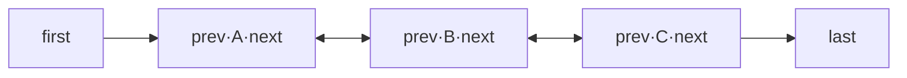

# 03 · LinkedList

> 基于**双向链表**实现，增删（头尾）O(1) 快、按下标查询 O(n) 慢，同时实现了 `List` 和 `Deque`，可当链表、栈、队列、双端队列用。面试重要度：⭐⭐。

## 📖 核心知识

`LinkedList` 底层是一个**双向链表**，每个节点是内部类 `Node`，持有 `prev`、`next` 指针和 `item` 值，另有 `first`、`last` 两个指针和 `size` 字段。



**增删快**：头尾增删只改几个指针引用，**O(1)**；已知节点引用时中间增删也是 O(1)。但**中间按下标插入/删除**需要先定位节点（O(n)）再改指针。

**查询慢**：没有下标数组，`get(i)` 要从 `first`（或 `last`，二分选近的一端）沿指针走，**O(n)**。

**没有扩容概念**：链表按需 new 节点，不需要像 `ArrayList` 那样扩容拷贝；但每个节点额外存两个指针，**内存开销比 ArrayList 大**。

**多重身份**：`LinkedList` 实现了 `Deque` 接口，因此可以直接当：

```java
LinkedList<Integer> list = new LinkedList<>();
// 当队列（FIFO）
list.offer(1); list.poll();
// 当栈（LIFO）
list.push(1); list.pop();
// 当双端队列
list.addFirst(0); list.addLast(9);
```

> 但当栈/队列用时，官方更推荐 `ArrayDeque`——基于数组、无节点对象开销、缓存友好，性能通常更好。

## 🔑 面试要点

- 底层双向链表（`Node` 有 prev/next），维护 `first`/`last` 指针。
- 头尾增删 O(1)；按下标 `get`/中间增删 O(n)（要先遍历定位）。
- `get(i)` 会根据 i 靠前还是靠后，选择从头或从尾遍历（折半优化）。
- 无扩容拷贝，但每个节点有额外指针开销，内存占用大。
- 实现了 `List` + `Deque`，可当链表/栈/队列/双端队列。
- 非线程安全；同样有 `modCount` 的 fail-fast。

## ❓ 高频面试题

**Q：LinkedList 查询慢，那它的增删一定快吗？**
A：不一定。**头尾**或已持有节点引用时增删是 O(1)；但「按下标 `add(i,e)`/`remove(i)`」要先 O(n) 遍历找到位置，整体仍是 O(n)。所谓「增删快」主要指头尾操作和迭代器遍历中的删除。

**Q：既然 LinkedList 能当栈和队列，为什么还推荐 ArrayDeque？**
A：`ArrayDeque` 基于循环数组，没有 `Node` 对象的内存和 GC 开销，CPU 缓存局部性更好，作为栈/队列的性能通常优于 `LinkedList`，也优于老旧的 `Stack`。

**Q：ArrayList 和 LinkedList 谁更省内存？**
A：多数情况 `ArrayList` 更省。`LinkedList` 每个元素要额外存 prev/next 两个引用（约多 2 个指针 + 对象头）；`ArrayList` 只在扩容时可能有预留空位浪费。

## ⚠️ 易错点 / 加分项

- 别一句「LinkedList 增删快」了事——要区分「头尾/已定位」是 O(1)，「按下标」仍需 O(n) 遍历。
- 实际开发中 `LinkedList` 用得远比想象少，绝大多数场景 `ArrayList` 就够且更快；随机访问多的场景绝不能用 `LinkedList`。
- 加分：`LinkedList` 的 `get(index)` 源码里有个小优化——`if (index < size/2)` 从头找，否则从尾找，把平均遍历距离减半。
- 加分：`LinkedList` 允许存 `null` 元素。
