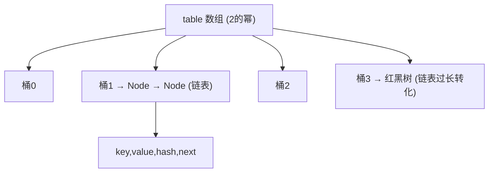
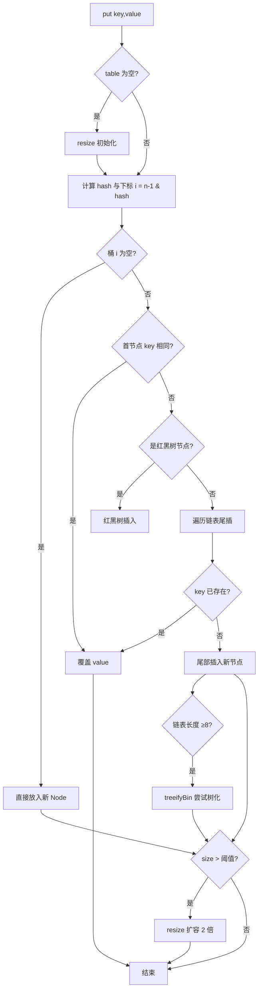

# 05 · HashMap ⭐

> 面试最高频的集合。JDK 8 底层为**数组 + 链表 + 红黑树**，靠 hash 扰动定位桶，默认容量 16、负载因子 0.75，链表长度 ≥8 且数组 ≥64 时转红黑树，扩容 2 倍。面试重要度：⭐⭐⭐（必须讲透原理）。

## 📖 核心知识

### 整体结构

`HashMap` 底层是一个 `Node<K,V>[] table` 数组（桶数组），每个桶存一条链表；JDK 8 起当链表过长会转成**红黑树**以提升查询效率。



- **key 的位置** = `(n - 1) & hash`，n 是数组长度。因为 n 是 2 的幂，`(n-1)` 全是低位 1，`&` 相当于对 n 取模但更快。
- 同一个桶里 hash 冲突的元素用链表（尾插）串起来；链表过长转红黑树。

### hash 扰动函数

```java
static final int hash(Object key) {
    int h;
    return (key == null) ? 0 : (h = key.hashCode()) ^ (h >>> 16);
}
```

把 `hashCode` 的**高 16 位与低 16 位异或**。因为 `(n-1) & hash` 定位桶时只用到低位，若不扰动，高位信息浪费、低位相同的 key 会大量碰撞。扰动让高位也参与运算，**减少哈希冲突**，且计算成本低。

### put 流程



关键点：先判断桶是否为空，再判断首节点、红黑树、链表；链表尾插后若长度达 8 触发树化；最后 `++size > threshold` 则扩容。

### 默认容量 16 与负载因子 0.75

- 默认容量 `DEFAULT_INITIAL_CAPACITY = 16`（必须是 2 的幂）。
- 负载因子 `DEFAULT_LOAD_FACTOR = 0.75f`，阈值 `threshold = 容量 × 0.75`，即 16×0.75 = 12，`size > 12` 就扩容。
- 0.75 是**时间与空间的折中**：太大（如 1.0）冲突多、查询慢；太小（如 0.5）浪费空间、频繁扩容。0.75 让泊松分布下桶内冲突概率较低。

### 扩容 resize（2 倍）

容量不够时扩容为**原来的 2 倍**（16→32→64…），新建数组并重新分配元素。JDK 8 优化：由于容量是 2 的幂、翻倍后只多了最高一个 bit，元素**要么留在原索引 `j`，要么移到 `j + oldCap`**，通过 `(hash & oldCap) == 0` 判断，无需重新计算 hash，效率高（详见 [06](./06-hashmap-jdk7-vs-jdk8.md)）。

### 树化阈值 8 与 64

- **链表转红黑树**：链表长度 ≥ **8**（`TREEIFY_THRESHOLD`）**且** 数组长度 ≥ **64**（`MIN_TREEIFY_CAPACITY`）。若数组 < 64，优先**扩容**而非树化。
- **红黑树退化链表**：树节点 ≤ **6**（`UNTREEIFY_THRESHOLD`）时退回链表。
- 为什么是 8？理想哈希下泊松分布中一个桶达到 8 个元素的概率极低（约千万分之六），正常不会树化；8 是「哈希严重不均」的兜底信号。设 6 和 8 之间留缓冲（避免在 7、8 之间反复转换）。

### 为什么容量必须是 2 的幂

- 定位下标用 `(n-1) & hash` 代替 `hash % n`，位运算比取模快，前提是 n 为 2 的幂时二者等价。
- 保证 `(n-1)` 的二进制低位全为 1，`&` 后 hash 的每一位都能参与，分布更均匀、冲突更少。
- 扩容时能用「原位 or 原位+oldCap」的高效迁移。
- 即使传入非 2 的幂的初始容量，`tableSizeFor()` 会把它**向上取整到最近的 2 的幂**。

## 🔑 面试要点

- JDK 8 结构：数组 + 链表 + 红黑树。
- 定位下标：`(n-1) & hash`；hash 扰动 = `hashCode() ^ (hashCode()>>>16)`。
- 默认容量 16、负载因子 0.75、阈值 12；扩容 2 倍。
- 树化条件：链表长 ≥8 **且** 数组长 ≥64；否则先扩容。退化阈值 6。
- 容量必须是 2 的幂：位运算取模 + 分布均匀 + 高效扩容。
- put 用尾插法（JDK 8）；允许一个 null key、多个 null value。
- 非线程安全，并发下会丢数据/死循环，多线程用 `ConcurrentHashMap`。

## ❓ 高频面试题

**Q：HashMap 的 put 过程？**
A：① 计算 key 的扰动 hash；② `(n-1)&hash` 定位桶；③ 桶空直接放；④ 非空则比较 key（`hash` 相等且 `equals` 相等则覆盖）；⑤ 是红黑树走树插入，是链表则尾插，链表长 ≥8 尝试树化；⑥ `++size > threshold` 则 resize 扩容。

**Q：为什么 HashMap 容量是 2 的幂？**
A：让 `(n-1)&hash` 等价于取模且更快，同时 `(n-1)` 低位全 1 使哈希分布更均匀、减少冲突，扩容迁移也能高效判断新位置。传入非 2 的幂会被 `tableSizeFor` 向上取整。

**Q：为什么树化阈值是 8，还要数组 ≥64？**
A：8 来自泊松分布——理想哈希下桶内到 8 个元素概率极低，是哈希异常的兜底。要求数组 ≥64 是因为数组太小冲突本就多，此时应优先扩容分散元素，而不是把小表里的链表急着变红黑树。

**Q：负载因子为什么是 0.75？**
A：空间与时间折中。过大冲突多查询慢，过小浪费内存且频繁扩容；0.75 在泊松分布下能让冲突概率和空间利用率取得较好平衡。

**Q：HashMap 允许 null 吗？**
A：允许 **1 个 null key**（hash 固定为 0，放在桶 0）和**多个 null value**。`ConcurrentHashMap` 则都不允许 null。

## ⚠️ 易错点 / 加分项

- 别只说「链表长 8 就树化」——还需**数组长度 ≥64**，否则只扩容不树化。
- 别把「负载因子 0.75」和「扩容 2 倍」搞混：0.75 决定**何时**扩，2 倍决定**扩多少**。
- key 一定要正确重写 `hashCode` 和 `equals`，否则会「存不进/取不出」；用不可变对象（如 `String`、`Integer`）当 key 最安全。
- 加分：JDK 8 扩容后不重算 hash，用 `(hash & oldCap)==0` 判断留原位还是移到 `原位+oldCap`，且改用尾插避免了 JDK 7 的并发死循环。
- 加分：`hashCode` 相同不代表 `equals` 相同（哈希冲突），所以定位到桶后仍要逐个 `equals` 比较。
