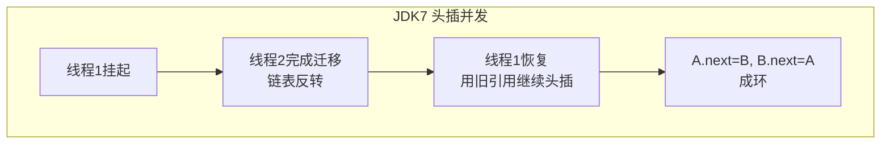

# 06 · HashMap JDK7 vs JDK8

> JDK7 是数组+链表、头插法（并发扩容会成环死循环）；JDK8 引入红黑树、改用尾插法，并优化了扩容迁移（不重算 hash）。面试重要度：⭐⭐⭐（版本差异是常考点）。

## 📖 核心知识

### 结构差异

| 维度 | JDK 7 | JDK 8 |
| --- | --- | --- |
| 底层结构 | 数组 + 链表 | 数组 + 链表 + **红黑树** |
| 节点类 | `Entry` | `Node` / `TreeNode` |
| 插入方式 | **头插法** | **尾插法** |
| hash 扰动 | 4 次位运算扰动 | 1 次 `h ^ (h>>>16)` |
| 扩容时机 | 先判断再插入 | 先插入再判断 |
| 扩容迁移 | 重新 `indexFor` 计算位置 | `(hash & oldCap)` 判断，原位或原位+oldCap |

### JDK7 头插法与并发死循环

JDK7 扩容时把旧链表节点搬到新数组用的是**头插法**——迁移后链表顺序会反转。单线程没问题，但**多线程并发扩容**时，两个线程同时 `transfe`r 同一条链表，可能让节点的 `next` 指针互相指向，形成**环形链表**。之后 `get` 命中这个桶就会**无限循环**（CPU 飙到 100%）。

> 注意：这是「数据结构损坏导致死循环」，本质仍是 `HashMap` 非线程安全——**任何版本都不该在多线程写 HashMap**。JDK8 修复了「死循环」，但并发下仍可能丢数据、覆盖，多线程请用 `ConcurrentHashMap`。

### JDK8 的改进

1. **尾插法**：迁移时保持原链表顺序，从根本上避免成环死循环。
2. **红黑树**：链表长 ≥8 且数组 ≥64 时转红黑树，把最坏查询从 O(n) 降到 O(log n)，抵御哈希碰撞攻击。
3. **扩容迁移优化**：容量翻倍后，元素新位置只取决于 hash 在 `oldCap` 那一位是 0 还是 1：
   - `(hash & oldCap) == 0` → 留在原索引 `j`；
   - `(hash & oldCap) != 0` → 移到 `j + oldCap`。
   - 无需重新计算 hash 和取模，一条链表被拆成 lo、hi 两条，效率更高。
4. **扰动函数简化**：从 JDK7 的多次移位异或简化为一次高低 16 位异或，效果相近但更快。

## 🔑 面试要点

- JDK7 数组+链表+头插；JDK8 数组+链表+红黑树+尾插。
- JDK7 并发扩容头插会形成环形链表 → `get` 死循环（CPU 100%）。
- JDK8 尾插修复死循环，但**仍非线程安全**（会丢数据），并发用 `ConcurrentHashMap`。
- JDK8 红黑树把冲突严重时的查询从 O(n) 优化到 O(log n)。
- JDK8 扩容用 `(hash & oldCap)` 拆成 lo/hi 两链，不重算 hash。
- JDK8 扰动函数简化为一次高低位异或。

## ❓ 高频面试题

**Q：JDK7 的 HashMap 为什么并发下会死循环？**
A：JDK7 扩容 `transfer` 用头插法迁移链表，多线程同时迁移同一桶时，节点 next 指针可能互相指向形成环形链表，后续 `get` 遍历该桶就无限循环。JDK8 改尾插法解决了这个问题。

**Q：JDK8 改成尾插就线程安全了吗？**
A：不是。尾插只解决了「死循环」，并发 put 仍可能因为多个线程同时写同一桶而**互相覆盖、丢数据**，`size` 也会算错。`HashMap` 任何版本都不是线程安全的。

**Q：JDK8 扩容是怎么优化的？**
A：容量翻倍，新下标只差最高一位。用 `(hash & oldCap)` 判断：为 0 留原位，非 0 移到 `原位 + oldCap`。把旧链拆成低位链和高位链两条分别挂到新数组，避免了逐个重新取模，也保持了顺序。

## ⚠️ 易错点 / 加分项

- 把「死循环」说成「JDK8 也有」是错的——JDK8 已用尾插修复，但会换成「丢数据」问题。
- 死循环发生在**扩容 transfer 阶段**，不是 put 冲突本身。
- 加分：能说清 JDK8 扩容「lo/hi 双链拆分 + `(hash&oldCap)` 判断」的细节，是区分背书和理解的关键点。
- 加分：红黑树的引入不仅提升性能，也是为了防御**恶意构造大量 hash 碰撞 key** 的 DoS 攻击。
