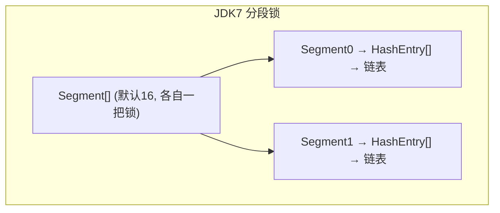
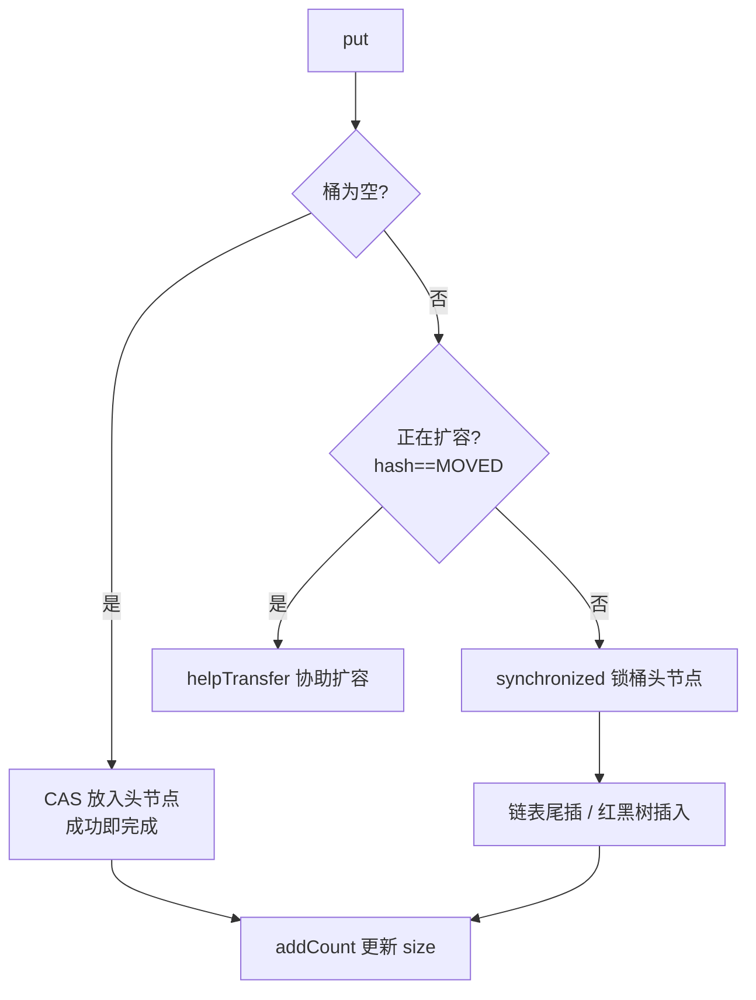

# 07 · ConcurrentHashMap ⭐

> 线程安全的 HashMap。JDK7 用**分段锁 Segment**（锁一段），JDK8 改为 **CAS + synchronized 锁单个桶 + 红黑树**，锁粒度更细、并发度更高；读操作无锁，且不允许 null。面试重要度：⭐⭐⭐。

## 📖 核心知识

### JDK7：分段锁 Segment

JDK7 把整个 map 拆成若干 **`Segment`**（默认 16 个），每个 Segment 继承 `ReentrantLock`，内部各自是一个小 HashMap（`HashEntry[]`）。

- 写不同 Segment 的线程互不阻塞，**并发度 = Segment 数（默认 16）**。
- 结构上是「Segment 数组 + HashEntry 数组 + 链表」两级哈希。
- 缺点：并发度被 Segment 数量写死，锁粒度仍是「一段」而非「一个桶」。

### JDK8：CAS + synchronized + 红黑树

JDK8 **抛弃 Segment**，结构与 HashMap 一致（`Node[]` 数组 + 链表 + 红黑树），线程安全靠：

- **CAS**：桶为空时，用 `casTabAt` 无锁地把新节点 CAS 进去，成功即完成，失败自旋。
- **synchronized**：桶非空（发生冲突）时，只 `synchronized` **锁住该桶的头节点**，锁粒度细化到「单个桶」，并发度 ≈ 桶数量，远高于 JDK7。
- **红黑树**：同 HashMap，链表过长转树。

### put / get

- **put**：定位桶 → 空则 CAS → 非空则 `synchronized` 锁头节点后插入 → `addCount` 更新计数并检测扩容。
- **get 无锁读**：`Node` 的 `val` 和 `next` 都用 **`volatile`** 修饰，保证可见性，因此 `get` 全程不加锁，直接读，性能高。

### size 计算：CounterCell

JDK8 不像 JDK7 那样锁所有 Segment 求和。它用 **`baseCount` + `CounterCell[]`** 分而治之：并发更新时把计数分散到多个 `CounterCell`（类似 `LongAdder` 思想）减少竞争，`size()` 时把 `baseCount` 和所有 cell 累加。因此 `size()` 是**近似值**（弱一致），高并发下不保证精确。

### 为什么不允许 null

`ConcurrentHashMap` 的 key 和 value 都**不允许 null**。原因：并发场景下 `map.get(k)` 返回 null 有**二义性**——无法区分「key 不存在」还是「key 存在但 value 是 null」，而单线程可以再用 `containsKey` 确认，多线程下两步之间值可能被改，无法消除歧义。作者 Doug Lea 干脆禁止 null。`HashMap` 是单线程容器，所以允许 null。

## 🔑 面试要点

- JDK7：Segment 分段锁（`ReentrantLock`），并发度 = Segment 数（默认 16）。
- JDK8：CAS（空桶）+ synchronized（锁单个桶头节点）+ 红黑树，锁粒度更细。
- get 无锁：`val`/`next` 用 `volatile` 保证可见性。
- put：空桶 CAS，冲突锁头节点；发现扩容会 `helpTransfer` 协助迁移。
- size：`baseCount + CounterCell[]`（LongAdder 思想），结果是弱一致近似值。
- key、value **都不允许 null**（避免 get 返回 null 的二义性）。
- 只保证单个操作原子，`get` 后 `put` 这类**复合操作仍需额外同步**（或用 `computeIfAbsent`/`merge`）。

## ❓ 高频面试题

**Q：ConcurrentHashMap JDK7 和 JDK8 有什么区别？**
A：JDK7 用 Segment 分段锁，一段一把 `ReentrantLock`，并发度固定为 Segment 数；JDK8 去掉 Segment，改用 CAS + synchronized 锁**单个桶头节点**，锁粒度从「段」细化到「桶」，并发度更高，还引入红黑树优化冲突。

**Q：ConcurrentHashMap 的 get 要加锁吗？**
A：不用。节点的 `val` 和 `next` 用 `volatile` 修饰，保证多线程可见性，`get` 直接无锁读，这是它高性能的重要原因。

**Q：为什么 ConcurrentHashMap 不允许 null key/value？**
A：并发下 `get` 返回 null 无法区分「无此 key」和「value 为 null」，而多线程无法像单线程那样安全地再用 `containsKey` 二次确认，存在二义性，因此禁止 null。

**Q：ConcurrentHashMap 能保证复合操作线程安全吗？**
A：不能。它只保证**单个** put/get/remove 原子。像「先 get 判断再 put」的复合逻辑仍有竞态，应使用原子方法 `putIfAbsent`、`computeIfAbsent`、`merge`。

**Q：它的 size() 准确吗？**
A：是弱一致的近似值。JDK8 用 `baseCount + CounterCell[]` 分散计数（LongAdder 思想）降低竞争，高并发瞬间的 `size()` 可能不完全精确。

## ⚠️ 易错点 / 加分项

- 别说 JDK8 还用 Segment——JDK8 已移除，Segment 仅为兼容序列化象征性保留。
- 别把 `synchronized` 锁的对象说成整个 map——JDK8 只锁**当前桶的头节点**。
- 复合操作不安全是高频坑：`if(!map.containsKey(k)) map.put(k,v)` 在并发下会出错，要用 `putIfAbsent`。
- 加分：JDK8 用 `synchronized` 而非 `ReentrantLock`，因为 JDK6 后 synchronized 有锁升级优化、且锁的是无竞争居多的单个桶，开销小、还省内存。
- 加分：扩容时其它线程 put 若发现桶是 `ForwardingNode`(hash=MOVED)，会调用 `helpTransfer` 一起搬迁，多线程协同扩容。
- 对比 `Hashtable`：`Hashtable` 直接给方法加 `synchronized` 锁**整张表**，并发极差，已淘汰。
