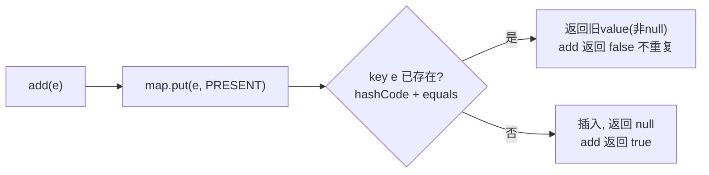

# 08 · HashSet

> 基于 `HashMap` 实现的无序、不重复集合——元素当 key 存进内部 HashMap，value 用一个固定的 `PRESENT` 占位对象，靠 HashMap 的 key 唯一性保证不重复。面试重要度：⭐⭐。

## 📖 核心知识

`HashSet` 内部就是一个 `HashMap`：

```java
private transient HashMap<E, Object> map;
private static final Object PRESENT = new Object(); // 所有 value 共用的占位对象

public HashSet() { map = new HashMap<>(); }

public boolean add(E e) {
    return map.put(e, PRESENT) == null; // 元素作 key，PRESENT 作 value
}

public boolean contains(Object o) { return map.containsKey(o); }
public boolean remove(Object o)   { return map.remove(o) == PRESENT; }
```

**如何保证唯一**：`add` 调用 `map.put(e, PRESENT)`。HashMap 的 key 本身就唯一——put 时先比较 hash，再用 `equals` 比较 key，若已存在则**覆盖 value 并返回旧 value**（非 null），`add` 因此返回 `false`，元素不会重复加入。所以去重逻辑完全**复用了 HashMap 的 key 判重机制**。

**去重依赖 hashCode + equals**：判断两个元素是否「相同」，先看 `hashCode()`（定位桶），再看 `equals()`（桶内比较）。因此自定义对象放进 `HashSet` **必须正确重写 `hashCode` 和 `equals`**，否则逻辑相等的对象会被当成不同元素重复存入。



## 🔑 面试要点

- `HashSet` 底层是 `HashMap`，元素作 key，value 是共享的 `PRESENT` 占位对象。
- 去重靠 HashMap 的 key 唯一性：`hashCode()` 定位桶 + `equals()` 桶内比较。
- 自定义对象入 Set 必须同时重写 `hashCode` 和 `equals`。
- 无序（不保证插入/排序顺序）、允许一个 null 元素、非线程安全。
- `LinkedHashSet` 底层 `LinkedHashMap`（保留插入顺序）；`TreeSet` 底层 `TreeMap`（排序）。

## ❓ 高频面试题

**Q：HashSet 如何保证元素不重复？**
A：它把元素作为内部 `HashMap` 的 key 存入。HashMap 的 key 天然唯一——put 时先比 hashCode 定位桶，再用 equals 比较，若已存在则覆盖并返回旧值，`add` 返回 false，从而实现去重。

**Q：往 HashSet 放自定义对象要注意什么？**
A：必须正确重写 `hashCode()` 和 `equals()`。只重写 equals 不重写 hashCode，两个相等对象可能落入不同桶而无法判重；两者要保持一致（equals 相等则 hashCode 必须相等）。

**Q：HashSet 和 HashMap 什么关系？**
A：`HashSet` 是对 `HashMap` 的封装，所有操作都委托给内部的 `HashMap`，value 全部用一个 `PRESENT` 占位对象。

## ⚠️ 易错点 / 加分项

- 只重写 `equals` 不重写 `hashCode` 是经典 bug：会导致 Set 里出现「看起来相同」的重复元素。
- `HashSet` 无序，别指望它保留插入顺序——要顺序用 `LinkedHashSet`，要排序用 `TreeSet`。
- 加分：`add` 返回 `boolean` 表示是否真正加入（已存在返回 false），可用来判断元素是否首次出现。
- 加分：能点出「Java 里几乎所有 Set 都是对应 Map 的薄封装」，体现对集合体系的整体理解。
