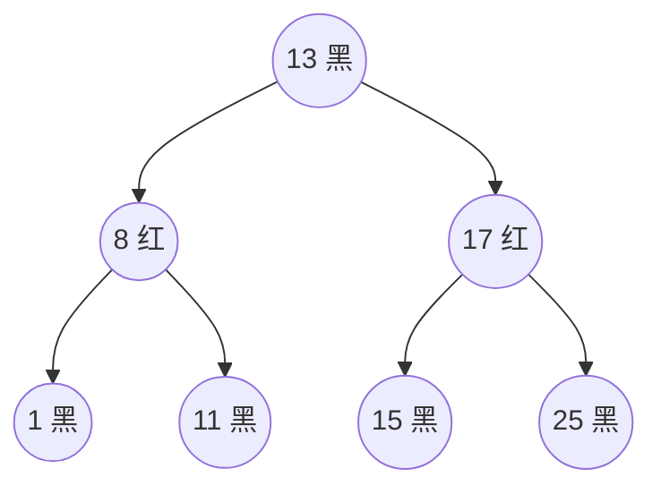

# 09 · TreeMap / TreeSet

> 基于**红黑树**（自平衡二叉查找树）的有序集合，元素/key 按**自然顺序或自定义 Comparator** 排序，增删查均 O(log n)。`TreeSet` 底层就是 `TreeMap`。面试重要度：⭐⭐。

## 📖 核心知识

`TreeMap` 底层是一棵**红黑树**（`Red-Black Tree`），实现了 `NavigableMap`。它按 key 排序存储，因此天然支持范围查询和顺序遍历。`TreeSet` 内部持有一个 `TreeMap`，逻辑同 `HashSet` 之于 `HashMap`。

**红黑树**是一种近似平衡的二叉查找树，满足：节点非红即黑、根黑、红节点子节点必黑、任一节点到叶子路径黑节点数相同。这些规则保证树高约为 `2·log(n)`，使 `get/put/remove` 稳定在 **O(log n)**。

**排序两种方式**：

```java
// 1) 自然排序：key 实现 Comparable，用其 compareTo
TreeMap<Integer, String> m1 = new TreeMap<>();       // Integer 天然有序

// 2) 定制排序：构造时传入 Comparator（优先级更高）
TreeMap<String, Integer> m2 = new TreeMap<>(Comparator.reverseOrder());
TreeSet<User> set = new TreeSet<>(Comparator.comparingInt(User::getAge));
```

若既没传 `Comparator`，key 又没实现 `Comparable`，插入时会抛 `ClassCastException`。（详见 [11-comparable-comparator](./11-comparable-comparator.md)）

**导航方法**（TreeMap/TreeSet 独有，面试加分）：`firstKey`/`lastKey`、`floorKey`（≤ 给定值的最大）、`ceilingKey`（≥ 给定值的最小）、`higherKey`/`lowerKey`、`headMap`/`tailMap`/`subMap` 范围视图。



## 🔑 面试要点

- 底层红黑树，`TreeSet` 依赖 `TreeMap`，key/元素**有序**。
- 增删改查 O(log n)（HashMap 是均摊 O(1)，但无序）。
- 排序两种：key 实现 `Comparable`（自然排序）或构造传 `Comparator`（定制，优先）。
- 两者都没有，插入抛 `ClassCastException`。
- key **不允许 null**（比较时会 NPE；空 map 放第一个 null 也会因比较报错）。
- 支持导航/范围查询：`floor/ceiling/higher/lower`、`subMap/headMap/tailMap`。
- 非线程安全。

## ❓ 高频面试题

**Q：TreeMap 怎么实现有序？和 HashMap 区别？**
A：`TreeMap` 底层红黑树，按 key 的 `Comparable` 或 `Comparator` 排序，遍历有序，操作 O(log n)；`HashMap` 底层哈希表，无序，操作均摊 O(1)。需要排序或范围查询用 TreeMap，只需快速存取用 HashMap。

**Q：TreeMap 的排序规则怎么定？**
A：优先用构造时传入的 `Comparator`；没传则要求 key 实现 `Comparable`，用 `compareTo`。两者都没有则插入抛 `ClassCastException`。

**Q：TreeSet 和 TreeMap 关系？**
A：`TreeSet` 内部就是一个 `TreeMap`，元素作 key、共享占位对象作 value，去重和排序都复用 TreeMap。

## ⚠️ 易错点 / 加分项

- `TreeMap` 判断 key 是否「重复」用的是**比较结果 == 0**，不是 `equals`——若 Comparator 逻辑与 equals 不一致，可能出现「equals 不等但被当同一个 key 覆盖」。
- key 不能为 null（不同于 HashMap 允许一个 null key）。
- 加分：需要「保留插入顺序」用 `LinkedHashMap`，需要「排序」才用 `TreeMap`，别混淆两种「有序」。
- 加分：红黑树 vs AVL 树——红黑树牺牲了严格平衡换取更少的旋转次数，插入删除性能更均衡，适合频繁增删的 Map。
