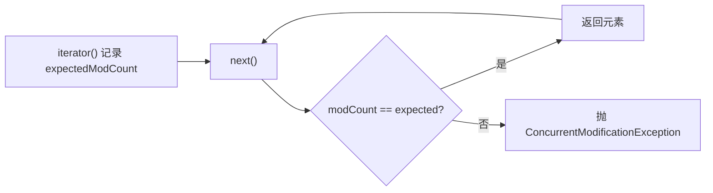

# 10 · fail-fast 与 fail-safe

> fail-fast（快速失败）：遍历中集合结构被改就立刻抛 `ConcurrentModificationException`，靠 `modCount` 检测；fail-safe（安全失败）：遍历副本或并发结构，不抛异常但可能读到旧数据。面试重要度：⭐⭐⭐。

## 📖 核心知识

### fail-fast 原理（modCount）

`ArrayList`、`HashMap` 等 `java.util` 下的集合都有一个 `modCount` 字段，记录集合**结构性修改**（add/remove/扩容等）的次数。创建迭代器时，会把当时的 `modCount` 存入迭代器的 `expectedModCount`。每次 `next()`/`remove()` 都执行 `checkForComodification()`：

```java
final void checkForComodification() {
    if (modCount != expectedModCount)
        throw new ConcurrentModificationException();
}
```

一旦遍历过程中集合被**结构性修改**（比如直接 `list.remove(x)`），`modCount` 变了而 `expectedModCount` 没变，下次迭代立即抛 `ConcurrentModificationException`——**快速失败**，尽早暴露问题而不是返回错乱数据。



**触发场景**：
- 单线程遍历时直接调集合的 `add`/`remove`（而非迭代器的 remove）。
- 多线程一个遍历、另一个修改。

> 注意：fail-fast **不保证一定检测到**（`modCount` 是普通 int，无同步），它只是一种「尽力而为」的错误检测机制，**不能用作并发正确性的保证**。

### 正确的遍历删除

```java
// ✅ 用迭代器的 remove，它会同步更新 expectedModCount
Iterator<Integer> it = list.iterator();
while (it.hasNext()) {
    if (it.next() == 2) it.remove();
}
// ✅ JDK 8+
list.removeIf(x -> x == 2);
```

### fail-safe（安全失败）

fail-safe 的迭代器在**副本**上遍历或用并发友好结构，因此遍历时修改**不会抛异常**，代价是可能读不到最新修改（弱一致性）。典型代表：

- **`CopyOnWriteArrayList` / `CopyOnWriteArraySet`**：写时复制。修改时拷贝一份新数组改完再替换引用，迭代器持有旧数组快照，读写不冲突、读无锁。适合**读多写少**。
- **`ConcurrentHashMap`**：迭代器弱一致，遍历不抛 `ConcurrentModificationException`，能容忍并发修改。

### 对比表

| 维度 | fail-fast | fail-safe |
| --- | --- | --- |
| 代表容器 | `ArrayList`、`HashMap`（java.util） | `CopyOnWriteArrayList`、`ConcurrentHashMap`（java.util.concurrent） |
| 遍历时修改 | 抛 `ConcurrentModificationException` | 不抛异常 |
| 检测机制 | `modCount` 比对 | 遍历副本 / 弱一致迭代器 |
| 数据一致性 | 实时（但会中断） | 可能读到旧数据 |
| 用途 | 及早暴露 bug | 并发遍历 |

## 🔑 面试要点

- fail-fast 靠 `modCount` 与迭代器 `expectedModCount` 比对，不一致就抛 `ConcurrentModificationException`。
- 结构性修改（add/remove/扩容）才改 `modCount`；`set(i)` 改值不算。
- 正确的遍历删除：用 `Iterator.remove()` 或 `removeIf()`。
- fail-fast 是**尽力检测**，不能当并发安全保证。
- fail-safe 遍历副本/弱一致（`CopyOnWriteArrayList`、`ConcurrentHashMap`），不抛异常但可能读旧值。

## ❓ 高频面试题

**Q：什么是 fail-fast？怎么触发的？**
A：集合遍历过程中若被结构性修改，迭代器检测到 `modCount != expectedModCount` 就立即抛 `ConcurrentModificationException`。常见于 for-each 里直接调 `list.remove()`，或多线程一边遍历一边改。

**Q：遍历时怎么安全地删除元素？**
A：用迭代器自己的 `remove()`（它会同步 `expectedModCount`），或用 JDK 8 的 `removeIf()`；不要直接调集合的 `remove`。

**Q：ConcurrentModificationException 一定发生在多线程吗？**
A：不一定。单线程 for-each 里直接 `list.remove()` 也会触发，因为改了 `modCount`。

**Q：CopyOnWriteArrayList 为什么遍历不抛异常？**
A：它是写时复制——写操作复制新数组，迭代器持有的是旧数组快照，遍历和修改互不影响，所以是 fail-safe；缺点是写开销大、迭代期间看不到新修改。

## ⚠️ 易错点 / 加分项

- `list.set(index, val)` 只改值不改结构，**不会**触发 fail-fast；只有 add/remove 才会。
- fail-fast 不是并发安全机制，别指望它保护多线程正确性——真并发要用并发容器。
- 加分：`CopyOnWriteArrayList` 适合读多写少（如白名单、监听器列表），写多会因频繁复制数组导致性能和内存问题。
- 加分：能点出「fail-fast 检测是 best-effort，`modCount` 无 volatile/同步，多线程下甚至可能漏检」。
