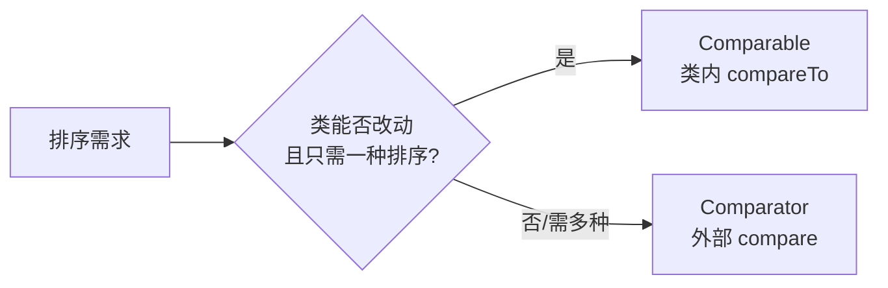

# 11 · Comparable 与 Comparator

> `Comparable` 是类**内部**的自然排序（实现 `compareTo`），`Comparator` 是**外部**定制的比较器（实现 `compare`）；前者「一种固定排序」，后者「灵活多种排序」。面试重要度：⭐⭐。

## 📖 核心知识

### Comparable（内部自然排序）

`java.lang.Comparable`，让类**自己**具备排序能力，实现 `compareTo(T o)`：

```java
public class User implements Comparable<User> {
    int age;
    @Override
    public int compareTo(User o) {
        return Integer.compare(this.age, o.age); // 按年龄升序（自然顺序）
    }
}
Collections.sort(userList); // 直接用自然顺序排序
```

`Integer`、`String`、`Double` 等都实现了 `Comparable`，所以能直接排序、直接放进 `TreeMap`/`TreeSet`。

### Comparator（外部定制排序）

`java.util.Comparator`，是**独立于类之外**的比较器，实现 `compare(T o1, T o2)`。不改动原类，可为同一个类定义**多种排序规则**：

```java
// 按年龄降序
userList.sort(Comparator.comparingInt(User::getAge).reversed());
// 先按年龄升序，再按姓名升序（多级排序）
userList.sort(Comparator.comparingInt(User::getAge)
                        .thenComparing(User::getName));
// TreeSet 传入定制比较器
TreeSet<User> set = new TreeSet<>(Comparator.comparing(User::getName));
```

### 返回值约定

`compareTo`/`compare` 返回：**负数**表示「前者 < 后者」、**0** 表示相等、**正数**表示「前者 > 后者」。升序常写 `a - b`（注意大数溢出，推荐 `Integer.compare(a,b)`）。

### 对比

| 维度 | Comparable | Comparator |
| --- | --- | --- |
| 包 | `java.lang` | `java.util` |
| 方法 | `compareTo(o)` 一个参数 | `compare(o1, o2)` 两个参数 |
| 位置 | 类**内部**实现（侵入） | 类**外部**独立定义（不侵入） |
| 排序规则数 | 一种（自然排序） | 任意多种 |
| 典型用法 | `Collections.sort(list)`、`TreeMap` 默认 | `list.sort(cmp)`、`TreeMap(cmp)` |
| 优先级 | 低 | 高（同时存在时用 Comparator） |



## 🔑 面试要点

- `Comparable` 在 `java.lang`，方法 `compareTo(o)`，是类的**自然排序**，侵入式、只能一种。
- `Comparator` 在 `java.util`，方法 `compare(o1,o2)`，**外部定制**，不侵入、可多种。
- 返回值：负/0/正 = 小于/等于/大于。
- 两者同时存在时，`Comparator` 优先。
- `Comparator` 支持链式：`comparing`、`thenComparing`、`reversed`、`naturalOrder`、`reverseOrder`。
- `TreeMap`/`TreeSet`、`Collections.sort`、`Arrays.sort`、`PriorityQueue`、Stream 的 `sorted` 都依赖它俩。

## ❓ 高频面试题

**Q：Comparable 和 Comparator 有什么区别？**
A：`Comparable` 是类内部实现的自然排序（`compareTo`，`java.lang`），一个类只能定义一种；`Comparator` 是外部独立的比较器（`compare`，`java.util`），不改原类、可定义多种排序，灵活性更高。两者共存时以 Comparator 为准。

**Q：什么场景用 Comparator 而不用 Comparable？**
A：① 无法修改源类（如第三方类、JDK 类）；② 同一个类需要多种排序规则（按年龄、按姓名…）；③ 排序逻辑临时/多变。这时用外部 `Comparator` 更合适。

**Q：写比较器时 `return a - b` 有什么坑？**
A：当 a、b 是很大或很小的 int 时相减会**整数溢出**，得到错误符号。推荐用 `Integer.compare(a, b)` 避免溢出。

## ⚠️ 易错点 / 加分项

- `a - b` 溢出是经典坑，一律用 `Integer.compare` / `Long.compare` 或 `Comparator.comparingInt`。
- `compareTo`/`compare` 的排序结果**应与 `equals` 一致**（`compareTo==0` 应意味着 equals 相等），否则放进 `TreeSet`/`TreeMap` 会出现「逻辑重复元素被吞」的怪现象。
- 加分：`Comparator.comparing(...).thenComparing(...)` 是实现多级排序的优雅写法，比手写 if-else 清晰。
- 加分：`Comparator.reverseOrder()`/`naturalOrder()`、`nullsFirst`/`nullsLast` 可优雅处理逆序和 null。
