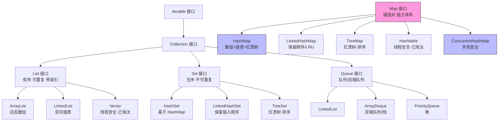

# 04 · 集合框架（Collections）

> Java 面试的绝对重头戏。`HashMap`、`ConcurrentHashMap` 原理几乎场场必问，`ArrayList`/`LinkedList` 对比、fail-fast、`Comparable`/`Comparator` 也是高频送分题。这一章要能把「底层数据结构 + 扩容 + 线程安全」讲透。

## 集合框架体系图

> 注意：`Map` 不继承 `Collection`，是独立的顶层接口。

## 知识点索引

| 编号 | 知识点 | 重要度 | 一句话 |
| --- | --- | --- | --- |
| [01](./01-collection-overview.md) | 集合体系总览（Collection Overview） | ⭐⭐⭐ | Collection/Map 两大体系 + List/Set/Queue/Map 特点 |
| [02](./02-arraylist.md) | ArrayList | ⭐⭐⭐ | 动态数组 + 默认容量 10 + 1.5 倍扩容 + 随机访问快 |
| [03](./03-linkedlist.md) | LinkedList | ⭐⭐ | 双向链表 + 增删快查询慢 + 可当 Deque/栈/队列 |
| [04](./04-arraylist-vs-linkedlist.md) | ArrayList vs LinkedList | ⭐⭐⭐ | 底层/随机访问/增删/内存/场景对比 |
| [05](./05-hashmap.md) | HashMap ⭐ | ⭐⭐⭐ | 数组+链表+红黑树 + put 流程 + 扩容 + 2 的幂 |
| [06](./06-hashmap-jdk7-vs-jdk8.md) | HashMap JDK7 vs JDK8 | ⭐⭐⭐ | 头插法死循环 vs 尾插+红黑树+扩容优化 |
| [07](./07-concurrenthashmap.md) | ConcurrentHashMap ⭐ | ⭐⭐⭐ | 分段锁 vs CAS+synchronized + 无锁读 + 不允许 null |
| [08](./08-hashset.md) | HashSet | ⭐⭐ | 基于 HashMap + 如何保证唯一 |
| [09](./09-treemap-treeset.md) | TreeMap / TreeSet | ⭐⭐ | 红黑树 + 排序 + Comparable/Comparator |
| [10](./10-fail-fast-fail-safe.md) | fail-fast 与 fail-safe | ⭐⭐⭐ | modCount + 快速失败原理 + CopyOnWrite/并发容器 |
| [11](./11-comparable-comparator.md) | Comparable 与 Comparator | ⭐⭐ | 内部自然排序 vs 外部定制排序 |

## 推荐复习顺序

01 建立体系 → 02/03/04 List 三连 → **05/06/07 HashMap 与 ConcurrentHashMap（重点中的重点，务必吃透）** → 08/09 其它容器 → 10/11 通用机制。

> 与 JMM、happens-before、CAS 底层原理强相关的部分只点到为止，深入见姊妹项目 [`jvm-learning`](../../jvm-learning) 与本项目 [`09-concurrency`](../09-concurrency)。
