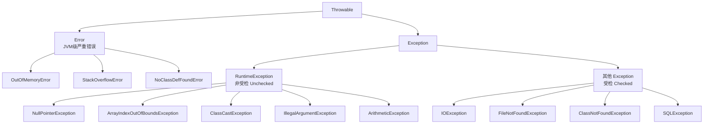

# 01 · 异常体系（Exception Hierarchy）

> 所有异常的根是 `Throwable`，分两大支：`Error`（JVM 层严重错误，不该 catch）和 `Exception`（程序可处理）。面试重要度 ⭐⭐⭐。

## 📖 核心知识

Java 异常都继承自 `Throwable`，它有两个直接子类：

**Error（错误）**：表示 JVM 层面的严重问题，程序**通常无法也不应该恢复**，不建议 catch。典型：
- `OutOfMemoryError`（堆内存溢出）、
- `StackOverflowError`（栈溢出，常因无限递归）、
- `NoClassDefFoundError`（类加载失败）。

**Exception（异常）**：程序可以处理的问题，又分两类：
- **RuntimeException 及其子类 → 非受检异常（Unchecked）**：编译器不强制处理，多由代码 bug 引起。如 `NullPointerException`、`ArrayIndexOutOfBoundsException`、`ClassCastException`、`IllegalArgumentException`、`ArithmeticException`。
- **其他 Exception → 受检异常（Checked）**：编译器强制 `try-catch` 或 `throws` 声明，多为外部/可预期的问题。如 `IOException`、`FileNotFoundException`、`ClassNotFoundException`、`SQLException`。

> 划分线是"是否 `RuntimeException` 的子类"，而非"是否 Exception 的子类"。`Error` 和 `RuntimeException` 都是非受检的（编译器不强制）。

## 🔑 面试要点

- 根类是 `Throwable`，只有 `Throwable` 及子类能被 `throw` / `catch`。
- 两大分支：`Error`（JVM 严重错误，不该处理）、`Exception`（程序可处理）。
- `Exception` 再分：`RuntimeException`（非受检）与 其余受检异常。
- **受检 vs 非受检的分界 = 是不是 `RuntimeException` 的子类**（`Error` 也不受检）。
- 常见 Error：`OutOfMemoryError`、`StackOverflowError`、`NoClassDefFoundError`。
- 常见 RuntimeException：`NullPointerException`、`ArrayIndexOutOfBoundsException`、`ClassCastException`、`NumberFormatException`（继承自 `IllegalArgumentException`）、`ArithmeticException`。
- 常见受检异常：`IOException`、`FileNotFoundException`、`ClassNotFoundException`、`SQLException`、`InterruptedException`。

## ❓ 高频面试题

**Q：Java 异常体系是怎样的？**
A：顶层是 `Throwable`，下分 `Error` 和 `Exception`。`Error` 是 JVM 级严重错误（如 OOM、栈溢出），程序一般不处理；`Exception` 是可处理异常，又分 `RuntimeException`（非受检，编译器不强制处理）和其他受检异常（编译器强制 try/throws）。

**Q：Error 和 Exception 有什么区别？**
A：`Error` 表示系统/JVM 级的严重故障，程序通常无力恢复，不建议捕获（如 `OutOfMemoryError`）；`Exception` 是应用层面可预期、可处理的问题，应当合理捕获或声明。

**Q：`NullPointerException` 是受检还是非受检异常？**
A：非受检。它是 `RuntimeException` 的子类，编译器不强制处理，通常是代码逻辑 bug（对 null 引用取值/调方法）导致。

**Q：`ClassNotFoundException` 和 `NoClassDefFoundError` 有什么区别？**
A：前者是受检**异常**，在显式加载类（如 `Class.forName`）找不到类时抛出；后者是**Error**，指编译时存在、运行时却找不到类定义（如 jar 缺失），属于更底层的加载错误。

## ⚠️ 易错点 / 加分项

- **易错**：以为"Exception 都要 try-catch"——`RuntimeException` 分支不强制处理。分界是 `RuntimeException`，不是 `Exception`。
- **易错**：把 `Error` 当异常去 catch。`Error` 一般不该捕获，捕获也难恢复。
- **加分**：`Throwable` 有 `getMessage()`、`getCause()`、`printStackTrace()`、`getStackTrace()` 等；`getCause()` 支撑异常链。
- **加分**：`OutOfMemoryError`/`StackOverflowError` 的根因和 JVM 内存布局强相关，可引用 `jvm-learning` 的运行时数据区，不在此展开。
- **加分**：`try` 里能同时 catch `Error` 吗？语法允许（都是 Throwable），但实践上不该拦截 Error。
