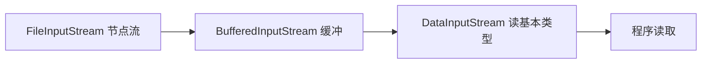

# 01 · IO 流分类（IO Streams）

> Java IO 以「流」为核心，按数据单位分字节流/字符流、按角色分节点流/处理流，处理流用**装饰器模式**层层包装。面试重要度 ⭐⭐⭐。

## 📖 核心知识

Java 传统 IO（`java.io`）把数据抽象成有方向的**流（Stream）**：输入流从数据源读、输出流往目的地写。整个体系由**四个抽象基类**撑起：

| 维度 | 输入 | 输出 |
|---|---|---|
| 字节流（8 bit，`byte`） | `InputStream` | `OutputStream` |
| 字符流（16 bit，`char`） | `Reader` | `Writer` |

**字节流 vs 字符流**：字节流面向二进制，读写任意数据（图片、视频、文本皆可）；字符流面向文本，内部带**字符编码**（`Charset`）转换，能正确处理中文等多字节字符，避免半个汉字被截断。字符流本质是「字节流 + 编码解码」的封装——`InputStreamReader`/`OutputStreamWriter` 就是字节流到字符流的桥梁（转换流）。

**节点流 vs 处理流**（按角色分）：

- **节点流（低级流）**：直接连接数据源，如 `FileInputStream`、`FileReader`、`ByteArrayInputStream`。
- **处理流（高级流/包装流）**：套在别的流之上，增强功能，如 `BufferedInputStream`（缓冲）、`DataInputStream`（读基本类型）、`ObjectInputStream`（序列化）。

处理流的设计正是**装饰器模式（Decorator Pattern）**：处理流持有一个被包装流的引用，在不改变原类的前提下动态叠加功能，可层层嵌套。



**为什么要用 `BufferedXxx`**：`FileInputStream.read()` 每次都触发一次系统调用（内核态/用户态切换 + 磁盘 IO），逐字节读极慢。`BufferedInputStream` 内部维护一个默认 8KB 的 `byte[]` 缓冲区，一次系统调用批量读满缓冲区，后续 `read()` 直接从内存拿，**大幅减少系统调用次数**。`BufferedWriter` 同理批量写，需 `flush()` 或 `close()` 才真正落盘。

```java
// 装饰器层层包装：节点流 -> 缓冲处理流
try (BufferedReader br = new BufferedReader(
         new InputStreamReader(
             new FileInputStream("data.txt"), StandardCharsets.UTF_8))) {
    String line;
    while ((line = br.readLine()) != null) {   // readLine 是 BufferedReader 增强的方法
        System.out.println(line);
    }
} // try-with-resources 自动 close，且外层 close 会级联关闭内层流
```

## 🔑 面试要点

- 四大基类：字节流 `InputStream`/`OutputStream`，字符流 `Reader`/`Writer`。
- 字节流通吃二进制数据；字符流带编码转换，专门处理文本、能防中文乱码/截断。
- 转换流 `InputStreamReader`/`OutputStreamWriter` 是字节流 → 字符流的桥梁，可指定 `Charset`。
- 节点流直连数据源；处理流包装其他流做增强，本质是**装饰器模式**。
- `BufferedXxx` 用内存缓冲区（默认 8KB）减少系统调用，是性能关键，写流别忘 `flush`。
- 用 `try-with-resources` 管理流，自动 `close`；关闭最外层处理流会级联关闭内层节点流。
- 常见处理流：`Buffered*`（缓冲）、`Data*`（读写基本类型）、`Object*`（序列化）、`Print*`（格式化输出）。

## ❓ 高频面试题

**Q：字节流和字符流有什么区别？该怎么选？**
A：字节流以 `byte` 为单位读写二进制，字符流以 `char`（16 bit）为单位并内置编码转换。处理图片/视频/压缩包等二进制数据用字节流；处理纯文本、尤其涉及中文时用字符流，避免一个汉字（UTF-8 下 3 字节）被拆读导致乱码。字符流底层其实也是字节流包了一层编解码。

**Q：处理流用了什么设计模式？好处是什么？**
A：装饰器模式。处理流持有被包装流的引用，在运行时动态叠加缓冲、类型转换、序列化等功能，可任意组合层叠。好处是功能与基础流解耦，无需为每种功能组合写一个子类，符合开闭原则。`java.io` 是 JDK 中装饰器模式最经典的示例。

**Q：为什么加了 `BufferedInputStream` 就快很多？**
A：无缓冲时每次 `read()` 一个字节都要一次系统调用和磁盘/网络 IO，开销巨大。`BufferedInputStream` 内部有 8KB 缓冲区，一次系统调用把数据批量读进内存，之后从缓冲区取，把「N 次系统调用」降为「N/8192 次」，减少了内核态与用户态切换和物理 IO 次数。

## ⚠️ 易错点 / 加分项

- `BufferedWriter`/`BufferedOutputStream` 写完不 `flush()` 或 `close()`，缓冲区数据可能丢失——数据「写了却没落盘」是经典 bug。
- 用 `FileReader`/`FileWriter` 时**无法指定编码**（用平台默认编码，容易乱码），推荐 `InputStreamReader`/`OutputStreamWriter` 显式传 `StandardCharsets.UTF_8`。
- 关闭流应关最外层包装流即可，重复或错误顺序关闭内层流可能抛异常；`try-with-resources` 是首选。
- 加分点：`System.out` 是 `PrintStream`（字节流），但能打印字符串是因为它内部做了编码；`readLine()` 是 `BufferedReader` 特有方法，普通 `Reader` 没有。
- 加分点：字节流不带缓冲也可用 `read(byte[])` 批量读来提速，但缓冲流封装更彻底、还提供 `readLine` 等高级 API。
