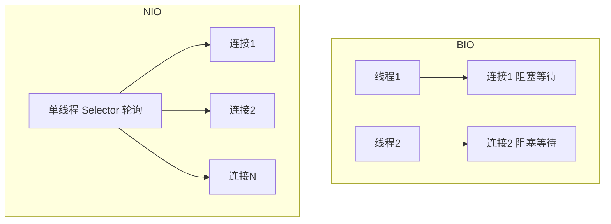

# 02 · BIO / NIO / AIO（IO Models）

> Java 三种 IO 模型：BIO 同步阻塞、NIO 同步非阻塞（多路复用）、AIO 异步非阻塞。是高并发网络编程的核心考点。面试重要度 ⭐⭐⭐。

## 📖 核心知识

要先分清两组概念：

- **阻塞 / 非阻塞**：发起 IO 调用后，线程**是否被挂起等待**。阻塞则线程卡住直到数据就绪；非阻塞则立即返回（没数据就返回「未就绪」）。
- **同步 / 异步**：**由谁完成数据的读写拷贝**。同步是应用线程亲自把数据从内核拷到用户空间；异步是内核拷贝完成后再通知你，你不用亲自等和读。

**BIO（Blocking IO，同步阻塞）** — `java.io` + `Socket`/`ServerSocket`
`accept()`、`read()`、`write()` 都阻塞。一个连接必须分配一个线程处理，即经典「一连接一线程」模型。连接数一多，线程数暴涨，内存和上下文切换开销拖垮系统。用线程池（伪异步 IO）能限制线程数，但阻塞本质没变，读一个慢连接会占住一个线程。适合**连接数少、固定**的场景。

**NIO（Non-blocking IO / New IO，同步非阻塞 + 多路复用）** — `java.nio`，JDK 1.4 引入
三大件 `Channel`/`Buffer`/`Selector`。核心是 **IO 多路复用**：把多个 `Channel` 注册到一个 `Selector`，由**一个线程**轮询 `select()`，只处理已就绪的连接。底层依赖操作系统 `epoll`/`kqueue`/`select`。这样**少量线程管理海量连接**（C10K 问题的解法）。注意它仍是「同步」——就绪后还得应用线程自己调 `read()` 把数据搬进 `Buffer`。适合**连接多、单连接数据量小**的高并发场景（聊天、网关），Netty 就基于它。

**AIO（Asynchronous IO，异步非阻塞）** — `java.nio.channels.AsynchronousXxx`，JDK 1.7（NIO.2）
真正的异步：发起读写后立即返回，**内核完成数据拷贝后**通过回调（`CompletionHandler`）或 `Future` 通知你。应用线程完全不参与 IO 等待和拷贝。适合**连接多、IO 耗时长**的场景。但 Linux 下 AIO 底层仍用 `epoll` 模拟、生态不成熟，实际应用远不如 NIO 广泛（Netty 曾试用 AIO 后又回退到 NIO）。

## 🔑 面试要点

- BIO = 同步阻塞，一连接一线程，`java.io`；NIO = 同步非阻塞 + 多路复用，`java.nio`，JDK 1.4；AIO = 异步非阻塞，NIO.2，JDK 1.7。
- 「阻塞/非阻塞」看线程是否等待；「同步/异步」看数据拷贝由应用还是内核完成。
- NIO 靠 `Selector` 多路复用，一个线程管多个 `Channel`，底层是 `epoll`，解决 C10K。
- NIO 仍是同步：就绪后应用线程亲自 `read`；AIO 才是内核拷完回调通知。
- BIO 适合连接少而固定；NIO 适合连接多、数据量小的高并发；AIO 适合连接多、IO 长耗时。
- Netty 底层用 NIO 而非 AIO——Linux 上 AIO 由 epoll 模拟无性能优势且不成熟。

## ❓ 高频面试题

**Q：BIO、NIO、AIO 有什么区别？**
A：见下表。

| 模型 | 阻塞 | 同步/异步 | 线程模型 | JDK | 适用场景 |
|---|---|---|---|---|---|
| BIO | 阻塞 | 同步 | 一连接一线程 | 1.0 | 连接数少且固定，如内部 RPC |
| NIO | 非阻塞 | 同步 | 一线程多连接（多路复用） | 1.4 | 高并发、连接多数据小，如 IM、网关 |
| AIO | 非阻塞 | 异步 | 回调/Future，内核通知 | 1.7 | 连接多且 IO 长耗时，如文件服务器 |

**Q：同步非阻塞和异步非阻塞有什么区别？NIO 为什么是同步的？**
A：NIO 非阻塞指 `select()` 不会傻等，但数据就绪后，仍需应用线程亲自调 `read()` 把数据从内核缓冲区拷贝到用户 `Buffer`——这个拷贝过程是同步的、由你的线程完成，所以叫「同步非阻塞」。AIO 则连拷贝都交给内核，内核拷完再回调你，应用全程不参与 IO，才是真异步。

**Q：既然 AIO 更先进，为什么主流框架（Netty）用 NIO？**
A：Windows 有真正的异步 IO（IOCP），但服务端主战场 Linux 的 AIO 支持不成熟，JDK 的 AIO 在 Linux 下底层仍用 `epoll` 模拟，相比 NIO 没有性能优势，反而 API 复杂、回调地狱、生态薄弱。Netty 通过精心设计的 Reactor 线程模型把 NIO 用到极致，因此没必要上 AIO。

## ⚠️ 易错点 / 加分项

- 别把「非阻塞」和「异步」画等号——NIO 非阻塞但同步，二者维度不同。
- NIO 的 N 有两种说法：New IO（相对旧 io 包）和 Non-blocking，面试都可提，本质是同一套 `java.nio`。
- 伪异步 IO（BIO + 线程池）只是限制了线程数，读写仍阻塞，慢连接照样占线程，本质还是 BIO。
- 加分项：能点出 NIO 底层是 IO 多路复用（`select`/`poll`/`epoll`），并说清 `epoll` 相比 `select` 的优势（无 1024 fd 限制、就绪列表回调避免 O(n) 遍历）。
- 加分项：把三种模型对应到 Reactor / Proactor 网络模型——NIO 是 Reactor，AIO 是 Proactor。
