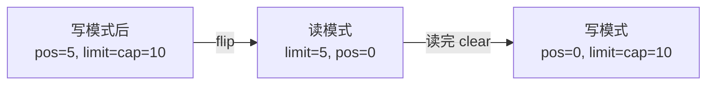
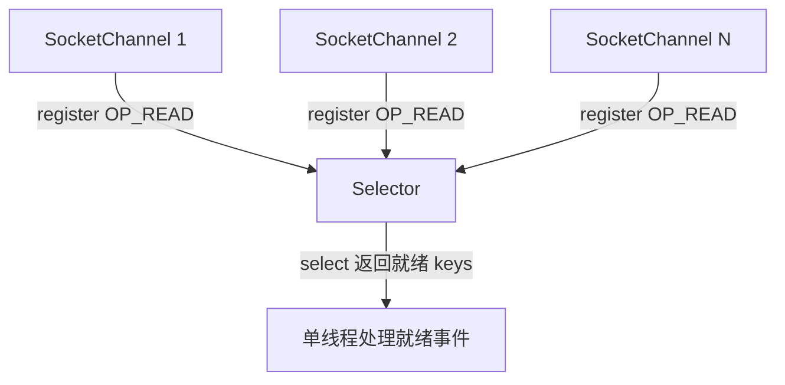

# 03 · NIO 三大件（Channel / Buffer / Selector）

> NIO 的核心：数据经 `Channel` 双向传输、装在 `Buffer` 中读写，`Selector` 用一个线程多路复用管理多个 `Channel`。`Buffer` 的三指针与 `flip()` 是必考点。面试重要度 ⭐⭐⭐。

## 📖 核心知识

NIO 与 BIO 的根本不同：BIO 面向**流**（单向、逐字节），NIO 面向**缓冲区 Buffer**（双向、块传输）。

**Channel（通道）**：双向的数据通道，既能读又能写（流是单向的）。数据总是「Channel ↔ Buffer」之间搬运：从 Channel `read` 进 Buffer，把 Buffer `write` 到 Channel。常见实现：`FileChannel`（文件）、`SocketChannel`/`ServerSocketChannel`（TCP）、`DatagramChannel`（UDP）。网络 Channel 可设 `configureBlocking(false)` 变非阻塞。

**Buffer（缓冲区）**：本质是一块内存（底层数组），带三个核心指针来记录读写状态：

- **capacity**：容量，缓冲区总大小，创建后不变。
- **position**：当前读/写位置，每读写一个元素后移。
- **limit**：读写上限，position 不能越过 limit。

关系恒有 `0 ≤ position ≤ limit ≤ capacity`。

**`flip()` 是核心操作——写模式切读模式**：写完数据后 position 停在已写数据末尾。调 `flip()` 会 `limit = position; position = 0`，于是读取范围正好锁定「刚写入的那段数据」。



配套方法：`clear()`（读完切回写模式，position=0、limit=capacity，数据未真删只是可覆盖）、`compact()`（保留未读数据后切写模式）、`rewind()`（重读，position 归 0）、`mark()`/`reset()`（标记/回到标记）。

```java
FileChannel ch = new RandomAccessFile("a.txt", "rw").getChannel();
ByteBuffer buf = ByteBuffer.allocate(1024);   // capacity=1024
int n = ch.read(buf);                          // 写入 Buffer，position 前移 n
buf.flip();                                    // 切读模式：limit=position, position=0
while (buf.hasRemaining()) {
    System.out.print((char) buf.get());        // 读取，position 前移
}
buf.clear();                                   // 切回写模式，准备下一轮
```

**Selector（选择器/多路复用器）**：一个线程管理多个 Channel 的关键。把多个非阻塞 `Channel` 注册到 `Selector` 上并声明关注的事件（`OP_ACCEPT`/`OP_CONNECT`/`OP_READ`/`OP_WRITE`），线程调 `select()` 阻塞等待，直到有 Channel 就绪，返回就绪的 `SelectionKey` 集合，只处理这些就绪连接。底层由 OS 的 `epoll`/`kqueue`/`select` 支撑。



```java
Selector selector = Selector.open();
ServerSocketChannel ssc = ServerSocketChannel.open();
ssc.bind(new InetSocketAddress(8080));
ssc.configureBlocking(false);
ssc.register(selector, SelectionKey.OP_ACCEPT);

while (true) {
    selector.select();                              // 阻塞直到有就绪事件
    Iterator<SelectionKey> it = selector.selectedKeys().iterator();
    while (it.hasNext()) {
        SelectionKey key = it.next();
        if (key.isAcceptable()) {
            SocketChannel client = ssc.accept();
            client.configureBlocking(false);
            client.register(selector, SelectionKey.OP_READ);
        } else if (key.isReadable()) {
            SocketChannel client = (SocketChannel) key.channel();
            ByteBuffer buf = ByteBuffer.allocate(1024);
            client.read(buf);
            // ... 处理数据
        }
        it.remove();   // 必须手动移除，否则下次仍在集合中被重复处理
    }
}
```

## 🔑 面试要点

- 三大件：`Channel` 双向传数据、`Buffer` 缓冲读写、`Selector` 多路复用；数据在 Channel 与 Buffer 间搬运。
- Buffer 三指针：`capacity`（总容量）、`position`（当前位置）、`limit`（读写上限），恒有 `0≤position≤limit≤capacity`。
- `flip()`：写→读，`limit=position; position=0`，圈定刚写入的数据供读取，**最易考**。
- `clear()` 读→写但不真删数据（可覆盖）；`compact()` 保留未读数据再切写；`rewind()` 重读。
- `Selector` 注册非阻塞 Channel + 关注事件，`select()` 返回就绪 `SelectionKey`，一个线程管千万连接。
- 处理完 `SelectionKey` 必须 `iterator.remove()`，否则重复处理。
- `ByteBuffer` 可用 `allocate`（堆内）或 `allocateDirect`（堆外 DirectByteBuffer，减少一次拷贝、适合大数据）。

## ❓ 高频面试题

**Q：`ByteBuffer` 的 position、limit、capacity 分别是什么？`flip()` 做了什么？**
A：capacity 是缓冲区总容量（固定）；position 是下一个读/写位置；limit 是本次读/写不可逾越的边界。写数据时 position 随写入前移；写完调 `flip()` 执行 `limit=position; position=0`，把「读边界」设到刚写数据的末尾、position 回到起点，于是接下来 `get()` 恰好读出刚写入的内容。忘记 `flip()` 直接读，会从 position 处读到一堆空数据。

**Q：Selector 的多路复用原理是什么？为什么能一个线程管理大量连接？**
A：把多个非阻塞 Channel 注册到一个 Selector 并声明关注事件。线程调 `select()` 委托操作系统（`epoll`）同时监视所有注册的 fd，只在有连接就绪时返回就绪集合，线程只处理这几个就绪连接、不为空闲连接浪费线程。因此无需「一连接一线程」，用极少线程即可支撑海量连接。

**Q：DirectByteBuffer（堆外内存）和堆内 Buffer 有什么区别？**
A：`allocate()` 分配在 JVM 堆，受 GC 管理但做 IO 时需先拷贝到堆外再交给内核，多一次拷贝；`allocateDirect()` 分配堆外内存（直接内存），IO 时零拷贝、性能更高，但分配/回收成本高（靠 `Cleaner`/GC 回收），适合大块、长生命周期缓冲。Netty 大量用池化的 DirectByteBuffer。

## ⚠️ 易错点 / 加分项

- 写完不 `flip()` 就读，或读完不 `clear()`/`compact()` 就写，是 NIO 编程头号 bug。
- `selectedKeys()` 处理完不 `remove()`，会导致同一 key 被反复处理。
- 注册到 Selector 的 Channel 必须先 `configureBlocking(false)`，阻塞模式的 Channel 不能注册（抛异常）。
- `clear()` 并不清空数据，只是复位指针；旧数据仍在，只是会被后续写入覆盖——「clear 不 clear 数据」是经典陷阱。
- 加分项：直接内存不受 `-Xmx` 限制而受 `-XX:MaxDirectMemorySize` 限制，用不当会 OOM（`Direct buffer memory`），底层布局见 [`../../jvm-learning/`](../../jvm-learning/)。
- 加分项：能说清 NIO 只是多路复用，真正生产用 Netty 封装（解决空轮询 bug、粘包拆包、Reactor 线程模型）。
