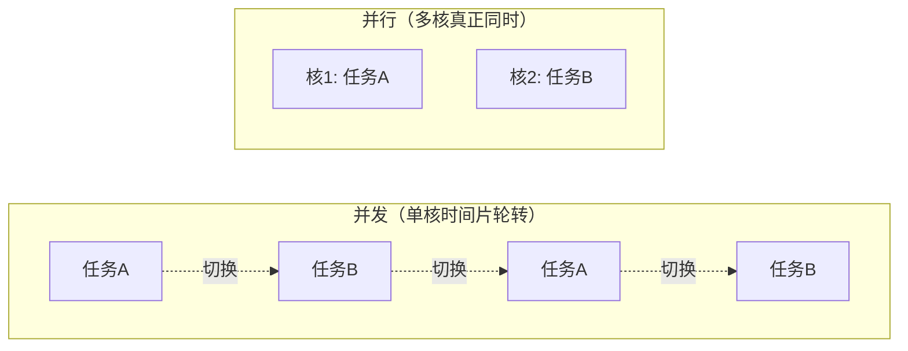

# 01 · 线程基础（Thread Basics）

> 线程是 CPU 调度的最小单位、进程是资源分配的最小单位；`sleep/join/yield/wait` 与用户/守护线程是并发开篇的高频送分题。面试重要度 ⭐⭐（并发地基，必答清楚）。

## 📖 核心知识

**进程 vs 线程**。**进程（Process）** 是操作系统进行**资源分配**的基本单位，拥有独立的地址空间；**线程（Thread）** 是 CPU **调度**的基本单位，是进程内的一条执行流。一个进程可包含多个线程，它们**共享进程的堆和方法区（元空间）**，但**各自拥有独立的程序计数器、虚拟机栈、本地方法栈**。线程切换比进程切换轻量（不需切换地址空间）。

| 维度 | 进程 | 线程 |
|---|---|---|
| 定义 | 资源分配基本单位 | CPU 调度基本单位 |
| 地址空间 | 独立 | 共享所属进程 |
| 通信 | IPC（管道/Socket/共享内存等），开销大 | 直接读共享内存，需同步 |
| 切换开销 | 大（切页表/上下文） | 小 |
| 健壮性 | 一个进程崩溃不影响其他 | 一个线程崩溃可能拖垮整个进程 |

**并发 vs 并行**。**并发（Concurrency）** 是指多个任务在**同一时间段内**交替执行（单核也能并发，靠时间片轮转「看起来同时」）；**并行（Parallelism）** 是指多个任务在**同一时刻**真正同时执行（必须多核）。一句话：并发是「同时应对多件事」，并行是「同时做多件事」。

**线程常用方法**：

- **`Thread.sleep(ms)`**（静态）：让**当前线程**休眠指定时间，进入 `TIMED_WAITING`。**不释放锁**，时间到自动恢复到就绪。
- **`join()`**：在线程 A 中调用 `threadB.join()`，则 **A 会等待 B 执行完毕**再继续。底层是 `wait()`，用于线程间「等待完成」的顺序控制。
- **`yield()`**（静态）：让当前线程**主动让出 CPU**，从运行态回到就绪态，重新参与竞争（可能立刻又被调度）。只是「提示」调度器，不保证生效，**不释放锁**。
- **`wait()` / `notify()` / `notifyAll()`**（`Object` 的方法）：**必须在 `synchronized` 同步块中调用**。`wait()` 让线程释放锁并进入等待队列（`WAITING`）；`notify()` 唤醒一个等待线程，`notifyAll()` 唤醒全部。用于线程间协作（生产者-消费者）。

**用户线程 vs 守护线程**。**用户线程（User Thread）** 是普通线程；**守护线程（Daemon Thread）** 是为用户线程服务的后台线程（典型如 **GC 线程**）。区别在于：**当 JVM 中所有用户线程都结束时，JVM 就会退出，无论守护线程是否还在运行**。通过 `thread.setDaemon(true)` 设置，**必须在 `start()` 之前调用**，且守护线程创建的子线程默认也是守护线程。

## 🔑 面试要点

- 进程 = 资源分配单位，线程 = CPU 调度单位；线程共享堆和方法区，独占 PC/栈。
- 并发是交替（单核可），并行是同时（需多核）。
- `sleep` 不释放锁；`wait` 释放锁。这是最高频对比点。
- `sleep`/`yield` 是 `Thread` 的静态方法；`wait`/`notify` 是 `Object` 的方法（因为锁绑定在对象上）。
- `join()` 底层用 `wait()` 实现，让调用线程等待目标线程结束。
- 守护线程：所有用户线程结束则 JVM 退出，不管守护线程；`setDaemon` 必须在 `start` 前调用。
- `yield` 只是给调度器的提示，不保证让出成功。

## ❓ 高频面试题

**Q：sleep 和 wait 的区别？**
A：① 归属不同——`sleep` 是 `Thread` 静态方法，`wait` 是 `Object` 方法；② **锁**——`sleep` 不释放锁，`wait` 释放锁；③ 调用位置——`wait` 必须在 `synchronized` 中调用，`sleep` 任意位置；④ 唤醒——`sleep` 到时自动醒，`wait` 需 `notify/notifyAll` 或超时唤醒；⑤ 用途——`sleep` 用于暂停，`wait` 用于线程协作。

**Q：为什么 wait/notify 定义在 Object 而不是 Thread？**
A：因为 `wait/notify` 是围绕**对象的监视器锁（monitor）** 工作的，每个 Java 对象都有一把锁。线程必须先持有某对象的锁才能在该对象上 `wait`，唤醒也针对该对象的等待队列。锁属于对象，所以这些方法自然定义在 `Object` 上。

**Q：如何优雅地停止一个线程？**
A：**不要用已废弃的 `stop()`**（会立即释放锁导致数据不一致）。推荐：① 用**中断标志** `interrupt()` + 在线程内轮询 `isInterrupted()` 配合退出；② 用 `volatile boolean` 标志位控制循环退出。阻塞方法（`sleep`/`wait`）会响应中断抛 `InterruptedException`。

## ⚠️ 易错点 / 加分项

- **`Thread.sleep(0)`** 并非无意义：它触发一次线程调度，让出 CPU 重新竞争。
- 调用 `run()` 不会启动新线程，只是普通方法调用；必须调 `start()`（内部由 JVM 调用 `run`）。
- `setDaemon(true)` 若在 `start()` 后调用会抛 `IllegalThreadStateException`。
- 守护线程里**不要做 IO/资源清理等关键工作**，因为 JVM 退出时它可能被强行终止，`finally` 都不一定执行。
- 加分：`wait()` 应放在 **while 循环**中判断条件（防止**虚假唤醒 spurious wakeup**），而非 `if`。
