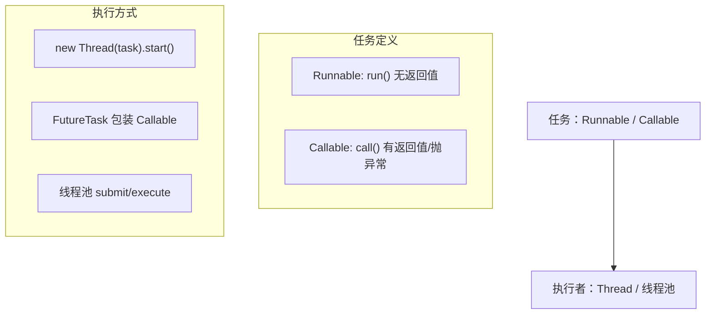

# 02 · 创建线程的方式（Ways to Create Threads）

> 本质上只有「实现 `Runnable`/`Callable` 任务」+「交给线程执行」两条路，`Thread` 只是任务与执行的耦合体；生产中应统一用**线程池**。面试重要度 ⭐⭐（送分题，答出对比与本质加分）。

## 📖 核心知识

**方式一：继承 `Thread`，重写 `run()`**。简单直接，但 Java 单继承，继承了 `Thread` 就不能再继承其他类，且把「任务」和「线程」耦合在一起。

```java
class MyThread extends Thread {
    @Override public void run() { System.out.println("run: " + getName()); }
}
new MyThread().start();
```

**方式二：实现 `Runnable`，作为任务传给 `Thread`**（推荐）。任务与线程解耦，一个 `Runnable` 可被多个线程复用，还能继续继承其他类。`run()` **无返回值、不能抛受检异常**。

```java
Runnable task = () -> System.out.println("run");
new Thread(task).start();
```

**方式三：实现 `Callable` + `FutureTask`**。`Callable<V>` 的 `call()` **有返回值、可抛受检异常**。配合 `FutureTask`（它实现了 `Runnable` 和 `Future`）交给 `Thread` 运行，通过 `future.get()` **阻塞获取结果**。

```java
Callable<Integer> c = () -> 1 + 2;
FutureTask<Integer> ft = new FutureTask<>(c);
new Thread(ft).start();
Integer result = ft.get(); // 阻塞直到有结果，返回 3
```

**方式四：线程池 `ThreadPoolExecutor`**（生产推荐）。复用线程、控制并发数、提供任务队列与拒绝策略。`submit()` 提交 `Callable`/`Runnable` 返回 `Future`。

```java
ExecutorService pool = Executors.newFixedThreadPool(4);
Future<Integer> f = pool.submit(() -> 1 + 2);
System.out.println(f.get());
pool.shutdown();
```



**四种方式对比**：

| 方式 | 返回值 | 受检异常 | 资源复用 | 说明 |
|---|---|---|---|---|
| 继承 `Thread` | 无 | 不能抛 | 否 | 耦合、占用单继承名额，不推荐 |
| 实现 `Runnable` | 无 | 不能抛 | 否 | 解耦、可共享任务，推荐 |
| `Callable`+`FutureTask` | **有** | **可抛** | 否 | 需要返回值/异常时用 |
| 线程池 | 有(`submit`) | 可抛 | **是** | 生产标准做法 |

> 严格说 Java 创建线程**本质只有一种**：`new Thread().start()`，其余都是「提供任务的不同形式」或「对 Thread 的封装」。

## 🔑 面试要点

- `Runnable` 优于继承 `Thread`：解耦、避免单继承限制、任务可复用。
- `Callable` 相比 `Runnable`：**有返回值 + 可抛受检异常**，配 `FutureTask`/线程池使用。
- `FutureTask` 同时是 `Runnable` 和 `Future`，是连接 `Callable` 与 `Thread` 的桥梁。
- `future.get()` 会**阻塞**当前线程直到任务完成，可传超时。
- `start()` 才真正启动线程；直接调 `run()` 只是同步方法调用。
- 生产环境**不用手动 new Thread**，统一用线程池管理（阿里规约强制）。

## ❓ 高频面试题

**Q：Runnable 和 Callable 的区别？**
A：① `Runnable.run()` 无返回值、不能抛受检异常；`Callable.call()` **有返回值 `V`、可抛受检异常**。② `Runnable` 是 JDK 1.0 就有，`Callable` 是 JDK 5 随 JUC 引入。③ 二者都可提交给线程池，`Callable` 常配 `Future`/`FutureTask` 获取结果。

**Q：start() 和 run() 的区别？**
A：`start()` 会向 JVM 申请创建一个新线程并**异步**执行 `run()` 中的代码，一个线程只能 `start` 一次（再次调用抛 `IllegalThreadStateException`）；直接调 `run()` 只是在**当前线程**同步执行方法体，不会开新线程。

**Q：FutureTask 的作用？get() 会怎样？**
A：`FutureTask` 包装 `Callable`（或 `Runnable`），既能作为任务被 `Thread`/线程池执行，又能通过 `get()` 获取结果、`cancel()` 取消、`isDone()` 查状态。`get()` 会阻塞调用线程，直到计算完成返回结果（或抛出执行中的异常），可用带超时的重载防止无限等待。

## ⚠️ 易错点 / 加分项

- 别把「创建线程的方式」说成四种「本质」——本质只有 `new Thread().start()`，其余是任务形式或封装，答出这点加分。
- `Executors` 创建线程池（`newFixedThreadPool`/`newCachedThreadPool`）**阿里规约不推荐**：前者队列 `Integer.MAX_VALUE` 可能 OOM，后者最大线程数 `Integer.MAX_VALUE` 可能创建过多线程。应手动 `new ThreadPoolExecutor(...)`。
- `future.get()` 未设超时会一直阻塞，任务卡死会拖垮调用方，生产建议用带超时的 `get(timeout, unit)`。
- JDK 8 后更推荐 `CompletableFuture` 做异步编排（见 14 篇），比裸 `Future` 强大得多。
