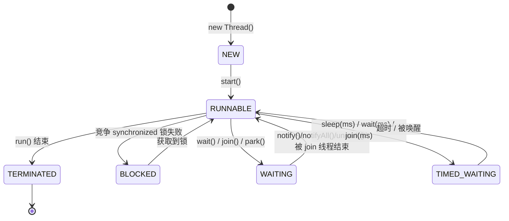

# 03 · 线程状态与转换（Thread State）

> Java 定义 6 种线程状态（`Thread.State` 枚举），与操作系统的「就绪/运行」不同——Java 把二者合并为 `RUNNABLE`；状态转换 + `sleep` vs `wait` 是并发高频题。面试重要度 ⭐⭐⭐。

## 📖 核心知识

`java.lang.Thread.State` 枚举定义 **6 种状态**：

| 状态 | 含义 | 典型触发 |
|---|---|---|
| **NEW** | 已创建未启动 | `new Thread()` 后、`start()` 前 |
| **RUNNABLE** | 可运行（含 OS 的就绪+运行） | 调用 `start()` 后 |
| **BLOCKED** | 阻塞，等待获取 `synchronized` 监视器锁 | 进入 `synchronized` 但锁被占 |
| **WAITING** | 无限期等待，需被显式唤醒 | `wait()`、`join()`、`park()` |
| **TIMED_WAITING** | 限期等待，超时自动返回 | `sleep(ms)`、`wait(ms)`、`join(ms)` |
| **TERMINATED** | 执行完毕或异常退出 | `run()` 结束 |

**关键：Java 没有单独的「Running」状态**。操作系统层面的「就绪（Ready）」和「运行（Running）」在 Java 里统一为 **`RUNNABLE`**——一个 `RUNNABLE` 的线程可能正在 CPU 上跑，也可能在等 CPU 时间片。

**状态转换图**：

**特别注意 `BLOCKED` 与 `WAITING` 的区别**：

- **`BLOCKED`**：只在**抢 `synchronized` 锁失败**时进入，是被动等待锁；拿到锁自动回到 `RUNNABLE`。
- **`WAITING`/`TIMED_WAITING`**：主动调用 `wait()`/`sleep()`/`join()`/`LockSupport.park()` 进入，需要相应的唤醒条件。
- 注意：调用 `wait()` 前线程持有锁，`wait()` 后**释放锁并进入 WAITING**；被 `notify` 唤醒后，它要**重新竞争锁**，竞争期间处于 `BLOCKED`，拿到锁才回 `RUNNABLE`。

**`sleep` vs `wait`**（最高频对比，见下表）：

| 维度 | `Thread.sleep(ms)` | `Object.wait()` |
|---|---|---|
| 所属类 | `Thread`（静态方法） | `Object`（实例方法） |
| 是否释放锁 | **不释放** | **释放** |
| 调用前提 | 任意位置 | 必须在 `synchronized` 块内 |
| 进入状态 | `TIMED_WAITING` | `WAITING`（带参为 `TIMED_WAITING`） |
| 唤醒方式 | 时间到自动醒 | `notify`/`notifyAll` 或超时 |
| 用途 | 让线程暂停一段时间 | 线程间通信/协作 |

## 🔑 面试要点

- Java **6 种**状态：NEW、RUNNABLE、BLOCKED、WAITING、TIMED_WAITING、TERMINATED。
- Java **没有 Running 状态**，OS 的就绪+运行合并成 `RUNNABLE`。
- `BLOCKED` 专指等 `synchronized` 锁；等 `ReentrantLock`（`LockSupport.park`）显示为 `WAITING`。
- `sleep` 不释放锁、`wait` 释放锁，是必考对比。
- `wait` 被唤醒后需重新抢锁，中间会短暂 `BLOCKED`。
- 有超时参数的都进 `TIMED_WAITING`：`sleep(ms)`、`wait(ms)`、`join(ms)`、`parkNanos`。

## ❓ 高频面试题

**Q：Java 线程有哪几种状态？和操作系统的线程状态有何不同？**
A：Java 有 6 种（见上）。区别在于 Java 把 OS 的「就绪」和「运行」合并为一个 `RUNNABLE`（因为 Java 无法区分线程是在 CPU 上运行还是在等待被调度）；同时 Java 细分出 `BLOCKED`（等锁）、`WAITING`/`TIMED_WAITING`（等待/限期等待）来描述更精细的阻塞原因。

**Q：BLOCKED 和 WAITING 的区别？**
A：`BLOCKED` 是竞争 `synchronized` 锁失败时进入，被动等锁，拿到锁即恢复；`WAITING` 是主动调用 `wait()`/`join()`/`park()` 进入的无限期等待，必须由其他线程 `notify`/`unpark` 或目标线程结束才唤醒。前者只与锁竞争有关，后者是有意的等待。

**Q：一个线程两次调用 start() 会怎样？**
A：抛 `IllegalThreadStateException`。因为 `start()` 后线程状态已不是 `NEW`，`threadStatus != 0`，源码会校验并抛异常。线程状态不可逆，`TERMINATED` 的线程也无法重新 `start`。

## ⚠️ 易错点 / 加分项

- 常见错误：以为有「Running」状态。Java 层面统一是 `RUNNABLE`。
- `LockSupport.park()` 阻塞的线程（如 `ReentrantLock` 等锁、`AQS` 排队）状态是 **WAITING**，不是 `BLOCKED`——这是区分 synchronized 与 Lock 的一个观察点，`jstack` 里能看到差异。
- 处于 `RUNNABLE` 的线程也可能在做**阻塞式 IO**（`RUNNABLE` 不代表一定在用 CPU）。
- 加分：用 `jstack`/`jconsole` 观察线程 dump 时，`BLOCKED` 常暗示锁竞争热点，`WAITING on <地址>` 能定位等待的锁对象，是排查死锁/性能的关键信息。
