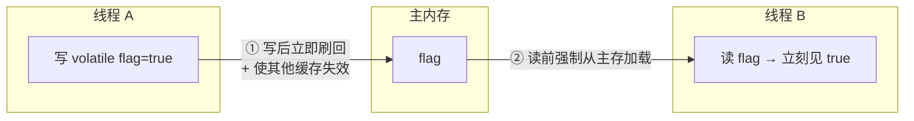

# 05 · volatile 关键字（volatile）

> `volatile` 是 JVM 提供的**轻量级同步机制**：保证共享变量的**可见性**和**有序性（禁止重排）**，但**不保证原子性**。是并发高频必考点。面试重要度 ⭐⭐⭐。底层实现（内存屏障/MESI）见姊妹项目 [`../../jvm-learning/31-volatile.md`](../../jvm-learning/31-volatile.md)。

## 📖 核心知识

`volatile` 修饰变量后具备两大语义，缺一大语义：

**① 保证可见性**。普通变量的修改可能停留在线程的工作内存（CPU 缓存），其他线程读到旧值。volatile 变量的**写会立即刷回主内存并使其他 CPU 缓存中的副本失效**，读时**强制从主内存重新加载**。于是「一个线程写，其他线程立刻能读到最新值」。



**② 保证有序性（禁止指令重排）**。JMM 通过在 volatile 读/写前后插入**内存屏障（Memory Barrier）** 禁止编译器和 CPU 把 volatile 读写与前后指令随意重排。简言之：volatile 写之前的操作不会重排到写之后，volatile 读之后的操作不会重排到读之前。对应 happens-before 中的「volatile 变量规则」：**对 volatile 写 happens-before 后续对它的读**。

**③ 不保证原子性**。volatile 只保证单次读/写可见，**不保证复合操作原子**。经典反例 `i++`（读→+1→写回 三步），多线程下即使 `i` 是 volatile 仍会丢失更新。要原子累加需 `synchronized` 或 `AtomicInteger`（CAS）。

**典型应用一：状态标志位**。最经典、最安全的用法——一个线程改标志，其他线程立即感知退出。

```java
private volatile boolean running = true;
public void stop() { running = false; }      // 线程 A 改
public void run() { while (running) { /*...*/ } } // 线程 B 立即感知退出
```

**典型应用二：DCL 双重检查锁单例（Double-Checked Locking）**。`volatile` 在此**禁止指令重排**：`instance = new Singleton()` 实际分三步——① 分配内存 ② 初始化对象 ③ 引用指向内存。若②③被重排为①③②，另一线程可能拿到「引用非 null 但未初始化完」的**半成品对象**。`volatile` 禁止这种重排。

```java
public class Singleton {
    private static volatile Singleton instance;   // volatile 必须加！
    private Singleton() {}
    public static Singleton getInstance() {
        if (instance == null) {                   // 第一次检查（无锁，性能）
            synchronized (Singleton.class) {
                if (instance == null) {           // 第二次检查（防重复创建）
                    instance = new Singleton();   // 可能指令重排 → 需 volatile
                }
            }
        }
        return instance;
    }
}
```

**volatile vs synchronized 对比**：

| 维度 | volatile | synchronized |
|---|---|---|
| 修饰对象 | 变量 | 方法 / 代码块 |
| 原子性 | ❌ 不保证 | ✅ 保证 |
| 可见性 | ✅ | ✅ |
| 有序性 | ✅（禁重排） | ✅ |
| 是否阻塞 | 否（无锁） | 是（可能阻塞） |
| 性能 | 轻量 | 相对重（已优化） |
| 适用 | 状态标志、DCL、一写多读 | 复合操作、临界区 |

## 🔑 面试要点

- volatile 三句话：**保证可见性、保证有序性、不保证原子性**。
- 可见性靠「写刷主存+使其他缓存失效、读强制读主存」；有序性靠**内存屏障**。
- `i++` 用 volatile 仍线程不安全（复合操作非原子）。
- DCL 单例中 `instance` 必须 `volatile`，防止「初始化未完成的半成品对象」被读到。
- volatile 是轻量级同步：无锁、不阻塞，适合「一写多读」的状态标志。
- volatile 保证不了原子性，需要原子性用 `Atomic` 类或 `synchronized`。

## ❓ 高频面试题

**Q：volatile 能保证线程安全吗？**
A：**不一定**。它保证可见性和有序性，但不保证原子性。对于「一写多读」「状态标志」这类场景安全；但对 `i++`、`count += n` 等复合操作不安全。要线程安全的自增需 `AtomicInteger` 或 `synchronized`。

**Q：DCL 单例为什么一定要加 volatile？**
A：`instance = new Singleton()` 非原子，包含「分配内存、初始化对象、引用赋值」三步，JIT/CPU 可能把「引用赋值」重排到「初始化」之前。这样线程 A 刚把引用指向内存（还没初始化完），线程 B 在第一次 `if (instance == null)` 判断为非 null，直接返回一个**未初始化完成的对象**导致 NPE 或脏数据。`volatile` 禁止这种重排，保证拿到的一定是构造完成的对象。

**Q：volatile 是怎么保证可见性和有序性的？**
A：底层靠**内存屏障（Memory Barrier / Fence）**。volatile 写后插 `StoreStore`/`StoreLoad` 屏障，把值刷回主存并使其他核缓存失效（配合 MESI 缓存一致性协议）；volatile 读前后插 `LoadLoad`/`LoadStore` 屏障，强制从主存读并禁止重排。屏障既保证可见性又限制重排。详见 JMM 篇。

## ⚠️ 易错点 / 加分项

- 误区：以为 volatile 能替代锁做计数器。复合操作不行。
- volatile 修饰的**数组**，只保证「数组引用」可见，不保证数组元素的读写可见。
- 加分：能说出 volatile 对应的 happens-before 规则（volatile 写 hb 后续读）与四种内存屏障。
- 加分：`long`/`double` 在旧规范下读写可能非原子（分高低 32 位），加 `volatile` 可保证其读写原子（现代 64 位 JVM 通常已原子）。
- 加分：volatile 写的开销主要在 `StoreLoad` 全屏障（禁止后续读越过写），是四种屏障里最贵的。
