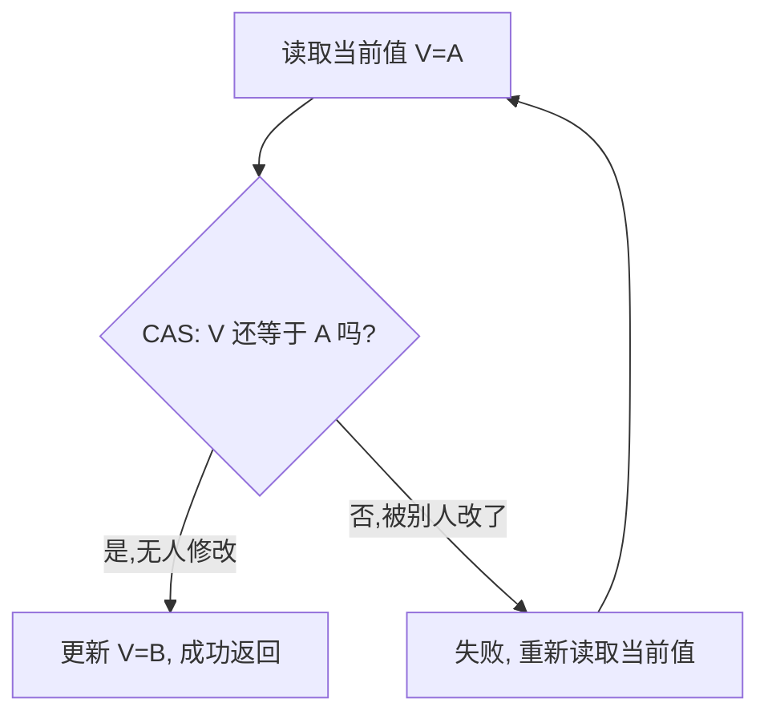

# 06 · CAS 与原子类（CAS & Atomic）

> CAS（Compare-And-Swap）是无锁并发的基石：靠 CPU 原子指令实现「比较并交换」，是 `Atomic` 类、AQS、`ConcurrentHashMap` 的底层。理解 CAS 原理、ABA 问题、自旋开销是并发进阶必考。面试重要度 ⭐⭐⭐。

## 📖 核心知识

**CAS 原理**。CAS 是一种**乐观锁**思想，包含三个操作数：**内存地址 V、预期旧值 A、要写入的新值 B**。逻辑：**当且仅当 V 处的值等于 A 时，才把 V 更新为 B；否则不做任何操作**。整个「比较+交换」是一条**原子指令**（x86 的 `cmpxchg`，配 `lock` 前缀保证原子），由 CPU 硬件保证不可分割。



**自旋（Spin）**。CAS 失败通常配合**循环重试**（自旋），直到成功。例如 `AtomicInteger.incrementAndGet()` 内部就是「读当前值→CAS 写 +1→失败则重读再试」。这就是**乐观锁 + 自旋**，无需阻塞线程，避免了 `synchronized` 的内核态切换。

**Unsafe 类**。Java 无法直接执行 CPU 指令，CAS 通过 `sun.misc.Unsafe` 的本地方法 `compareAndSwapInt/Long/Object`（JDK 9+ 为 `compareAndSetInt` 等）实现，最终调用 CPU 的 `cmpxchg`。`Unsafe` 是「不安全」的底层工具类，能直接操作内存、对象字段偏移量，普通开发不应直接使用。

**原子类家族**（`java.util.concurrent.atomic`）：

- **基本类型**：`AtomicInteger`、`AtomicLong`、`AtomicBoolean`。
- **引用类型**：`AtomicReference`、`AtomicStampedReference`（带版本号，解决 ABA）、`AtomicMarkableReference`（带布尔标记）。
- **数组**：`AtomicIntegerArray` 等。
- **字段更新器**：`AtomicIntegerFieldUpdater` 等。
- **高性能累加器（JDK 8）**：`LongAdder`、`LongAccumulator`、`DoubleAdder`。

```java
AtomicInteger cnt = new AtomicInteger(0);
cnt.incrementAndGet();                 // 原子 +1，返回新值
cnt.compareAndSet(1, 100);             // 期望是 1 则改成 100
```

**LongAdder vs AtomicLong**。高并发下 `AtomicLong` 所有线程 CAS 抢同一个 `value`，竞争激烈、大量自旋失败。**`LongAdder` 采用「分段（分散热点）」思想**：内部维护一个 `base` + `Cell[]` 数组，不同线程 CAS 更新**不同的 Cell**，降低冲突；求和时把 `base` 和所有 `Cell` 累加。**高并发写场景 `LongAdder` 吞吐远优于 `AtomicLong`**，代价是 `sum()` 瞬时值不够精确、占用内存略多。

**ABA 问题**。CAS 只比较「值是否等于预期」，若值经历 **A→B→A** 的变化，CAS 会误以为「没变过」而成功，但中间状态其实被动过。多数场景无害，但涉及「引用/栈」等结构时可能出错。

**解决方案：`AtomicStampedReference`**——引入**版本号（stamp）**，每次修改版本号 +1，CAS 时同时比较「值 + 版本号」，A→B→A 时版本号已变，CAS 失败。

```java
AtomicStampedReference<Integer> ref = new AtomicStampedReference<>(100, 0);
int stamp = ref.getStamp();
ref.compareAndSet(100, 101, stamp, stamp + 1); // 值和版本号都匹配才成功
```

## 🔑 面试要点

- CAS = 比较并交换，三操作数（V/A/B），CPU 原子指令 `cmpxchg` 保证，属**乐观锁**。
- CAS 是 `Atomic` 类、AQS、`ConcurrentHashMap` 等无锁并发的底层。
- Java 通过 `Unsafe.compareAndSwapXxx` 本地方法调用 CPU 指令。
- CAS 三大问题：**ABA、自旋开销大、只能保证一个变量原子**。
- ABA 用 `AtomicStampedReference`（版本号）解决。
- 高并发计数用 `LongAdder`（分段 CAS）优于 `AtomicLong`（单点 CAS 竞争）。
- CAS 是无锁、非阻塞，避免线程切换，但竞争激烈时自旋空耗 CPU。

## ❓ 高频面试题

**Q：什么是 CAS？它是如何保证原子性的？**
A：CAS（Compare-And-Swap）比较内存值与预期值，相等才更新为新值，否则重试。原子性由 **CPU 硬件指令**保证：x86 上是带 `lock` 前缀的 `cmpxchg`，`lock` 会锁总线/缓存行，使「比较+交换」不可被打断。Java 通过 `Unsafe` 的本地方法调用该指令。它是一种乐观锁，无需加锁阻塞。

**Q：CAS 有哪些缺点？如何解决？**
A：① **ABA 问题**——值 A→B→A 时 CAS 误判未变，用 `AtomicStampedReference` 加版本号解决；② **自旋开销**——高并发下长时间 CAS 失败空转耗 CPU，可用 `LongAdder` 分散热点或改用锁；③ **只能保证一个共享变量的原子操作**——多个变量需包成对象用 `AtomicReference`，或改用锁。

**Q：AtomicInteger 的 incrementAndGet 原理？**
A：内部是 CAS 自旋：读取当前值 `current`，计算 `next = current + 1`，用 `compareAndSet(current, next)` 尝试写入，失败（说明被其他线程改了）则重新读取当前值再试，直到成功。全程无锁、非阻塞。

**Q：LongAdder 为什么比 AtomicLong 快？**
A：`AtomicLong` 让所有线程 CAS 同一个 `value`，高并发下冲突严重、自旋浪费。`LongAdder` 把热点**分散**到 `base` + `Cell[]` 数组，不同线程更新不同 Cell，减少 CAS 冲突；读取时汇总 `base` 与所有 Cell。写多读少、高并发计数场景吞吐更高。

## ⚠️ 易错点 / 加分项

- CAS 不是「不消耗资源的锁」——竞争激烈时自旋空转，反而比阻塞锁更费 CPU。
- ABA 在多数「只关心最终值」的场景无害；只有涉及引用复用、无锁栈/链表等才需版本号。
- `LongAdder.sum()` 不是强一致快照，统计期间有并发写会有微小误差，做精确对账要慎用。
- 加分：能说出 CAS 只能保证**单个变量**原子，AQS 正是用一个 `int state` 变量 + CAS 巧妙实现了复杂同步。
- 加分：`Unsafe` 在 JDK 9+ 被 `VarHandle` 逐步替代，提供更安全的原子/内存屏障操作。
