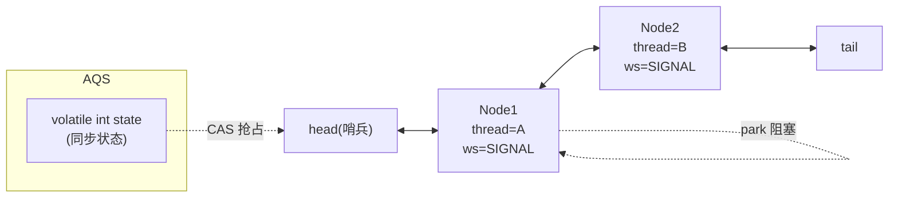
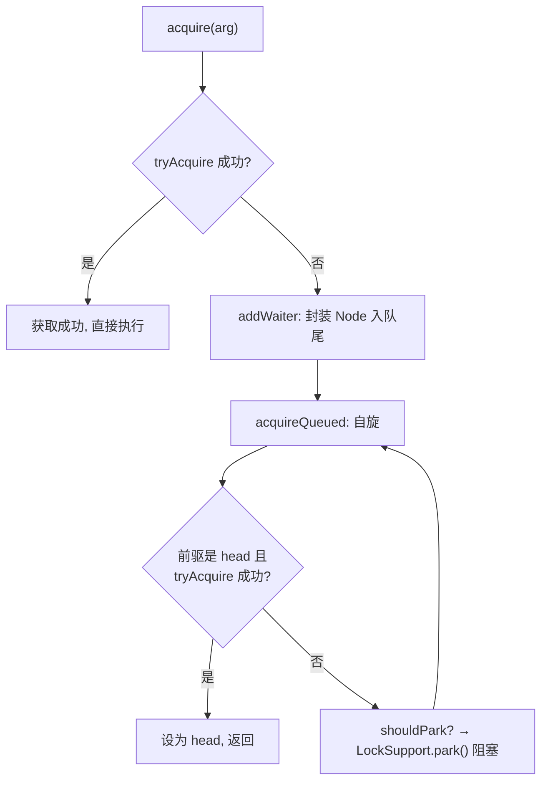

# 07 · AQS 抽象队列同步器（AbstractQueuedSynchronizer）

> AQS 是 JUC 的**半壁江山基石**：用一个 `volatile int state` + 一个 **CLH 变体双向队列**，通过**模板方法模式**封装了「获取/释放同步状态、线程排队与阻塞唤醒」的通用逻辑。`ReentrantLock`、`Semaphore`、`CountDownLatch`、`ReentrantReadWriteLock` 都基于它。面试重要度 ⭐⭐⭐（进阶必问）。

## 📖 核心知识

**AQS 是什么**。`AbstractQueuedSynchronizer` 是一个**抽象类**，为「基于 FIFO 等待队列的阻塞锁和同步器」提供框架。核心思想：如果被请求的**共享资源空闲**，就把请求线程设为有效工作线程并锁定资源；如果**被占用**，就把线程包成节点加入队列并阻塞，等资源释放时唤醒。

**两大核心：state + CLH 队列**。

- **`state`（同步状态）**：一个 `volatile int`，表示资源的持有情况。不同同步器语义不同：`ReentrantLock` 中 state 是重入次数（0 未锁）；`Semaphore` 中是可用许可数；`CountDownLatch` 中是剩余计数。通过 `getState()`/`setState()`/`compareAndSetState()`（CAS）操作。
- **CLH 变体双向队列**：一个 FIFO 的**双向链表**，未抢到资源的线程被封装成 **Node** 节点入队，节点里记录线程引用、前后指针、等待状态 `waitStatus`（如 `SIGNAL`=后继需被唤醒、`CANCELLED`=已取消等）。head 是虚拟头节点（哨兵），线程阻塞用 `LockSupport.park()`，释放时 `unpark()` 唤醒后继。

**两种资源共享模式**：

- **独占模式（Exclusive）**：同一时刻只有一个线程能获取资源，如 `ReentrantLock`。对应方法 `acquire`/`release`。
- **共享模式（Share）**：多个线程可同时获取，如 `Semaphore`、`CountDownLatch`、读写锁的读锁。对应方法 `acquireShared`/`releaseShared`。

**模板方法模式**。AQS 把「排队、阻塞、唤醒」等**通用骨架**写死在 `acquire()`/`release()` 等方法里，把「如何判断能否获取/释放资源」留给子类实现。子类只需重写几个 `protected` 方法（默认抛 `UnsupportedOperationException`）：

| 方法 | 含义 |
|---|---|
| `tryAcquire(int)` | 独占式尝试获取资源，成功返回 true |
| `tryRelease(int)` | 独占式尝试释放资源 |
| `tryAcquireShared(int)` | 共享式尝试获取（返回值含义见文档） |
| `tryReleaseShared(int)` | 共享式尝试释放 |
| `isHeldExclusively()` | 是否被当前线程独占 |

**acquire 的骨架流程**（独占）：

释放时 `release()` 调 `tryRelease()`，成功后 `unpark` 唤醒队列中后继节点，被唤醒线程继续自旋抢锁。

**基于 AQS 的 JUC 组件**：`ReentrantLock`（独占）、`Semaphore`（共享，许可）、`CountDownLatch`（共享，倒计数）、`ReentrantReadWriteLock`（读共享+写独占，用 state 高低 16 位分别表示读写）、`ThreadPoolExecutor.Worker`（独占，控制中断）等。它们内部都定义一个继承 AQS 的 `Sync` 内部类。

## 🔑 面试要点

- AQS 两大核心：`volatile int state`（同步状态）+ **CLH 变体双向 FIFO 队列**（存阻塞线程）。
- 用**模板方法模式**：骨架（排队/park/唤醒）由 AQS 实现，`tryAcquire`/`tryRelease` 等由子类定制。
- 两种模式：**独占**（Lock）与**共享**（Semaphore/CountDownLatch/读锁）。
- state 语义随同步器而变：重入次数 / 许可数 / 倒计数。
- 线程阻塞用 `LockSupport.park()`，唤醒用 `unpark()`；对应状态是 `WAITING`。
- `ReentrantLock`、`Semaphore`、`CountDownLatch`、读写锁、线程池 Worker 都基于 AQS。
- 节点 `waitStatus`：`SIGNAL`（后继需唤醒）、`CANCELLED`、`CONDITION`、`PROPAGATE`。

## ❓ 高频面试题

**Q：AQS 的原理是什么？**
A：AQS 用一个 `volatile int state` 表示同步状态，用一个 CLH 变体双向队列存放竞争失败被阻塞的线程节点。线程通过 CAS 修改 state 抢资源：成功则执行；失败则封装成 Node 入队并 `LockSupport.park()` 阻塞。持有者释放时改回 state 并 `unpark` 唤醒队首后继。它用模板方法把通用的排队/阻塞/唤醒逻辑固化，把「能否获取资源」的判断交给子类的 `tryAcquire`/`tryReleaseShared` 等实现。

**Q：AQS 的独占和共享模式区别？**
A：独占模式同一时刻只允许一个线程获取（`tryAcquire`/`tryRelease`），如 `ReentrantLock`；共享模式允许多个线程同时获取（`tryAcquireShared`/`tryReleaseShared`），如 `Semaphore`（多个许可）、`CountDownLatch`（计数到 0 全部放行）。共享模式在释放时会「传播」唤醒后续多个节点。

**Q：为什么 AQS 用模板方法模式？**
A：因为各种同步器「排队、阻塞、唤醒」的机制完全相同，只有「获取/释放资源的条件判断」不同。AQS 把相同的骨架实现好（`acquire`/`release`），把变化点抽成 `protected` 的 `tryXxx` 方法留给子类重写，达到最大复用。子类只需几十行就能实现一个新同步器。

**Q：ReentrantLock 是怎么用 AQS 实现可重入的？**
A：它的 `Sync` 继承 AQS。`tryAcquire` 时若 state==0 则 CAS 抢锁并记录持有线程；若持有线程就是当前线程，则 state++（重入计数），无需再抢。`tryRelease` 时 state--，减到 0 才真正释放并清空持有线程。这样同一线程可多次获取。

## ⚠️ 易错点 / 加分项

- CLH 队列是「变体」：原始 CLH 是自旋锁的隐式链表，AQS 改成**显式双向链表 + park 阻塞**（而非纯自旋），省 CPU。
- head 是**虚拟哨兵节点**，不关联具体线程；真正等待的线程从 head.next 开始。
- 加分：`ReentrantReadWriteLock` 巧用一个 state 的**高 16 位存读锁计数、低 16 位存写锁计数**，一个变量表达两种状态。
- 加分：`Condition` 是 AQS 的配套——每个 Condition 有独立的**条件队列**，`await()` 把节点从同步队列移到条件队列并释放锁，`signal()` 再移回同步队列。
- 加分：AQS 默认非公平（抢占式），公平模式在 `tryAcquire` 里加 `hasQueuedPredecessors()` 判断是否有前驱排队。
