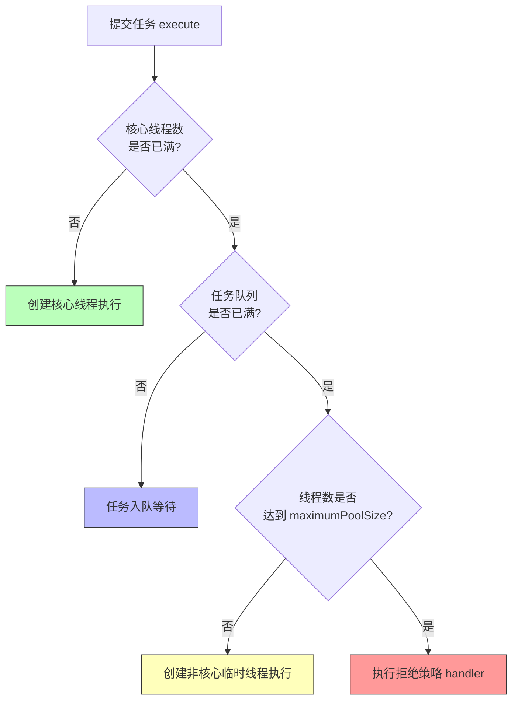

# 09 · 线程池（ThreadPoolExecutor）

> 用池化技术复用线程、削峰控流；面试必问 7 大参数、工作流程、拒绝策略、如何设线程数。面试重要度 ⭐⭐⭐ 高频。

## 📖 核心知识

**为什么要用线程池？** 线程的创建/销毁开销大（涉及内核态切换、栈内存分配），频繁 `new Thread` 会耗尽资源。线程池带来三大好处：**降低资源消耗**（复用已有线程）、**提高响应速度**（任务到达无需等待建线程）、**便于统一管理**（限制并发数、监控、调优）。

`Executors` 只是工厂类，真正的核心实现是 `ThreadPoolExecutor`。理解它的 **7 大构造参数**是掌握线程池的钥匙：

```java
public ThreadPoolExecutor(
    int corePoolSize,        // 1. 核心线程数：常驻线程，即使空闲也不回收（除非 allowCoreThreadTimeOut）
    int maximumPoolSize,     // 2. 最大线程数：核心 + 非核心（临时）线程的上限
    long keepAliveTime,      // 3. 空闲存活时间：非核心线程空闲超过此值被回收
    TimeUnit unit,           // 4. keepAliveTime 的时间单位
    BlockingQueue<Runnable> workQueue,     // 5. 任务队列：核心线程满了，任务先入队
    ThreadFactory threadFactory,           // 6. 线程工厂：定制线程名/优先级/守护属性，便于排查
    RejectedExecutionHandler handler)      // 7. 拒绝策略：队列满且线程数达 max 时如何处理
```

### 工作流程（面试核心）

新任务 `execute()` 时的判断顺序：**核心线程 → 任务队列 → 最大线程 → 拒绝策略**。



一句话记忆：**先用核心线程，忙不过来先塞队列排队，队列也满了才开临时工，临时工也满了就拒绝。** 注意是「先入队再扩线程」，这点常被误答成「先扩到 max 再入队」。

### 4 种拒绝策略

当线程数达到 `maximumPoolSize` 且队列已满，触发 `RejectedExecutionHandler`：

| 策略 | 行为 | 说明 |
| --- | --- | --- |
| `AbortPolicy`（默认） | 直接抛 `RejectedExecutionException` | 让调用方感知失败，最常用 |
| `CallerRunsPolicy` | 由**提交任务的线程**自己执行该任务 | 起到「减速」反压作用，不丢任务 |
| `DiscardPolicy` | 静默丢弃新任务 | 不抛异常，容易丢数据 |
| `DiscardOldestPolicy` | 丢弃队列中**最老**的任务，再尝试提交 | 保留新任务 |

也可实现 `RejectedExecutionHandler` 自定义（如落库、记日志、降级）。

## 🔑 面试要点

- 7 大参数：`corePoolSize`、`maximumPoolSize`、`keepAliveTime`、`unit`、`workQueue`、`threadFactory`、`handler`。
- 工作流程顺序：**核心线程 → 队列 → 最大线程 → 拒绝**（先入队，队列满才扩临时线程）。
- 4 种拒绝策略：`AbortPolicy`（默认抛异常）、`CallerRunsPolicy`（调用者执行）、`DiscardPolicy`（丢弃）、`DiscardOldestPolicy`（丢最老）。
- 非核心线程空闲 `keepAliveTime` 后被回收；`allowCoreThreadTimeOut(true)` 可让核心线程也回收。
- 队列选无界（`LinkedBlockingQueue` 默认 `Integer.MAX_VALUE`）时，`maximumPoolSize` 和拒绝策略实际**失效**——任务无限堆积可致 OOM。
- 阿里《Java 开发手册》**禁止用 `Executors` 创建线程池**，要求手动 `new ThreadPoolExecutor`，参数透明可控。
- 提交方式：`execute(Runnable)` 无返回值；`submit(Callable/Runnable)` 返回 `Future`，异常被封装进 `Future`（`get()` 时才抛）。

## ❓ 高频面试题

**Q：4 种 Executors 快捷池是什么？为什么阿里规约不推荐？**
A：
- `newFixedThreadPool(n)`：核心=最大=n，用**无界** `LinkedBlockingQueue` → 任务堆积可致 **OOM**。
- `newSingleThreadExecutor()`：单线程，同样无界队列 → **OOM** 风险。
- `newCachedThreadPool()`：核心 0、最大 `Integer.MAX_VALUE`，`SynchronousQueue` 不存任务，来一个开一个线程 → 线程数暴涨致 **OOM**。
- `newScheduledThreadPool(n)`：定时任务，最大线程 `Integer.MAX_VALUE` → 同样风险。

根源：前两者**队列无界**、后两者**线程数无界**，都可能耗尽内存。规约要求手动 `new ThreadPoolExecutor` 明确各参数（尤其**有界队列**），避免资源耗尽且便于排查。

**Q：线程数怎么设？CPU 密集 vs IO 密集？**
A：以 CPU 核数 `N = Runtime.getRuntime().availableProcessors()` 为基准：
- **CPU 密集型**（加解密、压缩、计算）：线程数 ≈ `N + 1`（+1 是为了在偶发缺页/中断挂起时仍能占满 CPU），线程太多反而增加上下文切换开销。
- **IO 密集型**（数据库、RPC、文件）：线程大量时间在等待，可设 `2N` 或更高。经验公式：`线程数 = N × (1 + 平均等待时间/平均计算时间)`。
- 工程上应结合压测确定，并预留监控动态调整（`setCorePoolSize` 等可运行时改）。

**Q：`submit` 提交的任务抛异常了，为什么看不到？**
A：`submit` 把任务包成 `FutureTask`，异常被捕获存进 `Future`，只有调用 `future.get()` 才会以 `ExecutionException` 抛出。若用 `execute`，异常会直接抛到线程的 `UncaughtExceptionHandler`。所以用 `submit` 时务必处理 `get()` 的异常，否则异常被「吞掉」。

**Q：核心线程会不会被回收？线程池怎么保活线程？**
A：默认核心线程不回收。线程池内部 `Worker` 线程在 `getTask()` 时对队列调用 `take()`（阻塞）或 `poll(keepAliveTime)`；核心线程用 `take()` 永久阻塞等任务从而保活，非核心线程用带超时的 `poll`，超时取不到任务就退出被回收。

## ⚠️ 易错点 / 加分项

- **误区**：以为「线程数先扩到 max 再入队」。真实顺序是**先入队**，队列满才扩到 max。所以用无界队列时永远走不到「扩临时线程」和「拒绝策略」。
- **误区**：`FixedThreadPool` 是安全的。它队列无界，积压任务照样 OOM。
- **加分**：能说出 `ctl` 这个 `AtomicInteger` 高 3 位存线程池状态（RUNNING/SHUTDOWN/STOP/TIDYING/TERMINATED）、低 29 位存线程数，一个变量原子管理两个信息。
- **加分**：`shutdown()` 平缓关闭（不接新任务、执行完存量），`shutdownNow()` 立即关闭（尝试中断线程、返回未执行任务列表）。
- **加分**：`ThreadFactory` 里给线程起有意义的名字（如 `order-pool-1`），线上 `jstack` 排查时能秒定位是哪个业务池。
- **加分**：线程池配合 `try-finally` 释放上下文，注意 `ThreadLocal` 在池化线程复用下需 `remove`，否则脏数据/内存泄漏（见 [10-threadlocal](./10-threadlocal.md)）。
