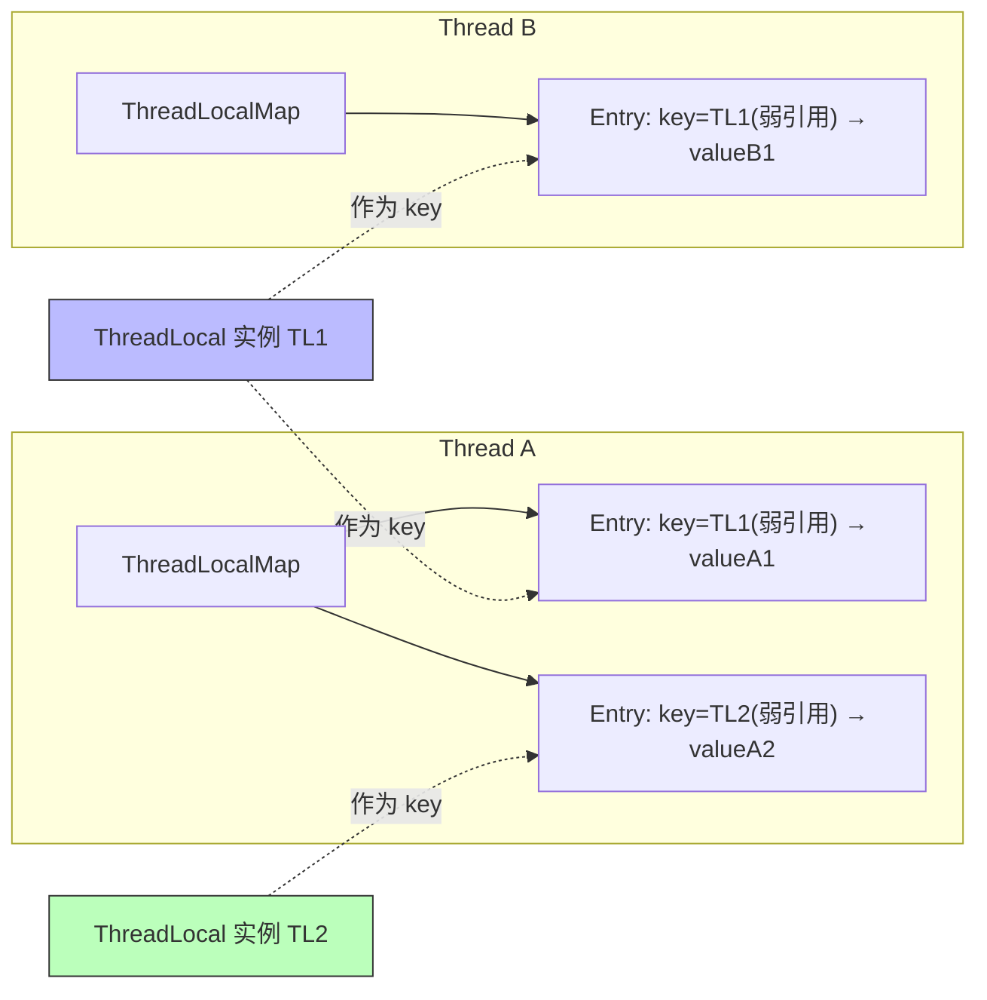

# 10 · ThreadLocal 线程本地变量

> 每个线程持有变量的独立副本，实现线程隔离；面试必问底层 `ThreadLocalMap`、弱引用 key、内存泄漏与 remove。面试重要度 ⭐⭐⭐ 高频。

## 📖 核心知识

`ThreadLocal` 提供**线程封闭**：同一个 `ThreadLocal` 对象，在不同线程 `get/set` 拿到的是各自独立的副本，互不干扰。典型用途：数据库连接/`SimpleDateFormat`（非线程安全）按线程隔离、用户上下文（登录信息、traceId）在一次请求内跨方法传递。

### 数据结构：数据存在 Thread 上，不是存在 ThreadLocal 上

关键点：**真正存值的是每个 `Thread` 对象里的 `ThreadLocalMap` 字段**，`ThreadLocal` 本身只是「访问的钥匙（key）」。



- `Thread` 有个字段 `ThreadLocal.ThreadLocalMap threadLocals`。
- `set(v)` 时：拿当前线程的 `threadLocals`，以 `this`（ThreadLocal 实例）为 key、`v` 为 value 存入。
- `get()` 时：拿当前线程的 map，以 `this` 为 key 取值。
- 所以「一个线程一份数据」天然成立——数据挂在线程自己身上。

### Entry 的弱引用 key 与内存泄漏

`ThreadLocalMap` 的 `Entry` 定义为：

```java
static class Entry extends WeakReference<ThreadLocal<?>> {
    Object value;  // value 是强引用
    Entry(ThreadLocal<?> k, Object v) { super(k); value = v; }
}
```

**key（ThreadLocal）是弱引用，value 是强引用**。引用链：`Thread → ThreadLocalMap → Entry → value（强）`。

- 当外部对 `ThreadLocal` 的强引用断开（如方法结束、置 null），下次 GC 弱引用 key 被回收 → key 变 `null`，但 **value 仍被 Entry 强引用着**，而 Entry 又被存活的 Thread（尤其线程池长期存活的线程）引用 → **value 无法回收 = 内存泄漏**（出现 key=null 的「僵尸 Entry」）。
- ThreadLocal 有部分自愈：`get/set/remove` 时会顺带清理一些 key=null 的 Entry（`expungeStaleEntry`），但不彻底、不及时。

**为什么 key 用弱引用？** 是「两害相权取其轻」的设计：如果 key 用强引用，那 ThreadLocal 实例本身也永远无法回收，泄漏更严重。用弱引用至少让 key 能被回收，配合清理机制减轻泄漏。

**根治办法：用完必须 `remove()`。** 尤其在**线程池**场景，线程被复用、生命周期极长，不 remove 会导致 value 长期滞留、甚至下个任务读到上个任务的脏数据。标准写法：

```java
try {
    userHolder.set(currentUser);
    // ... 业务逻辑
} finally {
    userHolder.remove();  // 必须！防泄漏 + 防脏数据
}
```

### InheritableThreadLocal

普通 `ThreadLocal` 的值**子线程读不到**（各线程 map 独立）。`InheritableThreadLocal` 让**子线程创建时**从父线程复制一份值：`Thread` 还有个 `inheritableThreadLocals` 字段，`new Thread()` 时若父线程该字段非空，会浅拷贝给子线程。

局限：只在**创建子线程那一刻**复制，之后父线程再改互不影响；且**线程池复用线程**时子线程不是新建的，复制不生效——阿里的 `TransmittableThreadLocal`（TTL）就是为解决池化场景的上下文传递而生。

## 🔑 面试要点

- 数据存在 **`Thread` 的 `threadLocals`（`ThreadLocalMap`）字段**里，ThreadLocal 只是 key，实现线程隔离。
- `ThreadLocalMap` 用**开放寻址法**（线性探测）解决 hash 冲突，不同于 `HashMap` 的链地址法。
- `Entry` 的 **key 是弱引用、value 是强引用**；key 被回收后 value 泄漏。
- 内存泄漏根因：线程（尤其线程池长命线程）强引用 map，key=null 的 value 无法回收 → **用完必须 `remove()`**。
- key 用弱引用是为了让 ThreadLocal 实例本身可被回收，减轻（而非消除）泄漏。
- `InheritableThreadLocal` 支持父子线程传值（创建时复制一次）；线程池下失效，需 `TransmittableThreadLocal`。

## ❓ 高频面试题

**Q：ThreadLocal 是怎么实现线程隔离的？**
A：每个 `Thread` 对象内部有一个 `ThreadLocalMap` 成员。调 `threadLocal.set(v)` 时，实际是往「当前线程自己的 map」里以该 ThreadLocal 为 key 存 v。因此不同线程各自操作各自的 map，天然隔离，根本不存在共享。ThreadLocal 对象本身不存值，只是 map 的 key。

**Q：为什么会内存泄漏？如何避免？**
A：引用链 `Thread → ThreadLocalMap → Entry → value`。Entry 的 key（ThreadLocal）是弱引用，GC 后可能变 null，但 value 是强引用仍挂在存活线程上，无法回收。线程池线程长期存活会持续积累这类僵尸 value。避免：**每次用完在 `finally` 里 `remove()`**；虽然 `get/set` 会顺带清理部分僵尸 Entry，但不可依赖。

**Q：ThreadLocalMap 的 key 为什么设计成弱引用？强引用不行吗？**
A：若 key 强引用 ThreadLocal，则只要线程存活，ThreadLocal 实例和 value 都无法回收，泄漏更严重且不可控。弱引用让「外部不再引用 ThreadLocal 时，key 可被 GC」，配合内部对 key=null 项的清理，把泄漏范围缩到「value」，并可通过 remove 彻底解决。是权衡之选。

**Q：父线程的 ThreadLocal 值，子线程能拿到吗？**
A：普通 `ThreadLocal` 不能，各线程 map 独立。要传递用 `InheritableThreadLocal`，它在**子线程被创建时**从父线程复制值。但线程池复用线程不会走「创建」逻辑，传递失效，需用阿里 `TransmittableThreadLocal`。

## ⚠️ 易错点 / 加分项

- **误区**：以为值存在 ThreadLocal 对象里。实际存在**每个 Thread** 的 map 里，ThreadLocal 只是 key。
- **误区**：以为弱引用会自动清掉 value。弱引用只作用于 **key**，value 是强引用，key 回收后 value 反而成了泄漏源。
- **加分**：`ThreadLocalMap` 用**线性探测开放寻址**解决冲突，与 `HashMap` 的拉链法不同——所以它对连续的 key=null 项做 `expungeStaleEntry` 清理很关键。
- **加分**：能区分「hash 冲突清理」和「remove 主动清理」，并指出 `remove` 是唯一可靠手段。
- **加分**：线上用 ThreadLocal 传 traceId/用户上下文时，务必在拦截器/AOP 的 `finally` 统一 remove，否则线程池复用会串上下文（安全事故）。
