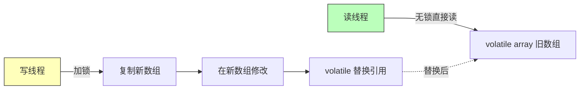

# 11 · 并发容器（Concurrent Collections）

> `java.util.concurrent` 提供的线程安全容器：读写分离的 `CopyOnWriteArrayList`、阻塞队列 `BlockingQueue`、无锁队列 `ConcurrentLinkedQueue`。面试重要度 ⭐⭐ 常考。

## 📖 核心知识

传统 `Vector`/`Hashtable`/`Collections.synchronizedList` 用**方法级 `synchronized` 全表锁**，并发下性能差且已淘汰。JUC 提供了更精细的并发容器。

### CopyOnWriteArrayList —— 读写分离，写时复制

核心思想：**读不加锁，写时复制**。写操作（`add/set/remove`）先加 `ReentrantLock`，把底层数组复制一份新的，在新数组上修改，最后用 `volatile` 引用原子替换旧数组；读操作直接读旧数组、完全无锁。

- **优点**：读操作无锁、性能极高，适合**读多写极少**（如白名单、监听器列表、配置）。
- **缺点**：① 每次写都复制整个数组，**写性能差、内存翻倍**；② **弱一致性**，迭代器基于创建时刻的数组快照，写入对正在迭代者不可见（但也因此**迭代不会抛 `ConcurrentModificationException`**，即 fail-safe）。

### BlockingQueue —— 阻塞队列（线程池 & 生产者消费者基石）

`BlockingQueue` 在队列空时 `take()` 阻塞、满时 `put()` 阻塞，天然适合生产者-消费者模型，底层靠 `ReentrantLock` + `Condition`。核心方法四组：

| 操作 | 抛异常 | 返回特殊值 | 阻塞 | 超时 |
| --- | --- | --- | --- | --- |
| 入队 | `add` | `offer` | `put` | `offer(e,t,u)` |
| 出队 | `remove` | `poll` | `take` | `poll(t,u)` |

**两大常用实现对比：**

| 维度 | `ArrayBlockingQueue` | `LinkedBlockingQueue` |
| --- | --- | --- |
| 底层结构 | 定长**数组** | **链表**（Node） |
| 容量 | **必须有界**（构造指定） | 可选，默认 `Integer.MAX_VALUE`（近似无界） |
| 锁 | **一把锁**（入队出队共用 `ReentrantLock`） | **两把锁**（`putLock`/`takeLock` 分离，吞吐更高） |
| 内存 | 预分配数组、无 GC 抖动 | 每次入队 new Node、有 GC 压力 |

> `PriorityBlockingQueue`（按优先级出队、无界）、`SynchronousQueue`（不存元素、直接交付，`newCachedThreadPool` 用它）、`DelayQueue`（延迟到期才能取）也是常见考点。

### ConcurrentLinkedQueue —— 无锁并发队列

基于**链表 + CAS** 的**无锁**（lock-free）队列，非阻塞。队列空时 `poll()` 返回 `null`（不阻塞）。适合高并发、不需要阻塞语义的场景，靠 CAS 自旋保证线程安全，吞吐高但需自己处理「取不到」的情况。

### ConcurrentHashMap

并发场景下线程安全的 `Map`，JDK7 分段锁、JDK8 改为 `CAS + synchronized` 锁桶头 + 无锁读，不允许 null 键值。原理详见集合章节 [`../04-collections/07-concurrenthashmap.md`](../04-collections/07-concurrenthashmap.md)。

## 🔑 面试要点

- `CopyOnWriteArrayList`：**读无锁 + 写时复制 + volatile 数组替换**；适合读多写少，缺点是写慢、内存翻倍、弱一致性。
- COW 的迭代器是**快照**，fail-safe，不抛 `ConcurrentModificationException`。
- `BlockingQueue` 提供阻塞的 `put/take`，是**线程池任务队列**和**生产者消费者**的基础。
- `ArrayBlockingQueue`（数组/有界/单锁） vs `LinkedBlockingQueue`（链表/可无界/双锁分离，吞吐更高）。
- `SynchronousQueue` 不存元素，`newCachedThreadPool` 用它实现「来一个交付一个」。
- `ConcurrentLinkedQueue`：CAS 无锁、非阻塞、空时 `poll` 返回 null。
- 用并发容器替代 `Vector`/`Hashtable`/`synchronizedXxx`（后者全表锁、已淘汰）。

## ❓ 高频面试题

**Q：CopyOnWriteArrayList 的原理？适用什么场景？**
A：写操作加锁并复制底层数组、在副本上改完再用 volatile 引用原子替换；读操作不加锁直接读当前数组。写写互斥、读读/读写并发。适合**读多写极少**（配置、监听器列表、黑白名单）。不适合频繁写或大数据量——每次写复制整个数组，性能和内存都吃亏。

**Q：ArrayBlockingQueue 和 LinkedBlockingQueue 有什么区别？**
A：① 结构：前者定长数组、后者链表；② 容量：前者构造必须指定有界、后者默认近似无界（易堆积致 OOM，用作线程池队列要显式限容）；③ 锁：前者入队出队共用一把锁，后者用 `putLock`/`takeLock` 两把锁分离，读写可并行、吞吐更高；④ 内存：前者预分配、无节点对象开销，后者每次入队创建 Node、有 GC 压力。

**Q：ConcurrentLinkedQueue 和 BlockingQueue 有什么不同？**
A：`ConcurrentLinkedQueue` 是**非阻塞**的无锁队列（CAS 实现），队空时 `poll` 立即返回 null；`BlockingQueue`（如 Linked/ArrayBlockingQueue）是**阻塞**队列，队空 `take` 会挂起等待、队满 `put` 会阻塞，用锁+Condition 实现。要生产者消费者的阻塞语义用 BlockingQueue，只要高吞吐无锁收发用 ConcurrentLinkedQueue。

## ⚠️ 易错点 / 加分项

- **误区**：以为 `CopyOnWriteArrayList` 读也要加锁。读**完全无锁**，只有写加锁。
- **误区**：以为并发容器的迭代反映实时数据。COW 迭代器是**快照**，迭代期间的写入看不到（弱一致性）。
- **加分**：`LinkedBlockingQueue` 双锁分离用 `Count` 的 `AtomicInteger` 协调，避免两把锁下计数错乱。
- **加分**：能点出 `BlockingQueue` 是 `ThreadPoolExecutor` 的第 5 个参数 `workQueue`，线程池「入队等待」就靠它（见 [09-thread-pool](./09-thread-pool.md)）。
- **加分**：`Collections.synchronizedList` 只是每个方法套 `synchronized`，**复合操作（如先查再改）仍需手动加锁**，且迭代要手动同步——所以真正并发选 JUC 容器。
