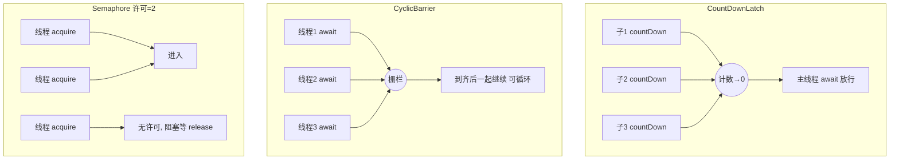

# 12 · JUC 同步工具（CountDownLatch / CyclicBarrier / Semaphore / CompletableFuture）

> 基于 AQS 的线程协作工具：倒计时门闩、循环栅栏、信号量，以及异步编排利器 `CompletableFuture`。面试重要度 ⭐⭐ 常考。

## 📖 核心知识

`CountDownLatch`、`CyclicBarrier`、`Semaphore` 都是**线程协作（同步）工具**，前两者底层基于 AQS 的共享模式（AQS 原理见并发章节 synchronized/AQS 相关文档）。

### CountDownLatch —— 倒计时门闩（一次性）

初始化一个计数 `n`，`await()` 的线程阻塞直到计数减到 0；其他线程完成工作调 `countDown()` 使计数 -1。**一次性，不能重置**。典型场景：**主线程等待 N 个子任务全部完成**、或 N 个线程等一个「发令枪」同时出发。

```java
CountDownLatch latch = new CountDownLatch(3);
for (int i = 0; i < 3; i++) {
    new Thread(() -> {
        try { doWork(); } finally { latch.countDown(); } // 完成就 -1
    }).start();
}
latch.await();        // 主线程阻塞，直到 3 个都 countDown
System.out.println("所有子任务完成");
```

### CyclicBarrier —— 循环栅栏（可重复）

让**一组线程互相等待**，都到达「栅栏点」`await()` 后再一起继续；计数归零后**自动重置**可循环使用，还能传入 `barrierAction` 在放行前执行一次。典型场景：多线程分阶段计算，每阶段结束都要「集合」再进下一阶段。

```java
CyclicBarrier barrier = new CyclicBarrier(3, () -> System.out.println("三人到齐，出发"));
Runnable player = () -> {
    prepare();
    try { barrier.await(); } catch (Exception e) {}  // 等其他人
    go();
};
```

### Semaphore —— 信号量（限流）

维护一组「许可证」，`acquire()` 拿一个许可（无则阻塞），`release()` 归还。用于**控制同时访问某资源的线程数量（限流/资源池）**。

```java
Semaphore semaphore = new Semaphore(2);   // 最多 2 个并发
semaphore.acquire();
try { accessLimitedResource(); }
finally { semaphore.release(); }          // 必须释放
```

### 三者对比

| 维度 | CountDownLatch | CyclicBarrier | Semaphore |
| --- | --- | --- | --- |
| 作用 | 一/多线程等**一组事件**完成 | 一组线程**互相等待**到齐 | 控制**并发访问数量**（限流） |
| 计数方向 | 递减到 0（`countDown`） | 递增到目标（`await`） | 许可增减（`acquire`/`release`） |
| 能否重用 | **不能**，一次性 | **能**，自动重置循环 | 能，反复 acquire/release |
| 等待者 | 调 `await` 的线程等 | 参与的线程**互相**等 | 拿不到许可的线程等 |
| 典型场景 | 主线程等子任务全完；发令枪 | 多阶段并行计算集合点 | 数据库连接池、接口限流 |



### CompletableFuture —— 异步编排（简介）

JDK8 引入，解决 `Future.get()` 只能**阻塞轮询**、无法组合的痛点。它支持**回调、链式、组合、异常处理**，是异步编排利器。

```java
CompletableFuture.supplyAsync(() -> queryUser())          // 异步执行有返回值
    .thenApply(user -> user.getName())                     // 转换结果（同线程）
    .thenCompose(name -> CompletableFuture.supplyAsync(() -> queryOrders(name))) // 串联另一个异步
    .thenAccept(System.out::println)                       // 消费结果
    .exceptionally(ex -> { log(ex); return null; });       // 异常兜底
```

常用 API：`supplyAsync/runAsync`（异步启动）、`thenApply/thenAccept/thenRun`（串行处理）、`thenCombine`（合并两个结果）、`allOf/anyOf`（等待全部/任一）、`exceptionally/handle`（异常处理）。默认用 `ForkJoinPool.commonPool()`，可传自定义线程池。

## 🔑 面试要点

- `CountDownLatch`：递减计数、**一次性**、`await` 等 `countDown` 归零；用于「等一组任务完成」。
- `CyclicBarrier`：一组线程**互相等待**、归零**自动重置可循环**、可带 `barrierAction`；用于「多阶段集合」。
- `Semaphore`：许可证控制**并发数量**，`acquire`/`release`，用于**限流/资源池**。
- 一句话区别：**Latch 等别人完成，Barrier 大家互相等，Semaphore 限制并发数。**
- `CompletableFuture` 支持回调/链式/组合/异常处理，取代阻塞式 `Future`；默认用 `ForkJoinPool.commonPool()`，生产建议传自定义线程池。
- `CountDownLatch`/`Semaphore`/`CyclicBarrier(部分)` 基于 AQS 共享模式；CyclicBarrier 基于 `ReentrantLock + Condition`。

## ❓ 高频面试题

**Q：CountDownLatch 和 CyclicBarrier 的区别？**
A：① 计数：Latch 递减、Barrier 递增到目标；② 重用：Latch 一次性不可重置，Barrier 归零后自动重置可循环；③ 语义：Latch 是「**一个/多个线程等待另一组线程**完成事件」（等待者和触发者是不同角色），Barrier 是「**一组线程互相等待**到齐再一起走」（所有线程角色相同）；④ 底层：Latch 基于 AQS，Barrier 基于 `ReentrantLock`+`Condition`；⑤ Barrier 可传到齐后执行的 `barrierAction`。

**Q：Semaphore 有什么用？**
A：控制同时访问资源的线程数量，实现**限流**或**资源池**。构造传许可数 N，`acquire` 拿许可（用完 N 个后续线程阻塞）、`release` 还许可。比如限制数据库连接并发、限制某接口 QPS。支持公平/非公平模式。

**Q：CompletableFuture 相比 Future 好在哪？**
A：`Future` 只能 `get()` 阻塞或 `isDone()` 轮询，无法注册回调、无法组合多个异步任务、无法优雅处理异常。`CompletableFuture` 支持链式回调（`thenApply/thenAccept`）、组合（`thenCompose`/`thenCombine`/`allOf`）、异常处理（`exceptionally/handle`），可编排复杂异步流程且不阻塞主线程。

## ⚠️ 易错点 / 加分项

- **易错**：`Semaphore` 的 `acquire` 后必须在 `finally` 里 `release`，否则许可泄漏，最终全部线程饿死。
- **易错**：`CyclicBarrier` 若参与线程数不足以凑齐、或某线程被中断/超时，会触发 `BrokenBarrierException`，其余等待线程一起失败——需处理该异常。
- **加分**：`CountDownLatch` 能实现「多个线程等一声令下同时开跑」——所有线程 `await` 同一个初值为 1 的 latch，主线程 `countDown` 一放，近似并发，常用于并发测试。
- **加分**：`CompletableFuture` 默认线程池是 `ForkJoinPool.commonPool()`，核心数与 CPU 相关，**IO 密集任务会打满公共池拖慢全局**，务必传自定义线程池。
- **加分**：`CompletableFuture.get()` 仍是阻塞的；真正的异步是用 `thenAccept` 等回调，不要退化成 `get`。
