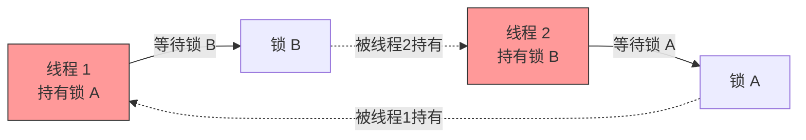

# 13 · 死锁（Deadlock）

> 两个及以上线程互相持有对方所需的锁并等待，导致永久阻塞；面试必答四个必要条件、排查（jstack）、如何避免。面试重要度 ⭐⭐⭐ 高频。

## 📖 核心知识

**死锁**：多个线程互相等待对方释放锁，谁也不肯让步，导致所有相关线程永久阻塞、无法推进。

### 死锁的四个必要条件（缺一不可）

只有**同时满足**这四个条件才可能死锁；打破任意一个即可避免。

| 条件 | 含义 |
| --- | --- |
| **互斥（Mutual Exclusion）** | 资源同一时刻只能被一个线程占用 |
| **持有并等待（Hold and Wait）** | 线程已持有资源，又去请求新资源且不释放已有的 |
| **不可剥夺（No Preemption）** | 资源只能由持有者主动释放，不能被强行抢走 |
| **循环等待（Circular Wait）** | 存在线程 A 等 B、B 等 A（或更长的环）的等待环 |



### 代码示例（经典交叉加锁）

```java
public class DeadlockDemo {
    private static final Object lockA = new Object();
    private static final Object lockB = new Object();

    public static void main(String[] args) {
        new Thread(() -> {
            synchronized (lockA) {                 // 线程1 先拿 A
                sleep(100);
                synchronized (lockB) {             // 再等 B（被线程2 持有）
                    System.out.println("线程1 拿到 A、B");
                }
            }
        }, "线程1").start();

        new Thread(() -> {
            synchronized (lockB) {                 // 线程2 先拿 B
                sleep(100);
                synchronized (lockA) {             // 再等 A（被线程1 持有）
                    System.out.println("线程2 拿到 B、A");
                }
            }
        }, "线程2").start();
    }
    static void sleep(long ms){ try{Thread.sleep(ms);}catch(Exception e){} }
}
```

两个线程各持一把、各等一把，形成循环等待 → 死锁。

### 如何用 jstack 排查

1. `jps` 或 `ps` 找到 Java 进程 PID。
2. `jstack <pid>` 打印线程栈；JVM 会**自动检测并直接标注** `Found one Java-level deadlock:`，列出涉及的线程、各自持有（`locked`）和等待（`waiting to lock`）的锁对象地址，形成闭环即死锁。

```
Found one Java-level deadlock:
=============================
"线程1":
  waiting to lock monitor 0x... (object 0x...lockB), which is held by "线程2"
"线程2":
  waiting to lock monitor 0x... (object 0x...lockA), which is held by "线程1"
```

也可用 `jconsole`/`jvisualvm`「检测死锁」按钮、Arthas `thread -b`（一键找出阻塞其他线程的死锁线程）。工具详解见姊妹项目 [`../../jvm-learning/34-troubleshooting-tools.md`](../../jvm-learning/34-troubleshooting-tools.md)。

### 如何避免死锁（打破必要条件）

- **破坏「循环等待」（最常用）**：所有线程按**固定全局顺序**申请锁（如永远先 lockA 再 lockB），环就不可能形成。
- **破坏「持有并等待」**：一次性申请到全部所需资源，或用 `tryLock` 拿不全就全部释放重试。
- **破坏「不可剥夺」**：用 `ReentrantLock.tryLock(timeout)` 超时放弃已持有的锁，避免无限等待。
- **减少锁粒度/持有时间**、用无锁结构或数据库乐观锁等，从根上少用锁。

## 🔑 面试要点

- 四个必要条件：**互斥、持有并等待、不可剥夺、循环等待**，同时满足才死锁，破坏任一即可避免。
- 最实用的避免手段：**统一加锁顺序**，破坏循环等待。
- `synchronized` 无法超时/中断，易死锁；`ReentrantLock` 的 `tryLock(timeout)`/`lockInterruptibly` 可主动避免。
- 排查：`jstack <pid>`，JVM 自动打印 `Found one Java-level deadlock`，看 `held by` / `waiting to lock` 闭环。
- 死锁 ≠ 活锁（互相谦让不断重试仍无进展）≠ 饥饿（线程一直抢不到资源）。

## ❓ 高频面试题

**Q：产生死锁的四个必要条件是什么？**
A：① 互斥：资源同时只能一个线程用；② 持有并等待：持有资源的同时又请求新资源且不放手；③ 不可剥夺：资源不能被强制夺走，只能持有者主动释放；④ 循环等待：存在线程互相等待的环。四者缺一不成死锁，破坏任意一个即可预防。

**Q：怎么排查线上死锁？**
A：先 `jps` 定位进程，再 `jstack <pid>` dump 线程栈。JVM 会自动检测并在末尾打印 `Found one Java-level deadlock`，明确列出死锁线程及各自持有/等待的锁，顺着 `held by` 找环即可定位到具体代码行。也可用 Arthas `thread -b`、jconsole/jvisualvm 的死锁检测。

**Q：如何避免死锁？**
A：最常用是**破坏循环等待——所有线程按统一顺序申请锁**。其它：一次性申请全部锁（破坏持有并等待）；用 `ReentrantLock.tryLock(超时)` 拿不到就释放重试（破坏不可剥夺）；减小锁粒度、缩短持锁时间、能不用锁就不用锁。

## ⚠️ 易错点 / 加分项

- **易错**：把死锁和活锁混为一谈。活锁是线程都在动、不断重试却因互相谦让始终无进展（如两人过道互相让路）；饥饿是某线程长期抢不到资源。
- **加分**：`synchronized` 不能设置超时，一旦交叉加锁就真死锁；换 `ReentrantLock.tryLock(long, TimeUnit)` 能超时退出，是工程上防死锁的关键改造。
- **加分**：能指出 JVM 只能检测 `synchronized` 和 JUC `Lock` 的死锁，无法检测「数据库锁 + 应用锁」跨系统死锁，需结合业务日志。
- **加分**：面试可引申——银行家算法（避免死锁）、资源有序分配法（预防死锁）是操作系统层面的经典方案。
- **加分**：给锁对象/资源编号，按编号升序加锁，是「统一加锁顺序」在多把动态锁时的通用落地方式。
