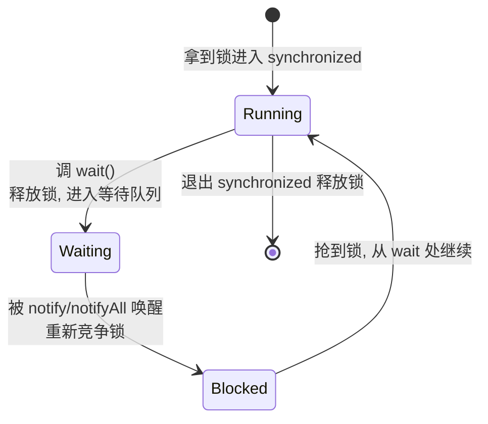

# 14 · 线程通信 wait / notify / notifyAll

> 定义在 `Object` 上的线程等待-唤醒机制，必须在 `synchronized` 中使用；生产者消费者的经典基石。面试重要度 ⭐⭐⭐ 高频。

## 📖 核心知识

`wait()`/`notify()`/`notifyAll()` 是 `Object` 的方法，用于**线程间协作通信**：一个线程条件不满足时 `wait()` 挂起并**释放锁**，另一个线程改变条件后 `notify()` 唤醒它。

### 三个方法

- `wait()`：使当前线程进入该对象的**等待队列（wait set）**并**释放持有的锁**，直到被 `notify`/`notifyAll` 唤醒或被中断。
- `notify()`：从等待队列中**随机唤醒一个**等待该对象锁的线程。
- `notifyAll()`：唤醒等待该对象的**全部**线程，被唤醒的线程重新竞争锁。



### 必须在 synchronized 中调用

调用 `wait/notify/notifyAll` 前，当前线程**必须持有该对象的监视器锁（monitor）**，否则抛 `IllegalMonitorStateException`。原因：

1. `wait` 要「释放锁 + 挂起」两步原子完成，没有锁就无从释放。
2. 防止**丢失唤醒（lost wakeup）**：若不加锁，可能出现「A 刚判断条件不满足、还没 wait，B 就 notify 了」，导致唤醒信号丢失、A 永久阻塞。synchronized 保证「判断条件」和「wait」在同一临界区内原子进行。

### wait 必须配合 while 循环判断条件

**不能用 `if` 判断条件，必须用 `while`**，防止**虚假唤醒（spurious wakeup）**以及被 `notifyAll` 唤醒后条件其实仍不满足：

```java
synchronized (lock) {
    while (!条件满足) {   // 必须 while，不能 if
        lock.wait();       // 被唤醒后回到 while 重新校验
    }
    // 执行业务
}
```

### 为什么 wait/notify 定义在 Object 而不是 Thread？

因为**锁是对象级别的**——任何对象都可以作为锁（monitor）。`wait/notify` 操作的是「某个对象的监视器和它的等待队列」，与具体对象绑定，而非线程。每个对象都有 monitor，所以这些方法自然定义在所有对象的基类 `Object` 上。若放在 `Thread` 上，就无法表达「在哪个对象的锁上等待」。

### 生产者-消费者示例

```java
public class ProducerConsumer {
    private final LinkedList<Integer> buffer = new LinkedList<>();
    private final int MAX = 10;

    public void produce(int v) throws InterruptedException {
        synchronized (buffer) {
            while (buffer.size() == MAX) {   // 满了就等
                buffer.wait();
            }
            buffer.add(v);
            buffer.notifyAll();              // 唤醒消费者
        }
    }

    public int consume() throws InterruptedException {
        synchronized (buffer) {
            while (buffer.isEmpty()) {       // 空了就等
                buffer.wait();
            }
            int v = buffer.removeFirst();
            buffer.notifyAll();              // 唤醒生产者
            return v;
        }
    }
}
```

### 与 Condition 对比

JUC 的 `Lock` + `Condition` 是 `synchronized` + `wait/notify` 的升级替代：

| 维度 | `Object` 的 wait/notify | `Condition`（配合 `ReentrantLock`） |
| --- | --- | --- |
| 依赖 | `synchronized` 内置锁 | `Lock` 显式锁（`lock/unlock`） |
| 等待队列数量 | **一个**对象只有一个等待队列 | 一个 Lock 可 `newCondition()` **多个**队列 |
| 精准唤醒 | 只能 `notify`（随机一个）/`notifyAll`（全部） | 可对**不同条件分别唤醒**（如满队列/空队列各一个 Condition），更高效 |
| 方法名 | `wait/notify/notifyAll` | `await/signal/signalAll` |
| 灵活性 | 不可中断超时细控（有限） | 支持 `awaitNanos`、`awaitUninterruptibly` 等 |

用 `Condition` 实现生产者消费者可用 `notFull`、`notEmpty` 两个条件队列，避免 `notifyAll` 唤醒无关线程的开销（`ArrayBlockingQueue` 内部正是如此）。

## 🔑 面试要点

- `wait/notify/notifyAll` 是 `Object` 的方法，因为**锁绑定在对象上**，任意对象都能当锁。
- 三者必须在 `synchronized`（持有该对象锁）中调用，否则抛 `IllegalMonitorStateException`。
- `wait()` 会**释放锁**并挂起；`notify` 唤醒后线程需**重新竞争锁**才能继续。
- **对比 `sleep`**：`Thread.sleep` 是 `Thread` 的静态方法、**不释放锁**、时间到自动醒；`wait` 释放锁、需被唤醒。
- 判断条件必须用 **`while` 而非 `if`**，防虚假唤醒和唤醒后条件不成立。
- 优先 `notifyAll`；`notify` 随机唤醒一个，可能唤错线程导致「信号丢失」死等。
- 升级方案：`ReentrantLock` + 多个 `Condition`，用 `await/signal/signalAll`，支持**多等待队列、精准唤醒**。

## ❓ 高频面试题

**Q：为什么 wait/notify 定义在 Object 而不是 Thread？**
A：因为 Java 的锁是对象级的——每个对象都有一个 monitor（监视器）和对应的等待队列，`wait/notify` 本质是操作「某个对象锁上的等待队列」。任何对象都能当锁，所以这些方法必须在所有对象的父类 `Object` 上。若放在 `Thread`，就无法表达「在哪个对象的锁上等待/唤醒」。

**Q：wait 和 sleep 的区别？**
A：① 归属：`wait` 是 `Object` 方法，`sleep` 是 `Thread` 静态方法；② 锁：`wait` **释放**当前对象锁，`sleep` **不释放**任何锁；③ 唤醒：`wait` 需 `notify`/中断/超时唤醒，`sleep` 到时自动醒；④ 使用限制：`wait` 必须在 `synchronized` 内，`sleep` 任意处可用。

**Q：为什么 wait 必须放在 synchronized 里、且用 while 判断？**
A：必须在 synchronized 里是因为 `wait` 要原子地「释放锁并挂起」，没锁无从释放，且能防止判断条件与 wait 之间被 notify 抢先造成**丢失唤醒**。用 `while` 是因为线程被唤醒后（尤其 `notifyAll` 或虚假唤醒）条件可能仍不满足，必须**重新校验**，否则会错误地继续执行。

**Q：notify 和 notifyAll 怎么选？**
A：`notify` 只随机唤醒一个等待线程，若唤醒的不是能满足条件的线程，可能导致该有效线程一直不被唤醒（信号丢失），有死锁风险。`notifyAll` 唤醒全部、重新竞争锁，更安全，是默认推荐。要精准唤醒某类线程，应改用 `Condition` 的多队列方案。

## ⚠️ 易错点 / 加分项

- **易错**：用 `if` 判断等待条件——被 `notifyAll` 唤醒后条件其实还不满足却直接往下走，产生数据错误。永远用 `while`。
- **易错**：以为 `notify` 会立刻让被唤醒线程运行。被唤醒线程只是从 wait set 移到「就绪竞争锁」，仍要等当前线程退出 synchronized、并抢到锁后才继续。
- **加分**：`notify` 随机唤醒可能引发「信号丢失/假死」，`Condition` 的 `signal` 也随机，但可用多个 Condition 对不同条件精准 `signal`，`ArrayBlockingQueue` 就用 `notFull`/`notEmpty` 两个条件。
- **加分**：能说清「丢失唤醒」问题——正是 synchronized 保证「检查条件 + wait」在同一临界区，才杜绝了 notify 在两步之间插入导致的永久阻塞。
- **加分**：`wait(long)` 支持超时返回，避免永久等待，是防「唤醒丢失导致死等」的一道保险。
