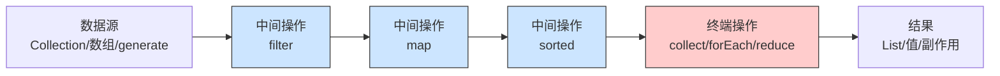

# 03 · Stream 流（Stream API）

> Stream 用声明式、链式的方式处理集合数据，核心特征是「中间操作惰性、终端操作触发」。它不存数据、不改源、只能用一次。是 Java 8 最重要、面试最高频的特性。面试重要度：⭐⭐⭐ 高频（重点！）。

## 📖 核心知识

Stream 是对集合/数组等数据源的一层「函数式处理管道」，让你像写 SQL 一样声明「做什么」而非「怎么循环」。**Stream 本身不存储数据，也不修改源数据**，每个操作产出新流或结果。

**三段式结构**：数据源（source）→ 若干中间操作（intermediate）→ 一个终端操作（terminal）。



**中间操作 vs 终端操作**——面试必答的核心区别：

| 类型 | 返回值 | 是否立即执行 | 举例 |
| --- | --- | --- | --- |
| 中间操作 | 返回 `Stream`（可链式） | **惰性**，不立即执行 | `filter`、`map`、`sorted`、`distinct`、`limit`、`skip`、`peek`、`flatMap` |
| 终端操作 | 返回具体结果或 void | **触发**整条管道执行 | `collect`、`forEach`、`reduce`、`count`、`min/max`、`anyMatch`、`findFirst`、`toArray` |

**惰性求值（lazy evaluation）**：中间操作只是「记录」要做什么，构建管道，并不真正遍历数据；直到遇到终端操作才一次性触发执行。没有终端操作，中间操作一行代码都不会跑。

```java
Stream.of("a", "b", "c")
      .filter(s -> { System.out.println("filter " + s); return true; });
// 上面没有终端操作 —— 什么都不打印！
```

惰性还带来一个优化：**短路 + 单次遍历**。管道是「垂直」执行的，每个元素依次流过所有操作，而非「水平」地对整个集合做完 filter 再做完 map。配合 `limit`、`findFirst`、`anyMatch` 等可以短路提前结束。

```java
List<String> names = Arrays.asList("Tom", "Jerry", "Alice", "Bob");
// filter 和 map 对每个元素依次执行，limit 拿够 2 个就停
List<String> r = names.stream()
    .filter(s -> s.length() > 3)   // 中间
    .map(String::toUpperCase)      // 中间
    .limit(2)                      // 中间（短路）
    .collect(Collectors.toList()); // 终端触发
// [JERRY, ALICE]
```

**常用操作速览**：

```java
// map：转换；filter：过滤
list.stream().map(User::getAge).filter(a -> a > 18);

// reduce：归约聚合（求和/求积/拼接）
int sum = nums.stream().reduce(0, Integer::sum);
Optional<Integer> max = nums.stream().reduce(Integer::max);

// collect：收集成集合
List<String> l = s.collect(Collectors.toList());
Set<String>  se = s.collect(Collectors.toSet());
Map<Long, User> m = users.stream()
    .collect(Collectors.toMap(User::getId, u -> u));
String joined = s.collect(Collectors.joining(", ", "[", "]"));

// groupingBy：分组（相当于 SQL group by）
Map<String, List<User>> byCity =
    users.stream().collect(Collectors.groupingBy(User::getCity));
// 分组后统计数量
Map<String, Long> cnt = users.stream()
    .collect(Collectors.groupingBy(User::getCity, Collectors.counting()));

// partitioningBy：按布尔条件二分
Map<Boolean, List<User>> parts =
    users.stream().collect(Collectors.partitioningBy(u -> u.getAge() >= 18));

// flatMap：把「流的流」压平成一个流
List<String> words = lines.stream()
    .flatMap(line -> Arrays.stream(line.split(" ")))
    .collect(Collectors.toList());
```

**并行流 `parallelStream()`**：底层用 `ForkJoinPool.commonPool()` 把数据拆分到多线程并行处理，最后合并。用法只是把 `stream()` 换成 `parallelStream()`，但**坑很多**：
- 数据量小 / 单元素处理很快时，线程调度和合并的开销反而更慢。
- Lambda 里若操作**共享可变状态**（如往外部 `ArrayList` add）会有线程安全问题，必须用 `collect` 或线程安全容器。
- 所有并行流共用一个 `commonPool`，若里面有阻塞 IO 会拖垮全局，生产慎用（可自定义 ForkJoinPool）。
- `forEach` 在并行流下**不保证顺序**，要保序用 `forEachOrdered`。
- 只有满足「无状态、无副作用、可结合(associative)」的操作并行才安全高效。

**Stream 不可复用**：一个 Stream 只能被消费一次，终端操作后流就「关闭」了，再用抛 `IllegalStateException: stream has already been operated upon or closed`。

```java
Stream<String> s = list.stream();
s.forEach(System.out::println);
s.forEach(System.out::println);  // 抛 IllegalStateException！
```

## 🔑 面试要点

- Stream 不存数据、不改源、只能消费一次；分数据源 + 中间操作 + 终端操作三段。
- **中间操作返回 Stream 且惰性，终端操作触发执行并返回结果/void**——这是最核心的区别。
- 惰性求值：无终端操作则中间操作不执行；管道对每个元素垂直执行，支持短路（limit/findFirst/anyMatch）。
- 常用：`map`（转换）、`filter`（过滤）、`reduce`（归约）、`collect`（收集）、`sorted`、`distinct`、`flatMap`（压平）。
- `Collectors`：`toList/toSet/toMap/joining/groupingBy/partitioningBy/counting/summingInt`。
- `parallelStream` 用 ForkJoin commonPool；注意共享可变状态、无序性、commonPool 阻塞、小数据反而慢。
- 基本类型流 `IntStream/LongStream/DoubleStream` 避免装箱，有 `sum/average/range` 等便捷方法。
- Stream 复用会抛 `IllegalStateException`。

## ❓ 高频面试题

**Q：中间操作和终端操作有什么区别？什么是惰性求值？**
A：中间操作返回新的 Stream，可以链式调用，是惰性的——只构建管道不真正执行；终端操作返回最终结果或 void，会触发整条管道执行，一个流只能有一个终端操作。惰性求值指中间操作被延迟到终端操作时才执行，若没有终端操作则一行都不跑；执行时每个元素依次流经所有操作（垂直执行），因此能配合 limit/findFirst 做短路优化，且整个数据源只遍历一次。

**Q：`map` 和 `flatMap` 有什么区别？**
A：`map` 是一对一转换，每个元素映射成一个新元素（`Stream<T>` → `Stream<R>`）；`flatMap` 是一对多再压平，每个元素先映射成一个流，再把所有流「拉平」合并成一个流，常用于处理「集合的集合」，比如把 `List<List<String>>` 展开成 `Stream<String>`。

**Q：`parallelStream()` 使用要注意什么？什么场景不该用？**
A：注意四点：①它用全局共享的 ForkJoin commonPool，若含阻塞 IO 会影响整个应用；②Lambda 内不能操作共享可变状态，否则有线程安全问题，应改用 collect；③forEach 不保证顺序，保序用 forEachOrdered；④数据量小或单元素处理快时，拆分/合并/线程切换的开销可能比串行还慢。适合 CPU 密集、大数据量、无状态无副作用且可结合的操作，且要实测性能。

**Q：Stream 可以被重复使用吗？**
A：不可以。Stream 是一次性的，执行完终端操作后流即关闭，再次操作会抛 `IllegalStateException`。若要多次处理，应重新从数据源创建新流，或先 collect 成集合再操作。

## ⚠️ 易错点 / 加分项

- 忘了写终端操作，以为 filter/map 执行了——惰性求值下它们根本不跑。
- `Collectors.toMap` 遇到重复 key 会抛 `IllegalStateException`，需传第三个参数指定合并策略：`toMap(k, v, (a,b)->a)`。
- 并行流里往普通 `ArrayList` add 元素——非线程安全，数据可能丢失或异常。
- `peek` 用于调试（打印中间值），别拿它做业务副作用；且无终端操作时 peek 也不执行。
- 加分：说清并行流共用 commonPool 的坑，以及可用 `new ForkJoinPool(n).submit(() -> stream.parallel()...).get()` 隔离。
- 加分：处理大量基本类型时用 `IntStream`（`mapToInt`）避免装箱，性能更好且有 `sum/average` 等专用方法。
- 加分：`reduce` 的三参数版本 `reduce(identity, accumulator, combiner)` 中 combiner 只在并行时用于合并各段结果。
