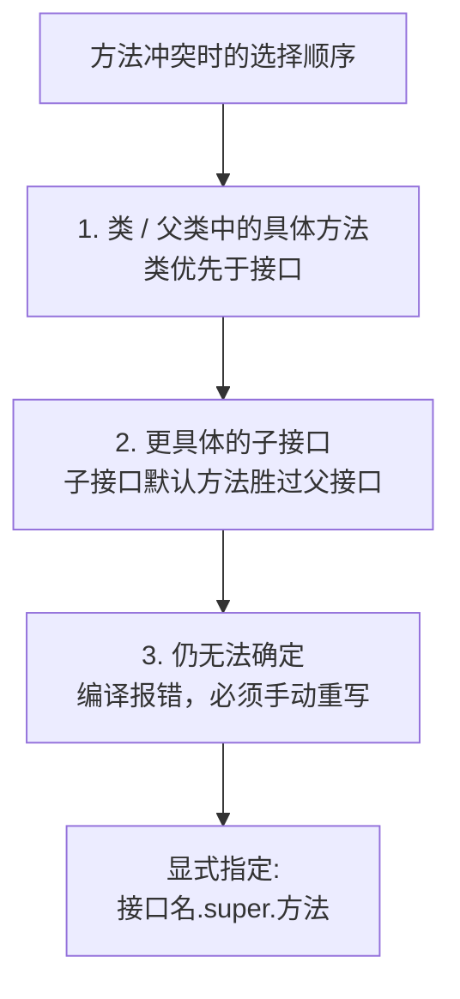

# 07 · 接口默认方法（Default Method）

> Java 8 允许接口定义带方法体的 `default` 方法和 `static` 方法。它的核心目的是**接口演进**——给已有接口加新方法时，不破坏所有实现类。面试重要度：⭐⭐ 常考。

## 📖 核心知识

Java 8 之前，接口只能有抽象方法（和常量）。Java 8 起接口可以有：
- **默认方法（default method）**：用 `default` 修饰、带方法体，实现类**可继承可重写**。
- **静态方法（static method）**：用 `static` 修饰、带方法体，只能用**接口名**调用，不被继承。

```java
interface Greeting {
    void hello();                          // 抽象方法
    default void greet() {                 // 默认方法，实现类可直接用
        System.out.println("Hi, " + name());
    }
    default String name() { return "Guest"; }
    static Greeting create() {             // 静态方法，工厂
        return () -> System.out.println("hello");
    }
}
```

**为什么引入（面试核心）——接口演进 / 向后兼容**：设想 `Collection` 接口要新增 `stream()`、`forEach()` 方法。如果是普通抽象方法，那么**所有**实现了 `Collection` 的类（包括无数第三方库）都必须实现它，否则编译不过——这会造成大面积破坏。有了默认方法，就能在接口里直接给出默认实现，老的实现类**不改一行代码**也能自动获得新方法。Java 8 正是靠 default 方法给 `Collection` 加上了 `stream()`、`forEach()`，给 `Comparator` 加上了 `reversed()`、`thenComparing()` 等。

一句话：**默认方法是为了在不破坏现有实现的前提下扩展接口。**

**菱形继承冲突（diamond problem）**：一个类可以实现多个接口，若多个接口有**同名同参**的默认方法，就会冲突。Java 的解决规则有明确优先级：



**三条规则**：
1. **类优先（Class wins）**：父类中的方法（具体方法）优先于接口默认方法。「具体类的方法总是赢」。
2. **子接口优先（Subtype wins）**：若两个冲突接口有继承关系，更具体的子接口默认方法胜出。
3. **否则强制手动**：若上面都无法裁决（两个无关接口同名默认方法），编译器报错，实现类**必须重写**该方法，可用 `接口名.super.方法()` 显式选择某个父接口的实现。

```java
interface A { default void say() { System.out.println("A"); } }
interface B { default void say() { System.out.println("B"); } }

class C implements A, B {
    @Override
    public void say() {
        A.super.say();   // 显式选 A 的实现，解决冲突
    }
}
```

## 🔑 面试要点

- 接口可有 `default`（有方法体、可被实现类继承/重写）和 `static`（接口名调用、不继承）方法。
- 引入目的是**接口演进 / 向后兼容**：给老接口加方法而不破坏已有实现类（如 Collection 的 stream/forEach）。
- 默认方法可被实现类重写；静态方法不能被重写、只能用接口名调用。
- 菱形冲突三规则：①类优先于接口 ②子接口优先于父接口 ③都无法裁决则强制手动重写。
- 手动裁决用 `接口名.super.方法()` 显式调用某父接口默认实现。
- 接口仍不能有实例字段（只有常量 `public static final`），所以不是「多继承」的完全替代。

## ❓ 高频面试题

**Q：Java 8 为什么要给接口引入默认方法？**
A：核心目的是**接口的向后兼容演进**。Java 8 要给 `Collection` 等已有接口新增 `stream()`、`forEach()` 等方法，如果用抽象方法，所有实现类（含大量第三方代码）都必须实现新方法否则编译失败，破坏性极大。默认方法允许接口自带方法实现，老实现类无需改动即可获得新功能，从而在不破坏兼容性的前提下扩展接口。

**Q：一个类实现的两个接口有同名默认方法会怎样？如何解决？**
A：如果两个接口无继承关系且有同名同参默认方法，会产生冲突，编译器无法自动选择，**强制要求实现类重写该方法**，否则编译报错。重写时可用 `接口名.super.方法名()` 显式指定调用哪个接口的默认实现。若冲突方能被裁决（类中方法优先、子接口优先于父接口）则按规则自动选，不报错。

**Q：默认方法和抽象类有什么区别？既然接口能有方法体，还要抽象类干嘛？**
A：区别在于：①接口不能有实例字段/状态（只有静态常量），抽象类可以有成员变量、构造器、各种访问修饰符；②一个类只能继承一个抽象类，却能实现多个接口。所以默认方法适合「给接口补充通用行为」，而需要维护对象状态、共享字段、模板方法模式时仍应用抽象类。二者互补而非替代。

## ⚠️ 易错点 / 加分项

- 以为有了默认方法接口就等于抽象类——接口**没有实例状态（字段）**，这是本质区别。
- 静态方法不能被实现类继承，也不能通过实现类调用，只能 `接口名.方法()`。
- 菱形冲突时忘了必须显式重写——不写会编译报错。
- `接口名.super.方法()` 语法容易写错成 `super.接口名.方法()`。
- 加分：能举出实际例子——`Comparator` 的 `reversed()`/`thenComparing()`、`Collection` 的 `stream()`/`forEach()` 都是默认方法。
- 加分：指出「类优先」规则的设计哲学——具体实现类的行为永远优先于接口的默认行为，保证兼容性时不意外覆盖已有实现。
