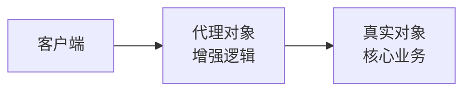

# 03 · 代理模式（Proxy）

> 为目标对象提供一个「替身」，在不改动目标代码的前提下，于调用前后插入额外逻辑（日志、权限、事务、缓存）。它是 Spring AOP 的底层基石。面试重要度 ⭐⭐⭐。

## 📖 核心知识

代理模式让**代理对象**和**真实对象**实现同一接口，客户端拿到的是代理，代理内部持有真实对象，在转发调用的同时做增强。



### 1. 静态代理

手写一个代理类，编译期就确定。缺点：**每个接口都要写一个代理类**，接口方法多、类多时代码爆炸。

```java
interface Service { void doWork(); }
class RealService implements Service {
    public void doWork() { System.out.println("核心业务"); }
}
class ServiceProxy implements Service {
    private final Service target;
    ServiceProxy(Service target) { this.target = target; }
    public void doWork() {
        System.out.println("前置：记录日志");
        target.doWork();
        System.out.println("后置：清理资源");
    }
}
```

### 2. 动态代理

运行时**动态生成**代理类，一套增强逻辑可套用到任意接口/类，无需手写代理类。两种实现：

**（1）JDK 动态代理**——基于**接口**，用 `Proxy` + `InvocationHandler`，要求目标类必须实现接口。

```java
Service proxy = (Service) Proxy.newProxyInstance(
    target.getClass().getClassLoader(),
    target.getClass().getInterfaces(),
    (proxyObj, method, args) -> {          // InvocationHandler
        System.out.println("前置增强");
        Object result = method.invoke(target, args);  // 反射调真实方法
        System.out.println("后置增强");
        return result;
    });
proxy.doWork();
```

**（2）CGLIB 动态代理**——基于**继承**，运行时生成目标类的**子类**并重写方法，不要求接口。因为靠继承，所以**不能代理 final 类/final 方法**。

### JDK 动态代理 vs CGLIB

| 维度 | JDK 动态代理 | CGLIB |
| --- | --- | --- |
| 依赖 | JDK 自带（`java.lang.reflect.Proxy`） | 第三方（基于 ASM 字节码） |
| 原理 | 运行时生成实现**接口**的代理类 | 运行时生成目标类的**子类** |
| 要求 | 目标类**必须有接口** | 无需接口，但不能是 final 类 |
| 限制 | 只能代理接口方法 | 不能代理 final/private 方法 |

### 真实应用：Spring AOP

Spring AOP 就是动态代理的经典落地：**目标 Bean 有接口 → 默认用 JDK 动态代理；没有接口 → 用 CGLIB**（Spring Boot 2.x 起默认全用 CGLIB）。事务 `@Transactional`、`@Async`、缓存 `@Cacheable` 都靠代理在方法前后织入逻辑。

> 这也解释了一个经典坑：`@Transactional` 方法**类内自调用会失效**——因为自调用走的是 `this.method()`，绕过了代理对象。

## 🔑 面试要点

- 代理 = 替身对象，同接口 + 持有真实对象 + 调用前后增强。
- 静态代理编译期写死，一对一，类会爆炸；动态代理运行时生成，一套逻辑通用。
- JDK 动态代理基于**接口** + `InvocationHandler` + 反射 `method.invoke`。
- CGLIB 基于**继承**（生成子类），不要求接口，但代理不了 `final`。
- Spring AOP：有接口用 JDK，无接口用 CGLIB（Spring Boot 2.x 起默认 CGLIB）。
- `@Transactional` 自调用失效，根因是绕过了代理对象。

## ❓ 高频面试题

**Q：JDK 动态代理和 CGLIB 有什么区别？分别在什么场景用？**
A：JDK 动态代理基于接口，用 `Proxy.newProxyInstance` 生成实现同接口的代理类，要求目标类有接口；CGLIB 基于继承，用 ASM 生成目标类的子类重写方法，不要求接口但代理不了 final 类/方法。Spring 中有接口默认走 JDK，无接口走 CGLIB。

**Q：JDK 动态代理为什么必须要接口？**
A：因为它生成的代理类继承自 `java.lang.reflect.Proxy`，Java 单继承，代理类已经继承了 `Proxy` 就无法再继承目标类，只能通过**实现目标接口**来保证类型兼容。

**Q：静态代理和动态代理的区别？**
A：静态代理在编译期手写代理类，一个接口一个代理类，改动大；动态代理在运行时根据接口/父类动态生成代理，一套 `InvocationHandler` 逻辑可复用到任意目标，代码量小、扩展强。

**Q：为什么 `@Transactional` 在同一个类里自己调自己会失效？**
A：Spring 的事务增强是加在代理对象上的。类内 `this.methodB()` 直接调的是原始对象方法，没经过代理，自然不会触发事务/AOP 逻辑。解决办法：注入自身代理、或把方法拆到另一个 Bean。

## ⚠️ 易错点 / 加分项

- **误区**：「动态代理不用反射。」——JDK 动态代理的 `InvocationHandler.invoke` 里正是用 `method.invoke()` 反射调用真实方法。动态代理的反射底层详见 [`08-reflection-proxy`](../08-reflection-proxy)。
- **误区**：「CGLIB 比 JDK 代理一定慢。」——早期 CGLIB 创建慢但调用快，现代 JDK 优化后差距很小，不必纠结性能选型。
- **加分**：能说出 JDK 代理类命名规则 `$Proxy0`，以及它继承 `Proxy`、实现目标接口。
- **加分**：能点出代理模式和装饰器模式的区别——代理**控制访问**（增强/权限/懒加载），装饰器**增强功能**（详见 [08-decorator](./08-decorator.md)）。
