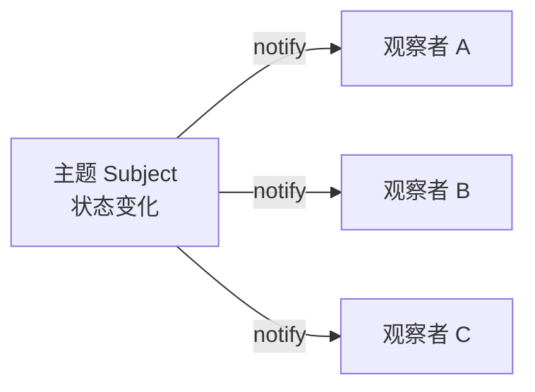

# 05 · 观察者模式（Observer）

> 定义对象间「一对多」的依赖：当一个对象（被观察者/主题）状态变化时，自动通知所有依赖它的对象（观察者）。也叫发布-订阅模式，是事件驱动、监听机制的核心。面试重要度 ⭐⭐。

## 📖 核心知识

角色：**Subject（主题/被观察者）**维护一个观察者列表，提供注册/移除/通知方法；**Observer（观察者）**实现一个统一的更新接口，被通知时执行自己的逻辑。二者**面向接口**耦合，主题不关心观察者具体是谁。



```java
interface Observer { void update(String event); }

class Subject {
    private final List<Observer> observers = new ArrayList<>();
    public void register(Observer o) { observers.add(o); }
    public void remove(Observer o) { observers.remove(o); }
    public void publish(String event) {           // 状态变化，通知所有观察者
        for (Observer o : observers) o.update(event);
    }
}

// 使用
Subject subject = new Subject();
subject.register(e -> System.out.println("邮件服务收到：" + e));
subject.register(e -> System.out.println("短信服务收到：" + e));
subject.publish("订单已创建");   // 两个观察者同时被通知
```

### 发布-订阅 vs 观察者

严格说两者有细微差别：**观察者模式**中主题和观察者直接引用（松耦合但仍知道彼此）；**发布-订阅**通常多一个「消息中间件/事件总线（Broker）」在中间，发布者和订阅者完全不知道对方——如 MQ、`EventBus`。面试中一般可视为同一思想。

### 真实应用

- **`java.util.Observable` / `Observer`**：JDK 自带（已在 JDK 9 标记 `@Deprecated`，因设计不够灵活）。
- **Swing / AWT 事件监听**：`button.addActionListener(e -> ...)` 就是观察者，按钮是主题。
- **Spring `ApplicationEvent` + `ApplicationListener` + `@EventListener`**：Spring 事件机制的标准实现。
- **Guava `EventBus`**、消息队列（Kafka/RabbitMQ）的发布订阅。
- **Node/前端**：`addEventListener`、Vue 的响应式、RxJava 的订阅。

## 🔑 面试要点

- 一对多依赖：主题变化 → 自动通知所有观察者。
- 两个角色：Subject（注册/移除/通知）+ Observer（统一 `update` 接口）。
- **松耦合**：主题只依赖 Observer 接口，不关心具体实现，符合开闭原则（加观察者不改主题）。
- 发布-订阅比观察者多一个中间的事件总线/Broker，发布订阅方彻底解耦。
- 典型应用：GUI 事件监听、Spring 事件机制、消息队列。

## ❓ 高频面试题

**Q：观察者模式的核心角色和流程？**
A：Subject 维护观察者列表并提供注册/移除/通知；Observer 实现统一更新接口。Subject 状态变化时遍历列表调用每个 Observer 的 `update`。二者通过接口松耦合，新增观察者无需改 Subject。

**Q：观察者模式和发布-订阅有什么区别？**
A：观察者模式中 Subject 直接持有 Observer 的引用，二者知道彼此的存在；发布-订阅在中间引入事件总线/消息中间件，发布者和订阅者互不感知，解耦更彻底、可跨进程。日常面试可视为同一思想的不同粒度。

**Q：举一个你用过的观察者模式例子？**
A：Spring 的事件机制——发布 `ApplicationEvent`，用 `@EventListener` 或实现 `ApplicationListener` 订阅，业务解耦（如「用户注册」事件触发发邮件、加积分等多个独立监听器）。

## ⚠️ 易错点 / 加分项

- **加分**：能提到通知方式有**推（push，主题把数据推给观察者）**和**拉（pull，观察者主动来取）**两种。
- **加分**：观察者列表遍历通知时若某观察者抛异常，会中断后续通知——生产中常用 try-catch 隔离或异步通知。
- **加分**：Spring 事件默认**同步**执行（在同一线程/事务里），可加 `@Async` 改异步。
- **易错**：观察者忘记 `remove`（注销）可能导致内存泄漏（主题一直持有观察者引用）。
- **加分**：`java.util.Observable` 为什么被废弃——它是**类**不是接口（Java 单继承限制），且线程安全和顺序无保证。
