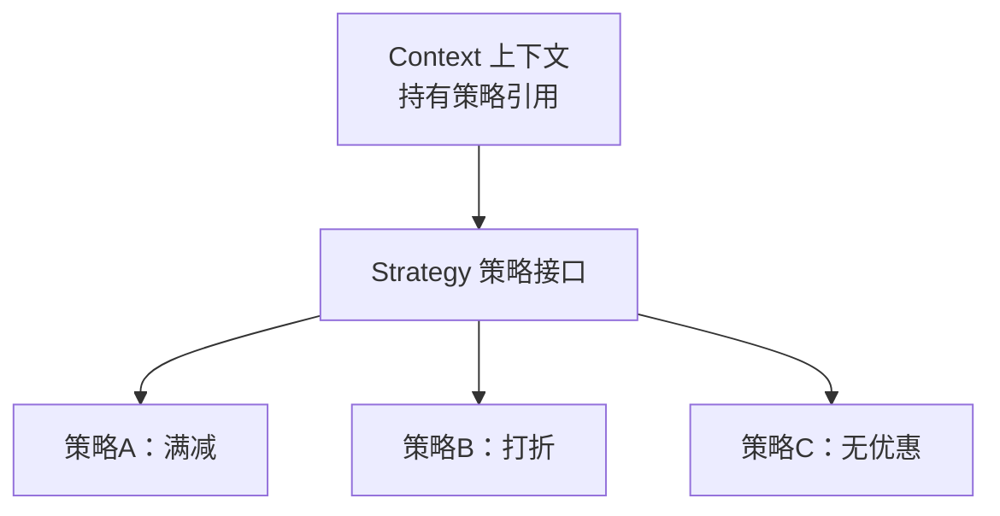

# 06 · 策略模式（Strategy）

> 把一组「可互换的算法/行为」各自封装成独立的类，让它们能在运行时自由切换，从而**消除大量 if-else/switch**。面试重要度 ⭐⭐⭐（「怎么优化一堆 if-else」几乎必问）。

## 📖 核心知识

策略模式定义一个统一的**策略接口**，每种算法是一个实现类；**上下文（Context）**持有一个策略引用，运行时注入哪个就用哪个，调用方不感知具体实现。



**反例（面试常见待优化代码）**：

```java
// 一堆 if-else，加一种优惠就改一次，违反开闭原则
if (type.equals("满减")) { ... }
else if (type.equals("打折")) { ... }
else if (type.equals("无优惠")) { ... }
```

**用策略模式重构**：

```java
interface DiscountStrategy { double calc(double price); }

class FullReduction implements DiscountStrategy {   // 满 100 减 20
    public double calc(double price) { return price >= 100 ? price - 20 : price; }
}
class Percentage implements DiscountStrategy {       // 打 9 折
    public double calc(double price) { return price * 0.9; }
}

class Context {
    private final DiscountStrategy strategy;
    Context(DiscountStrategy strategy) { this.strategy = strategy; }
    double execute(double price) { return strategy.calc(price); }
}

// 使用：切换策略只换实现类，不改 Context
double r = new Context(new Percentage()).execute(200);  // 180.0
```

实战中常把策略实现放进 `Map<String, Strategy>`（Spring 里自动注入所有实现），按 key 取策略，彻底告别 if-else。

### 真实应用

- **`Comparator`**：`Collections.sort(list, comparator)` 里，不同的 `Comparator` 就是不同的排序策略。
- **线程池的拒绝策略 `RejectedExecutionHandler`**：`AbortPolicy`（抛异常）、`CallerRunsPolicy`（调用者执行）、`DiscardPolicy`（丢弃）、`DiscardOldestPolicy`（丢最老），四种是可插拔策略（详见 [`09-concurrency`](../09-concurrency)）。
- **Spring `Resource` 加载**、**`Ordered` 排序**、支付/短信渠道路由（微信/支付宝/银联各一个策略实现）。

## 🔑 面试要点

- 核心目的：**封装可互换的算法族**，运行时切换，**消除 if-else/switch**，符合开闭原则。
- 三角色：策略接口 + 具体策略实现 + Context（持有并委托策略）。
- 实战优化：用 `Map<类型, 策略实现>` 替代 if-else，Spring 可自动把某接口所有实现注入成 Map/List。
- 与状态模式相似（都持有一个接口引用），区别：**策略由外部主动选择切换；状态是内部状态流转自动切换**。
- 典型应用：`Comparator`、线程池拒绝策略、支付渠道路由。

## ❓ 高频面试题

**Q：项目里有大量 if-else 判断类型然后走不同逻辑，怎么优化？**
A：用策略模式。把每个分支逻辑抽成一个策略实现类，实现统一接口，用 `Map<类型, 策略>` 注册，运行时按 key 取对应策略执行。新增类型只需加实现类并注册，不改原有代码，符合开闭原则。Spring 中可把接口的所有实现自动注入为 Map。

**Q：策略模式和工厂模式怎么配合？**
A：工厂负责「根据条件**创建/获取**具体策略对象」，策略负责「**执行**算法」。二者常组合：工厂/Map 选出策略，Context 委托策略执行，既解耦创建又解耦行为。

**Q：策略模式和状态模式的区别？**
A：结构几乎一样（Context 持有接口引用）。区别在语义：策略模式的策略之间**互相独立、由客户端主动指定**；状态模式的各状态**彼此知道如何流转、由内部状态变化自动切换**下一个状态。

## ⚠️ 易错点 / 加分项

- **加分**：Java 8 后简单策略可直接用 **Lambda/函数式接口**表达（如 `Comparator.comparing`），不必每个策略写一个类。
- **加分**：能说出线程池四种拒绝策略正是策略模式的经典落地，并解释 `CallerRunsPolicy` 的降级保护作用。
- **加分**：结合 Spring——`@Autowired List<Strategy>` 或 `Map<String, Strategy>` 自动收集所有策略 Bean，是企业级消除 if-else 的标准写法。
- **易错**：策略类过多也是成本，分支少（2~3 个）且稳定时，if-else 反而更简单，别过度设计。
