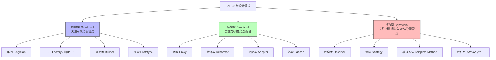

# 11 · 常用设计模式（Design Patterns）

> 设计模式是「面向对象设计经验」的复用套路，共 23 种，分三大类。面试不要求背全部，重点是**单例、工厂、代理、建造者、观察者、策略、模板方法、装饰器**这几个高频模式：能讲清「解决什么问题、怎么实现、JDK/Spring 里哪里用了」。

## 三大分类总览

- **创建型（Creational）**：把「对象怎么被创建」这件事封装起来，让代码与具体类解耦。典型：单例、工厂、建造者。
- **结构型（Structural）**：关注如何把类和对象**组合**成更大的结构，同时保持灵活。典型：代理、装饰器、适配器。
- **行为型（Behavioral）**：关注对象之间的**职责划分与通信**。典型：观察者、策略、模板方法。

## 六大设计原则（SOLID + 一条）

面试常一起考，记住核心即可：

- **单一职责（SRP）**：一个类只负责一件事。
- **开闭原则（OCP）**：对扩展开放、对修改关闭（设计模式的终极目标）。
- **里氏替换（LSP）**：子类能无缝替换父类。
- **接口隔离（ISP）**：接口要小而专，不强迫实现用不到的方法。
- **依赖倒置（DIP）**：面向接口编程，不依赖具体实现。
- **迪米特法则（LoD）**：最少知道原则，降低耦合。

## 知识点索引

| 编号 | 知识点 | 分类 | 重要度 | 一句话 |
| --- | --- | --- | --- | --- |
| [01](./01-singleton.md) | 单例模式（Singleton）⭐ | 创建型 | ⭐⭐⭐ | 5 种写法 + DCL 为什么加 volatile + 枚举最安全 |
| [02](./02-factory.md) | 工厂模式（Factory） | 创建型 | ⭐⭐ | 简单工厂/工厂方法/抽象工厂三者区别 |
| [03](./03-proxy.md) | 代理模式（Proxy） | 结构型 | ⭐⭐⭐ | 静态 vs 动态（JDK/CGLIB）+ Spring AOP 基石 |
| [04](./04-builder.md) | 建造者模式（Builder） | 创建型 | ⭐⭐ | 链式构建复杂对象 + StringBuilder / Lombok |
| [05](./05-observer.md) | 观察者模式（Observer） | 行为型 | ⭐⭐ | 发布-订阅 + 一对多联动 + 事件监听 |
| [06](./06-strategy.md) | 策略模式（Strategy） | 行为型 | ⭐⭐⭐ | 封装算法族消除 if-else + Comparator |
| [07](./07-template-method.md) | 模板方法（Template Method） | 行为型 | ⭐⭐ | 定义骨架 + 钩子 + AQS / JdbcTemplate |
| [08](./08-decorator.md) | 装饰器模式（Decorator） | 结构型 | ⭐⭐ | 动态增强功能 + Java IO + 与代理区别 |

## 推荐复习顺序

**01 单例（面试第一高频，5 种写法必背）** → 02 工厂 → 03 代理（与 [`08-reflection-proxy`](../08-reflection-proxy) 呼应，Spring AOP 必问） → 04 建造者 → 06 策略（消除 if-else 实战常问） → 07 模板方法 → 05 观察者 → 08 装饰器（与代理对比）。

> 动态代理的反射底层见 [`08-reflection-proxy`](../08-reflection-proxy)；策略/模板方法在并发里的应用（线程池拒绝策略、AQS）见 [`09-concurrency`](../09-concurrency)。
