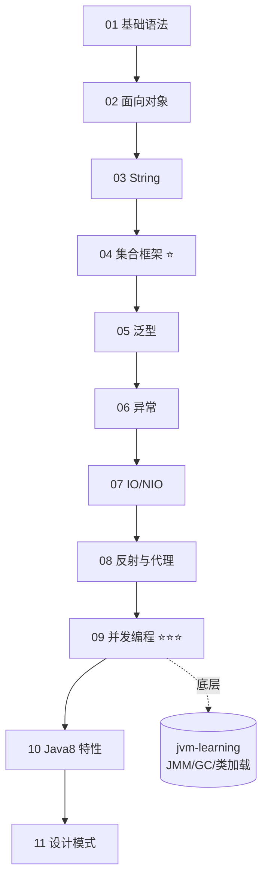

# Java 面试学习合集 ☕（面试向）

> 系统梳理 **Java SE 核心面试知识**。**主题分类 + 一个知识点一个 md，按顺序编号**，中文讲解 + 面试要点 + 高频 Q&A + 易错点。基于 JDK 8+。JVM 底层（类加载/GC/JMM/调优）见姊妹项目 [`jvm-learning`](../jvm-learning)，语言版本演进见 [`jdk-learning`](../jdk-learning)。

---

## 一、知识地图

---

## 二、主题索引

| # | 主题 | 重要度 | 内容 |
|---|---|---|---|
| 01 | [`01-java-basics`](01-java-basics) | ⭐⭐ | 数据类型、装箱缓存、值传递、==与equals、final/static |
| 02 | [`02-oop`](02-oop) | ⭐⭐ | 封装继承多态、抽象类vs接口、重载vs重写、Object方法、内部类 |
| 03 | [`03-string`](03-string) | ⭐⭐⭐ | 不可变性、String/StringBuilder/StringBuffer、常量池与intern |
| 04 | [`04-collections`](04-collections) | ⭐⭐⭐ | ArrayList/LinkedList、HashMap原理、ConcurrentHashMap、fail-fast |
| 05 | [`05-generics`](05-generics) | ⭐⭐ | 泛型、类型擦除、通配符与PECS |
| 06 | [`06-exception`](06-exception) | ⭐⭐ | 异常体系、受检vs非受检、try-catch-finally、最佳实践 |
| 07 | [`07-io-nio`](07-io-nio) | ⭐⭐ | IO流体系、BIO/NIO/AIO、NIO三大件、序列化 |
| 08 | [`08-reflection-proxy`](08-reflection-proxy) | ⭐⭐ | 反射、注解、动态代理（JDK vs CGLIB） |
| 09 | [`09-concurrency`](09-concurrency) | ⭐⭐⭐ | 线程、synchronized、volatile、CAS、AQS、锁、线程池、ThreadLocal、JUC |
| 10 | [`10-java8-features`](10-java8-features) | ⭐⭐⭐ | Lambda、Stream、Optional、函数式接口、新时间API |
| 11 | [`11-design-patterns`](11-design-patterns) | ⭐⭐ | 单例、工厂、代理、建造者、观察者、策略、模板、装饰器 |

> 每个主题文件夹下有自己的 `README.md`（知识点索引）；每个知识点一个独立 md。

---

## 三、面试冲刺路线

- **最高频（⭐⭐⭐ 必背）**：集合（HashMap/ConcurrentHashMap）、并发（synchronized/volatile/线程池/AQS/ThreadLocal）、String、Java8 Stream。
- **1~2 天速览**：04 集合 → 09 并发 → 03 String → 10 Java8 →（配合 `jvm-learning` 的 JMM/GC）。
- **系统掌握**：按 01→11 顺序过一遍，重点看每篇「🔑 面试要点」与「❓ 高频面试题」。

> 规范见 [`_CONVENTIONS.md`](_CONVENTIONS.md)。JVM 相关引用 [`jvm-learning`](../jvm-learning)。
